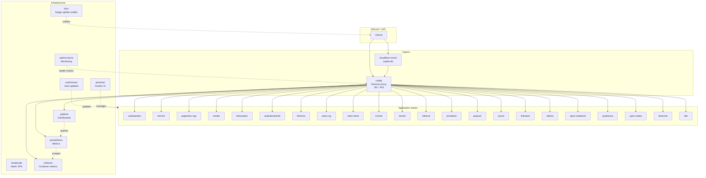

# 🐳 Docker homelab

A collection of **Docker Compose stacks** for self-hosting at home: reverse proxy, monitoring, auto-updates, document management, search, and optional Cloudflare Tunnels. Each stack lives in its own folder with a dedicated README—pick what you need and run it.

---

## 🗺️ Topology



- **Traffic:** Clients hit Caddy (directly via local DNS or through Cloudflare Tunnel). Caddy routes by hostname to each app.
- **Infrastructure:** Portainer manages stacks; Watchtower updates images; Diun notifies when image tags change (e.g. Telegram/Discord); Uptime Kuma monitors Caddy and app health endpoints; Headscale provides Tailscale-compatible mesh VPN. Dozzle (behind Caddy) is a log viewer for all containers.

---

## 📦 What’s inside

| Stack | What it does |
|-------|----------------|
| **portainer** | Docker management UI (Portainer CE) |
| **stacks/caddy** | Reverse proxy with automatic HTTPS (Let’s Encrypt, optional Cloudflare DNS-01) |
| **stacks/cloudflare-tunnel** | Expose services via Cloudflare without port forwarding (cloudflared) |
| **stacks/headscale** | Self-hosted Tailscale control server (mesh VPN) |
| **stacks/diun** | Docker image update notifier (Telegram, Discord, etc.) |
| **stacks/dozzle** | Real-time container log viewer |
| **stacks/n8n** | Workflow automation (Zapier/Make-style, self-hosted) |
| **stacks/audiobookshelf** | Audiobook and podcast server |
| **stacks/freshrss** | RSS feed aggregator (Feedly-like) |
| **stacks/immich** | Photo and video backup (OAuth-ready) |
| **stacks/it-tools** | Developer and IT utilities (converters, hashes, QR, etc.) |
| **stacks/linkwarden** | Bookmark manager and link aggregator |
| **stacks/mealie** | Recipe manager and meal planner |
| **stacks/paperless-ngx** | Document management with OCR and search |
| **stacks/searx-ng** | Privacy-respecting metasearch engine |
| **stacks/uptime-kuma** | Status page and monitoring |
| **stacks/grafana** | Metrics dashboards (use with Prometheus + cAdvisor) |
| **stacks/prometheus** | Metrics collection and storage |
| **stacks/cadvisor** | Container resource metrics (CPU, memory, etc.) |
| **stacks/vaultwarden** | Lightweight Bitwarden-compatible password manager |
| **stacks/privatebin** | Encrypted pastebin (share text with expiration, no account) |
| **stacks/infisical** | Self-hosted secrets manager (API keys, env vars, config) |
| **stacks/watchtower** | Automatic container image updates (nickfedor fork, Docker 29+) |
| **stacks/web-check** | OSINT and website analysis tool |
| **stacks/password-pusher** | Password/secret sharing with view limits and expiration (Password Pusher) |
| **stacks/yourls** | Self-hosted URL shortener (YOURLS): short links, web UI, optional API |
| **stacks/linkstack** | Self-hosted link-in-bio page (Linktree-style: one URL with your links) |
| **stacks/ollama** | Local LLM runtime (Ollama) with GPU support and configurable model storage |
| **stacks/open-notebook** | Open-source Notebook LM alternative (SurrealDB + multi-provider AI) |
| **stacks/perplexica** | Privacy-focused AI answering engine (bundled SearxNG, optional Ollama) |
| **stacks/open-webui** | Self-hosted AI chat UI; Ollama model management and multi-provider support |
| **stacks/librechat** | ChatGPT-style UI with agents, MCP, code interpreter (MongoDB + Redis) |

Each stack has its own **README** with setup and usage; see also `portainer/README.md`.

### Optional: services that make maintenance easier

Beyond Portainer, Uptime Kuma, and Watchtower, these can reduce friction when running and debugging the stacks:

| Idea | What it does | Why it helps |
|------|----------------|--------------|
| **Dozzle** | Real-time container log viewer (single container, Docker socket) | When something breaks, see which container and what it logged without `docker logs` or Portainer log tabs. |
| **Backup** (e.g. **Restic** or **Duplicati**) | Backs up volumes and/or configs to local/NAS/S3/B2 | Configs are in git; app data (DBs, uploads) is not. A scheduled backup avoids losing data on bad updates or disk failure. |
| **Diun** | Notifies when new Docker image tags are available | Complements Watchtower: you see what images changed (e.g. Telegram/Discord/email) before or after Watchtower pulls. |
| **Grafana + Prometheus + cAdvisor** | Host and container metrics (CPU, memory, disk) | Uptime Kuma answers “is it up?”; these stacks answer “why is the host slow?” and help plan capacity. Deploy all three on the `monitor` network; see each stack’s README. |
| **Cloudflare Access (SSO)** | Login in front of tunnel subdomains | Use Zero Trust Access to protect e.g. `portainer.yourdomain.com` with Google/GitHub SSO or one-time PIN instead of basic auth. See [documents/ACCESS-SSO.md](documents/ACCESS-SSO.md). |
| **Scrutiny** | SMART disk health dashboard | Optional; useful if the host has physical disks—warn before failure. |

**Dozzle**, **Diun**, **Grafana**, **Prometheus**, and **cAdvisor** are included as stacks. Dozzle and the metrics stack are behind Caddy (see Caddyfile.example); Diun has no web UI.

---

## 🚀 Getting started

### 1. 🔐 Secrets and config

Sensitive files (`.env`, `config.yml`, `Caddyfile`, etc.) are gitignored. Copy from the `.example` templates in each stack and fill in your values:

- **stacks/caddy** — `.env.example` → `.env` (for Cloudflare DNS), `Caddyfile.example` → `Caddyfile`
- **stacks/cloudflare-tunnel** — `.env.example` → `.env`, optionally `config.yml.example` → `config.yml`. To put tunnel subdomains behind SSO (e.g. Google/GitHub) instead of basic auth, see [documents/ACCESS-SSO.md](documents/ACCESS-SSO.md).
- **stacks/paperless-ngx** — `.env.example` → `.env`; set `PAPERLESS_URL`, `PAPERLESS_SECRET_KEY`
- **stacks/immich** — `.env.example` → `.env`; set `DB_PASSWORD` (and optionally `TZ`, OAuth via Admin UI)
- **stacks/searx-ng** — `.env.example` → `.env`; set `SEARXNG_SECRET` (and optionally `SEARXNG_BASE_URL`)
- **stacks/web-check** — optional: `.env.example` → `.env` for API keys
- **stacks/vaultwarden** — `.env.example` → `.env`; set `DOMAIN` if behind Caddy, `SIGNUPS_ALLOWED` (false after first account)
- **stacks/headscale** — `.env.example` → `.env`; create `config.yaml` from `config.example.yaml`, then set `HEADSCALE_CONFIG_B64` to its base64 (e.g. `base64 -w 0 config.yaml`) in `.env` or in Portainer stack env
- **stacks/linkwarden** — `.env.example` → `.env`; set `NEXTAUTH_SECRET`, `POSTGRES_PASSWORD`, `MEILI_MASTER_KEY` (and `NEXTAUTH_URL` if behind Caddy)
- **stacks/mealie** — `.env.example` → `.env`; set `BASE_URL` if behind Caddy, `ALLOW_SIGNUP` (false after first account)
- **stacks/freshrss** — `.env.example` → `.env`; optional `PUID`, `PGID`, `TZ`
- **stacks/diun** — `.env.example` → `.env`; set `DIUN_NOTIF_TELEGRAM_TOKEN` and `DIUN_NOTIF_TELEGRAM_CHATIDS` (or another notifier)
- **stacks/dozzle** — no secrets; optional `DOZZLE_AUTH_*` for simple auth (see stack README)
- **stacks/n8n** — `.env.example` → `.env`; set `N8N_HOST` and `WEBHOOK_URL` to your Caddy URL (e.g. https://n8n.home or https://n8n.bolens.dev); optional `N8N_ENCRYPTION_KEY`
- **stacks/infisical** — `.env.example` → `.env`; set `ENCRYPTION_KEY`, `AUTH_SECRET`, `POSTGRES_PASSWORD`, `SITE_URL` (e.g. `https://infisical.home` or `https://secrets.yourdomain.com`)
- **stacks/grafana** — optional `.env` for `GF_SERVER_ROOT_URL` (e.g. https://grafana.yourdomain.com)
- **stacks/prometheus** — no secrets; `prometheus.yml` is in the repo
- **stacks/cadvisor** — no config files
- **stacks/password-pusher** — `.env.example` → `.env`; set `PWPUSH_MASTER_KEY` (generate at https://us.pwpush.com/generate_key); optional `PWP__HOST_DOMAIN` if behind Caddy
- **stacks/yourls** — `.env.example` → `.env`; set `YOURLS_SITE` (e.g. https://short.home or https://short.yourdomain.com) to match Caddy hostname; set `YOURLS_USER`, `YOURLS_PASS`, `YOURLS_COOKIEKEY`, `YOURLS_DB_PASSWORD`, `YOURLS_DB_ROOT_PASSWORD`
- **stacks/linkstack** — `.env.example` → `.env` (all vars optional); optional `HTTP_SERVER_NAME` / `HTTPS_SERVER_NAME` when behind Caddy
- **stacks/ollama** — `.env.example` → `.env`; optional `OLLAMA_MODELS_PATH` (absolute path recommended for models); other data uses Docker volume; GPU requires NVIDIA Container Toolkit
- **stacks/open-notebook** — `.env.example` → `.env`; set `OPEN_NOTEBOOK_ENCRYPTION_KEY` (e.g. `openssl rand -base64 32`); optional `OLLAMA_BASE_URL`
- **stacks/perplexica** — `.env.example` → `.env`; optional `PERPLEXICA_DATA_PATH`, `SEARXNG_API_URL`, `OLLAMA_BASE_URL`
- **stacks/open-webui** — `.env.example` → `.env`; set `OLLAMA_BASE_URL` to reach Ollama (e.g. `http://ollama:11434` or `http://host.docker.internal:11434`)
- **stacks/librechat** — `.env.example` → `.env`; set `JWT_SECRET`, `JWT_REFRESH_SECRET` (e.g. `openssl rand -base64 32`); set `MONGO_INITDB_ROOT_PASSWORD`, `REDIS_PASSWORD`; set `OLLAMA_BASE_URL` if using Ollama

### 2. ⚙️ Shared settings

For timezone, locale, and optional per-app settings, see **[documents/ENV-VARS.md](documents/ENV-VARS.md)**.

### 3. ▶️ Deploy

From a stack directory: `docker compose up -d`, or add the stack in Portainer (Git deploy so bind-mounted config files are present).

---

## 💚 Health endpoints (Uptime Kuma)

These stacks expose a dedicated health/status URL so you can monitor them without hitting the main page:

| Stack | Endpoint |
|-------|----------|
| **headscale** | `/health` |
| **vaultwarden** | `/alive` |
| **immich** | `/api/server/ping` |
| **audiobookshelf** | `/healthcheck` |
| **mealie** | `/api/app/about` |
| **password-pusher** | `/up` |
| **yourls** | (no dedicated health endpoint; use HTTP check to app URL) |
| **ollama** | (API only; use HTTP check to `http://ollama:11434` or `/api/tags`) |
| **open-notebook** | (use HTTP check to app URL) |
| **perplexica** | (use HTTP check to app URL) |
| **open-webui** | (use HTTP check to app URL) |
| **librechat** | (use HTTP check to app URL) |
| **n8n** | `/healthz` |

Other stacks (paperless-ngx, linkwarden, searx-ng, linkstack, caddy, infisical, etc.) have no dedicated health endpoint; use an HTTP check to the app URL if needed.

---

## 📁 Layout

```
docker/
├── portainer/          # Portainer stack
├── stacks/
│   ├── caddy/          # Reverse proxy
│   ├── cloudflare-tunnel/
│   ├── diun/
│   ├── dozzle/
│   ├── n8n/
│   ├── uptime-kuma/
│   ├── grafana/
│   ├── prometheus/
│   ├── cadvisor/
│   ├── watchtower/
│   ├── audiobookshelf/
│   ├── freshrss/
│   ├── it-tools/
│   ├── immich/
│   ├── infisical/
│   ├── mealie/
│   ├── paperless-ngx/
│   ├── searx-ng/
│   ├── web-check/
│   ├── vaultwarden/
│   ├── headscale/
│   ├── linkwarden/
│   ├── password-pusher/
│   ├── privatebin/
│   ├── yourls/
│   ├── linkstack/
│   ├── ollama/
│   ├── open-notebook/
│   ├── perplexica/
│   ├── open-webui/
│   └── librechat/
├── documents/          # ENV-VARS.md, ACCESS-SSO.md, other guides
└── .gitignore          # Excludes .env, config.yml, Caddyfile, etc.
```
