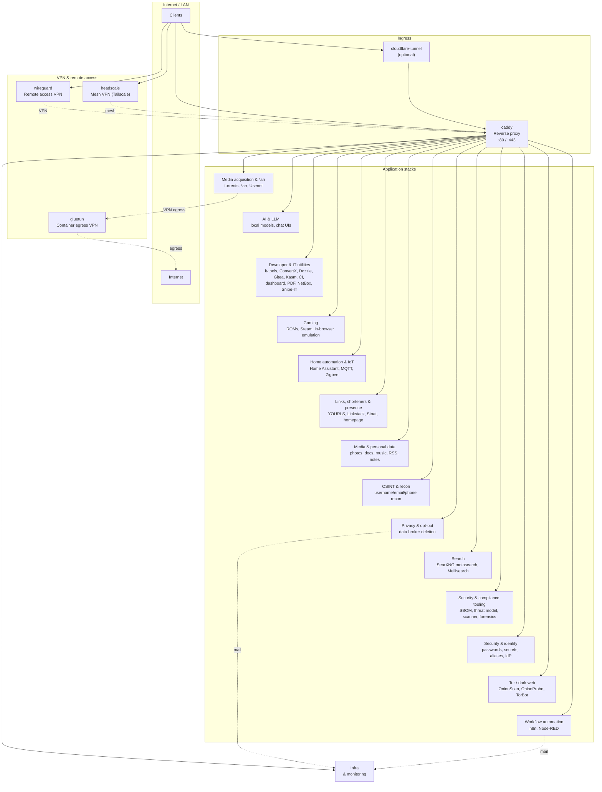
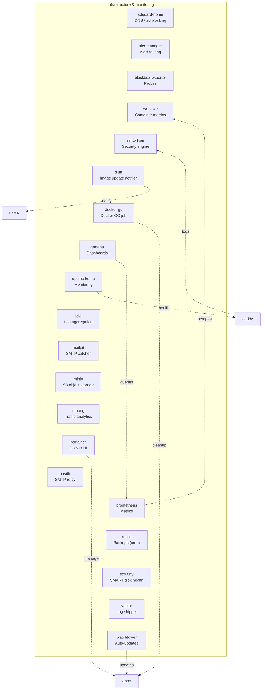

# 🐳 Docker homelab

A collection of **Docker Compose stacks** for self-hosting at home: reverse proxy, monitoring, auto-updates, document management, search, and optional Cloudflare Tunnels. Each stack lives in its own folder with a dedicated README—pick what you need and run it.

---

## 🗺️ Topology

The diagram and prose below are generated from **documents/topology.yaml**. To regenerate after editing that file, from the docker repo root run:

```bash
python3 scripts/build-topology.py --in-place
```

(Requires PyYAML: `pip install pyyaml`)

<!-- TOPOLOGY_GENERATED_START -->

```mermaid
%%{init: {'flowchart': {'curveStyle': 'linear'}}}%%
flowchart TB

    subgraph internet["Internet / LAN"]
        users["Clients"]
        outbound["Internet"]
    end

    subgraph ingress["Ingress"]
        tunnel["`cloudflare-tunnel
(optional)`"]
        caddy["`caddy
Reverse proxy
:80 / :443`"]
    end

    subgraph vpn["VPN & remote access"]
        direction TB
        headscale["`headscale
Mesh VPN (Tailscale)`"]
        wireguard["`wireguard
Remote access VPN`"]
        gluetun["`gluetun
Container egress VPN`"]
    end

    internet ~~~ ingress ~~~ vpn

    subgraph apps["Application stacks"]
        direction TB
        apps_acquisition["`Media acquisition & *arr
torrents, *arr, Usenet`"]
        apps_ai["`AI & LLM
local models, chat UIs`"]
        apps_dev["`Developer & IT utilities
it-tools, ConvertX, Dozzle, Gitea, Kasm, CI, dashboard, PDF, NetBox, Snipe-IT`"]
        apps_gaming["`Gaming
ROMs, Steam, in-browser emulation`"]
        apps_home["`Home automation & IoT
Home Assistant, MQTT, Zigbee`"]
        apps_links["`Links, shorteners & presence
YOURLS, Linkstack, Stoat, homepage`"]
        apps_media["`Media & personal data
photos, docs, music, RSS, notes`"]
        apps_osint["`OSINT & recon
username/email/phone recon`"]
        apps_privacy["`Privacy & opt-out
data broker deletion`"]
        apps_search["`Search
SearXNG metasearch, Meilisearch`"]
        apps_sec_tooling["`Security & compliance tooling
SBOM, threat model, scanner, forensics`"]
        apps_security["`Security & identity
passwords, secrets, aliases, IdP`"]
        apps_tor["`Tor / dark web
OnionScan, OnionProbe, TorBot`"]
        apps_workflow["`Workflow automation
n8n, Node-RED`"]
    end
    apps_acquisition ~~~ apps_ai ~~~ apps_dev ~~~ apps_gaming ~~~ apps_home ~~~ apps_links ~~~ apps_media ~~~ apps_osint ~~~ apps_privacy ~~~ apps_search ~~~ apps_sec_tooling ~~~ apps_security ~~~ apps_tor ~~~ apps_workflow

    infra["`Infra
& monitoring`"]

    users --> tunnel
    users --> caddy
    tunnel --> caddy
    users --> wireguard
    users --> headscale
    caddy --> apps_acquisition
    caddy --> apps_ai
    caddy --> apps_dev
    caddy --> apps_gaming
    caddy --> apps_home
    caddy --> apps_links
    caddy --> apps_media
    caddy --> apps_osint
    caddy --> apps_privacy
    caddy --> apps_search
    caddy --> apps_sec_tooling
    caddy --> apps_security
    caddy --> apps_tor
    caddy --> apps_workflow
    caddy --> infra

    wireguard -.->|VPN| caddy
    headscale -.->|mesh| caddy
    apps_acquisition -.->|VPN egress| gluetun
    gluetun -.->|egress| outbound
    apps_privacy -.->|mail| infra
    apps_workflow -.->|mail| infra
```

#### Infrastructure & monitoring


```mermaid
%%{init: {'flowchart': {'curveStyle': 'linear'}}}%%
flowchart TB

    subgraph infra["Infrastructure & monitoring"]
        direction TB
        adguard_home["`adguard-home
DNS / ad blocking`"]
        alertmanager["`alertmanager
Alert routing`"]
        blackbox_exporter["`blackbox-exporter
Probes`"]
        cadvisor["`cAdvisor
Container metrics`"]
        crowdsec["`crowdsec
Security engine`"]
        diun["`diun
Image update notifier`"]
        dockergc["`docker-gc
Docker GC job`"]
        grafana["`grafana
Dashboards`"]
        kuma["`uptime-kuma
Monitoring`"]
        loki["`loki
Log aggregation`"]
        mailpit["`mailpit
SMTP catcher`"]
        minio["`minio
S3 object storage`"]
        ntopng["`ntopng
Traffic analytics`"]
        portainer["`portainer
Docker UI`"]
        postfix["`postfix
SMTP relay`"]
        prometheus["`prometheus
Metrics`"]
        restic["`restic
Backups (cron)`"]
        scrutiny["`scrutiny
SMART disk health`"]
        vector["`vector
Log shipper`"]
        watchtower["`watchtower
Auto-updates`"]
    end
    adguard_home ~~~ alertmanager ~~~ blackbox_exporter ~~~ cadvisor ~~~ crowdsec ~~~ diun ~~~ dockergc ~~~ grafana ~~~ kuma ~~~ loki ~~~ mailpit ~~~ minio ~~~ ntopng ~~~ portainer ~~~ postfix ~~~ prometheus ~~~ restic ~~~ scrutiny ~~~ vector ~~~ watchtower

    caddy["caddy"]
    apps["apps"]
    users["users"]

    caddy -.->|logs| crowdsec
    kuma -.->|health| caddy
    prometheus -.->|scrapes| cadvisor
    grafana -.->|queries| prometheus
    watchtower -.->|updates| apps
    dockergc -.->|cleanup| apps
    diun -.->|notify| users
    portainer -.->|manage| apps
```

- **Traffic:** All HTTP(S) to apps and to web UIs (e.g. Uptime Kuma, Grafana) goes through Caddy. Clients reach Caddy directly (local DNS) or via Cloudflare Tunnel; Caddy routes by hostname.
- **VPN & remote access:** **Headscale** – mesh VPN (Tailscale); mesh clients reach Caddy and apps. **WireGuard** – remote-access VPN (UDP 51820); VPN clients connect from outside. **Gluetun** – outbound VPN for containers; media acquisition stacks (e.g. qbittorrent) send traffic through Gluetun to a VPN provider.
- **Application categories:** **Media acquisition & *arr** – download clients and *arr automation (torrents, Usenet, Sonarr/Radarr/Lidarr/Readarr, Bazarr, MeTube, Mylar3). **AI & LLM** – local models and chat UIs (Ollama, Open WebUI, LibreChat, Open Notebook, Perplexica). **Developer & IT utilities** – it-tools, ConvertX, Dozzle, Gitea, Harbor, Woodpecker CI, Homarr dashboard, Baserow, Stirling-PDF, ntfy, NetBox, Snipe-IT. **Gaming** – Steam automation (ASF), ROM manager and in-browser emulation (RomM). **Home automation & IoT** – Home Assistant, Mosquitto (MQTT), Zigbee2MQTT. **Links, shorteners & presence** – YOURLS, Linkstack, Stoat, static homepage/landing. **Media & personal data** – consumption and personal content (photos, docs, music, recipes, bookmarks, RSS, comics, eBooks, tasks, wiki, notes, budgeting). **OSINT & recon** – username/email/phone recon, breach lookups, subdomain enumeration, AIL. **Privacy & opt-out** – data broker deletion (Naisho, Privotron). **Search** – SearXNG, Meilisearch. **Security & compliance tooling** – SBOM/vuln tracking (Dependency-Track), threat modeling (Threat Dragon), web scanner (ZAP), digital forensics (Acquire, Plaso, Docker Forensics Toolkit). **Security & identity** – passwords, secrets, aliases, remote desktop, secure sharing, IdP (Keycloak, authentik). **Tor / dark web** – OnionScan, OnionProbe, TorBot. **Workflow automation** – n8n, Node-RED
- **Application stacks (detail):** Each category and what it does:
- **Media acquisition & *arr:** download clients and *arr automation (torrents, Usenet, Sonarr/Radarr/Lidarr/Readarr, Bazarr, MeTube, Mylar3) Stacks: qbittorrent, rtorrent-flood, nzbget, nzbhydra2, prowlarr, sonarr, radarr, lidarr, readarr, bazarr, metube, mylar3.
- **AI & LLM:** local models and chat UIs (Ollama, Open WebUI, LibreChat, Open Notebook, Perplexica) Stacks: ollama, open-webui, librechat, open-notebook, perplexica.
- **Developer & IT utilities:** it-tools, ConvertX, Dozzle, Gitea, Harbor, Woodpecker CI, Homarr dashboard, Baserow, Stirling-PDF, ntfy, NetBox, Snipe-IT Stacks: baserow, convertx, dozzle, gitea, harbor, homarr, it-tools, kasm, netbox, ntfy, snipe-it, stirling-pdf, woodpecker-ci.
- **Gaming:** Steam automation (ASF), ROM manager and in-browser emulation (RomM) Stacks: asf, romm.
- **Home automation & IoT:** Home Assistant, Mosquitto (MQTT), Zigbee2MQTT Stacks: home-assistant, mosquitto, zigbee2mqtt.
- **Links, shorteners & presence:** YOURLS, Shlink, Linkstack, Stoat, static homepage/landing Stacks: homepage, linkstack, shlink, stoat, yourls.
- **Media & personal data:** consumption and personal content (photos, docs, music, recipes, bookmarks, RSS, comics, eBooks, tasks, wiki, notes, budgeting) Stacks: actual-budget, archivebox, audiobookshelf, bookstack, calibre-web, emby, firefly-iii, freshrss, hedgedoc, immich, jellyfin, joplin-server, logseq-sync, kavita, komga, lanraragi, linkding, linkwarden, mealie, navidrome, nextcloud, outline, paperless-ngx, plex, seafile, slink, syncthing, vikunja.
- **OSINT & recon:** username/email/phone recon, breach lookups, subdomain enumeration, AIL Stacks: social-hunt, maigret, spiderfoot, phoneinfoga, theharvester, holehe, blackbird, ghunt, metagoofil, reconftw, sublist3r, ail, web-check.
- **Privacy & opt-out:** data broker deletion (Naisho, Privotron) Stacks: naisho, privotron.
- **Search:** SearXNG, Meilisearch Stacks: meilisearch, searx-ng.
- **Security & compliance tooling:** SBOM/vuln tracking (Dependency-Track), threat modeling (Threat Dragon), web scanner (ZAP), digital forensics (Acquire, Plaso, Docker Forensics Toolkit) Stacks: acquire, dependency-track, docker-forensics-toolkit, plaso, threat-dragon, zap.
- **Security & identity:** passwords, secrets, aliases, remote desktop, secure sharing, IdP (Keycloak, authentik) Stacks: authentik, guacamole, infisical, keycloak, password-pusher, privatebin, simplelogin, vaultwarden.
- **Tor / dark web:** OnionScan, OnionProbe, TorBot Stacks: onionprobe, onionscan, torbot.
- **Workflow automation:** n8n, Node-RED Stacks: n8n, nodered.
- **Infrastructure:** Portainer manages stacks; Watchtower updates images; Docker GC cleans up; Diun notifies on image changes; Uptime Kuma monitors Caddy and app health; Grafana/Prometheus/cAdvisor provide metrics; CrowdSec consumes Caddy logs. **MinIO** provides S3-compatible object storage, often used as a backend for apps and backups; **Restic** handles scheduled backups to object storage; **Scrutiny** monitors disk SMART health. **Postfix** – SMTP relay for outbound mail from apps (e.g. Naisho, n8n). Dozzle (behind Caddy) is a log viewer.
- **Relations:**
  - **users → tunnel**: Clients use optional Cloudflare Tunnel to reach Caddy.
  - **users → caddy**: Clients reach Caddy directly (local DNS or tunnel).
  - **tunnel → caddy**: Tunnel forwards to Caddy by hostname.
  - **users → wireguard**: Clients connect via WireGuard for remote access.
  - **users → headscale**: Clients join mesh via Headscale (Tailscale).
  - **caddy → apps**: Caddy routes HTTP(S) to all application stacks by hostname.
  - **caddy → infra**: Caddy is managed and monitored by infra services.
  - **wireguard → caddy** (VPN): VPN clients reach Caddy and apps.
  - **headscale → caddy** (mesh): Mesh clients reach Caddy and apps.
  - **apps_acquisition → gluetun** (VPN egress): Media acquisition stacks send traffic through Gluetun (VPN).
  - **gluetun → outbound** (egress): Gluetun egresses via VPN provider to internet.
  - **apps_privacy → postfix** (mail): Privacy/opt-out apps send mail via Postfix.
  - **apps_workflow → postfix** (mail): Workflow apps (e.g. n8n) send mail via Postfix.
  - **postfix → mailpit** (relay (internal-only)): When RELAYHOST=mailpit:1025, Postfix relays to Mailpit; no external delivery.
  - **caddy → crowdsec** (logs): Caddy logs feed CrowdSec security engine.
  - **kuma → caddy** (health): Uptime Kuma monitors Caddy and app health.
  - **prometheus → cadvisor** (scrapes): Prometheus scrapes cAdvisor for container metrics.
  - **grafana → prometheus** (queries): Grafana queries Prometheus for dashboards.
  - **watchtower → apps** (updates): Watchtower updates container images for app stacks.
  - **dockergc → apps** (cleanup): Docker GC cleans stopped containers and unused images.
  - **diun → users** (notify): Diun notifies users of new image tags.
  - **portainer → apps** (manage): Portainer manages Docker stacks and containers.
<!-- TOPOLOGY_GENERATED_END -->


---

## 📦 What’s inside

| Stack | What it does |
|-------|----------------|
| [**stacks/ail**](stacks/ail/README.md) | AIL framework – analyse information leaks (pastes, trackers, MISP/TheHive, credentials/cards/keys detection) |
| [**stacks/archivebox**](stacks/archivebox/README.md) | Self-hosted web archive (ArchiveBox) – saves full snapshots (HTML, screenshots, PDFs, WARCs) from URLs and feeds |
| [**stacks/acquire**](stacks/acquire/README.md) | Digital forensics artifact collection (Acquire/Dissect) – gather artifacts from disk images or dirs into an archive; CLI only |
| [**stacks/adguard-home**](stacks/adguard-home/README.md) | Network-wide DNS ad/tracker blocking and web UI; DNS on host 53/853, UI via Caddy |
| [**stacks/actual-budget**](stacks/actual-budget/README.md) | Envelope-style budgeting (Actual Budget sync server); use with desktop/mobile app |
| [**stacks/alertmanager**](stacks/alertmanager/README.md) | Prometheus Alertmanager – route alerts to email, webhooks, chat (use with Prometheus) |
| [**stacks/authentik**](stacks/authentik/README.md) | Identity provider / SSO (OIDC, OAuth2, SAML); use as IdP for other apps or Cloudflare Access |
| [**stacks/asf**](stacks/asf/README.md) | ArchiSteamFarm – Steam card idling and automation; web IPC (ASF-ui, API) behind Caddy |
| [**stacks/audiobookshelf**](stacks/audiobookshelf/README.md) | Audiobook and podcast server |
| [**stacks/bazarr**](stacks/bazarr/README.md) | Subtitle manager and downloader for Sonarr/Radarr libraries |
| [**stacks/blackbird**](stacks/blackbird/README.md) | OSINT: username/email search across many sites with optional PDF/CSV reports |
| [**stacks/blackbox-exporter**](stacks/blackbox-exporter/README.md) | Prometheus Blackbox Exporter – HTTP/TCP/ICMP probes for synthetic monitoring |
| [**stacks/baserow**](stacks/baserow/README.md) | Self-hosted Airtable alternative – tables, views, API (no-code database) |
| [**stacks/bookstack**](stacks/bookstack/README.md) | Wiki and documentation (books, chapters, pages); MariaDB |
| [**stacks/calibre-web**](stacks/calibre-web/README.md) | Web UI for Calibre library – browse, read, and download eBooks (OPDS, optional conversion) |
| [**stacks/caddy**](stacks/caddy/README.md) | Reverse proxy with automatic HTTPS (Let’s Encrypt, optional Cloudflare DNS-01) |
| [**stacks/cadvisor**](stacks/cadvisor/README.md) | Container resource metrics (CPU, memory, etc.) |
| [**stacks/cloudflare-tunnel**](stacks/cloudflare-tunnel/README.md) | Expose services via Cloudflare without port forwarding (cloudflared) |
| [**stacks/convertx**](stacks/convertx/README.md) | Self-hosted online file converter (1000+ formats: documents, images, video, e-books) |
| [**stacks/crowdsec**](stacks/crowdsec/README.md) | CrowdSec Security Engine – collaborative intrusion prevention and curated blocklists for malicious IPs |
| [**stacks/dependency-track**](stacks/dependency-track/README.md) | OWASP Dependency-Track – SBOM/dependency vulnerability tracking (upload CycloneDX/SPDX, CVE alerts) |
| [**stacks/diun**](stacks/diun/README.md) | Docker image update notifier (Telegram, Discord, etc.) |
| [**stacks/docker-gc**](stacks/docker-gc/README.md) | Garbage collector for Docker containers and images (removes old stopped containers and unused images) |
| [**stacks/docker-forensics-toolkit**](stacks/docker-forensics-toolkit/README.md) | Post-mortem analysis of Docker host disk images (containers, images, configs, logs, timelines); CLI only |
| [**stacks/dozzle**](stacks/dozzle/README.md) | Real-time container log viewer |
| [**stacks/emby**](stacks/emby/README.md) | Media server for movies, TV, and music (Emby) |
| [**stacks/firefly-iii**](stacks/firefly-iii/README.md) | Personal finance manager – accounts, transactions, budgets, reports |
| [**stacks/freshrss**](stacks/freshrss/README.md) | RSS feed aggregator (Feedly-like) |
| [**stacks/ghunt**](stacks/ghunt/README.md) | OSINT: investigate Google accounts (email, Gaia, Drive, BSSID) via CLI with JSON export |
| [**stacks/gitea**](stacks/gitea/README.md) | Self-hosted Git service (repos, issues); pairs with Woodpecker CI |
| [**stacks/gluetun**](stacks/gluetun/README.md) | Outbound VPN client for other containers (use via `network_mode: service:gluetun`) |
| [**stacks/grafana**](stacks/grafana/README.md) | Metrics dashboards (use with Prometheus + cAdvisor) |
| [**stacks/guacamole**](stacks/guacamole/README.md) | Clientless remote desktop gateway (RDP, VNC, SSH) with HTML5 web UI (Apache Guacamole) |
| [**stacks/harbor**](stacks/harbor/README.md) | Container registry (pointer stack – use official Harbor installer; see README) |
| [**stacks/headscale**](stacks/headscale/README.md) | Self-hosted Tailscale control server (mesh VPN) |
| [**stacks/homepage**](stacks/homepage/README.md) | Static landing / under-construction page for your root domain or homepage.yourdomain.com |
| [**stacks/homarr**](stacks/homarr/README.md) | Homelab dashboard – links, widgets, optional Docker/Uptime Kuma integrations |
| [**stacks/home-assistant**](stacks/home-assistant/README.md) | Home automation hub – lights, sensors, devices; optional Zigbee2MQTT + Mosquitto |
| [**stacks/hedgedoc**](stacks/hedgedoc/README.md) | Collaborative markdown editor (HackMD-like); real-time notes and docs |
| [**stacks/holehe**](stacks/holehe/README.md) | OSINT: check where an email address has accounts via a FastAPI web UI (holehe-web) |
| [**stacks/immich**](stacks/immich/README.md) | Photo and video backup (OAuth-ready) |
| [**stacks/infisical**](stacks/infisical/README.md) | Self-hosted secrets manager (API keys, env vars, config) |
| [**stacks/it-tools**](stacks/it-tools/README.md) | Developer and IT utilities (converters, hashes, QR, etc.) |
| [**stacks/jellyfin**](stacks/jellyfin/README.md) | Open-source media server for movies, TV, and music |
| [**stacks/joplin-server**](stacks/joplin-server/README.md) | Sync backend for Joplin note-taking clients |
| [**stacks/kasm**](stacks/kasm/README.md) | Container streaming platform – browser-based desktops and apps (Kasm Workspaces) |
| [**stacks/kavita**](stacks/kavita/README.md) | Comics, manga, and eBook server – web reader, OPDS, reading progress |
| [**stacks/keycloak**](stacks/keycloak/README.md) | Identity provider / SSO (OIDC, OAuth2, SAML); use as IdP for other apps |
| [**stacks/komga**](stacks/komga/README.md) | Comics and manga server – web reader, OPDS (Tachiyomi), reading progress |
| [**stacks/librechat**](stacks/librechat/README.md) | ChatGPT-style UI with agents, MCP, code interpreter (MongoDB + Redis) |
| [**stacks/lanraragi**](stacks/lanraragi/README.md) | Tag-based comic/manga archive manager (CBR, CBZ, PDF; plugins) |
| [**stacks/lidarr**](stacks/lidarr/README.md) | Music collection manager for Usenet and torrents (Lidarr) |
| [**stacks/linkstack**](stacks/linkstack/README.md) | Self-hosted link-in-bio page (Linktree-style: one URL with your links) |
| [**stacks/linkwarden**](stacks/linkwarden/README.md) | Bookmark manager and link aggregator |
| [**stacks/linkding**](stacks/linkding/README.md) | Lightweight bookmark manager (tags, import, API) |
| [**stacks/loki**](stacks/loki/README.md) | Log aggregation (Loki); add as Grafana data source |
| [**stacks/logseq-sync**](stacks/logseq-sync/README.md) | Community Logseq sync backend (experimental; see README) |
| [**stacks/maigret**](stacks/maigret/README.md) | OSINT: collect a dossier by username from thousands of sites (web UI, HTML/PDF/XMind reports) |
| [**stacks/mailpit**](stacks/mailpit/README.md) | Local SMTP catcher for dev/testing – catches all mail, no external delivery (use with Postfix for internal-only) |
| [**stacks/mealie**](stacks/mealie/README.md) | Recipe manager and meal planner |
| [**stacks/meilisearch**](stacks/meilisearch/README.md) | Fast search engine (API, typo tolerance, faceting) |
| [**stacks/minio**](stacks/minio/README.md) | S3-compatible object storage (backups, app uploads, Outline/Firefly backend) |
| [**stacks/metagoofil**](stacks/metagoofil/README.md) | OSINT: download documents and extract metadata (users, paths, versions) via search engines |
| [**stacks/metube**](stacks/metube/README.md) | Self-hosted yt-dlp web GUI with playlist support and download queue (MeTube) |
| [**stacks/mylar3**](stacks/mylar3/README.md) | Automated comic downloader (Usenet/torrents); pair with Komga for library |
| [**stacks/mosquitto**](stacks/mosquitto/README.md) | MQTT broker for Home Assistant, Zigbee2MQTT, Node-RED (port 1883) |
| [**stacks/n8n**](stacks/n8n/README.md) | Workflow automation (Zapier/Make-style, self-hosted) |
| [**stacks/naisho**](stacks/naisho/README.md) | Send data deletion request emails to data brokers at once (Rails app; SMTP in UI) |
| [**stacks/navidrome**](stacks/navidrome/README.md) | Personal music streaming server (Navidrome) – web UI and Subsonic-compatible apps |
| [**stacks/nextcloud**](stacks/nextcloud/README.md) | Personal cloud storage, sync, calendar, contacts |
| [**stacks/netbox**](stacks/netbox/README.md) | IPAM/DCIM (pointer stack – use netbox-docker upstream; document networks, devices) |
| [**stacks/nodered**](stacks/nodered/README.md) | Low-code flow editor for automations (Node-RED) |
| [**stacks/ntfy**](stacks/ntfy/README.md) | Push notifications (HTTP pub/sub; Android/iOS app, optional auth) |
| [**stacks/ntopng**](stacks/ntopng/README.md) | Network traffic analytics (host networking; optional Caddy proxy to :3000) |
| [**stacks/nzbget**](stacks/nzbget/README.md) | High-performance Usenet downloader (NZBGet) |
| [**stacks/nzbhydra2**](stacks/nzbhydra2/README.md) | Meta search for Usenet indexers (Newznab-compatible API) |
| [**stacks/ollama**](stacks/ollama/README.md) | Local LLM runtime (Ollama) with GPU support and configurable model storage |
| [**stacks/onionprobe**](stacks/onionprobe/README.md) | Tor Onion Services monitoring (probe endpoints, Prometheus + Grafana + Alertmanager) |
| [**stacks/onionscan**](stacks/onionscan/README.md) | CLI to investigate Tor hidden services (OnionScan; scans for opsec/misconfig, runs over Tor in container) |
| [**stacks/open-notebook**](stacks/open-notebook/README.md) | Open-source Notebook LM alternative (SurrealDB + multi-provider AI) |
| [**stacks/open-webui**](stacks/open-webui/README.md) | Self-hosted AI chat UI; Ollama model management and multi-provider support |
| [**stacks/outline**](stacks/outline/README.md) | Team knowledge base / wiki; S3 (e.g. MinIO), optional IdP (Keycloak/authentik) |
| [**stacks/paperless-ngx**](stacks/paperless-ngx/README.md) | Document management with OCR and search |
| [**stacks/password-pusher**](stacks/password-pusher/README.md) | Password/secret sharing with view limits and expiration (Password Pusher) |
| [**stacks/perplexica**](stacks/perplexica/README.md) | Privacy-focused AI answering engine (bundled SearxNG, optional Ollama) |
| [**stacks/phoneinfoga**](stacks/phoneinfoga/README.md) | OSINT: phone number reconnaissance (country, carrier, line type, web footprints) with web UI/API |
| [**stacks/plex**](stacks/plex/README.md) | Media server for movies, TV, and music (Plex) |
| [**stacks/plaso**](stacks/plaso/README.md) | Digital forensics timeline (Plaso / log2timeline) – extract timestamps from evidence to CSV/timeline; CLI only |
| [**portainer**](portainer/README.md) | Docker management UI (Portainer CE) |
| [**stacks/postfix**](stacks/postfix/README.md) | SMTP relay for outbound mail from apps (Postfix) |
| [**stacks/privatebin**](stacks/privatebin/README.md) | Encrypted pastebin (share text with expiration, no account) |
| [**stacks/prometheus**](stacks/prometheus/README.md) | Metrics collection and storage |
| [**stacks/promtail**](stacks/promtail/README.md) | Log shipper for Loki (host and Docker logs) |
| [**stacks/privotron**](stacks/privotron/README.md) | CLI to automate data broker opt-outs (Playwright; profiles, skip list, parallel runs) |
| [**stacks/prowlarr**](stacks/prowlarr/README.md) | Indexer manager/proxy for *arr apps (Usenet and torrent indexers) |
| [**stacks/qbittorrent**](stacks/qbittorrent/README.md) | Torrent client behind VPN (Gluetun) for *arr automation; shared `torrents` network and `torrents_downloads` |
| [**stacks/radarr**](stacks/radarr/README.md) | Movie collection manager for Usenet and torrents (Radarr) |
| [**stacks/readarr**](stacks/readarr/README.md) | Book and audiobook collection manager for Usenet and torrents (Readarr) |
| [**stacks/reconftw**](stacks/reconftw/README.md) | Automated recon framework orchestrating many tools (subdomains, ports, screenshots, Nuclei, etc.) |
| [**stacks/restic**](stacks/restic/README.md) | Scheduled backups with restic (cron); target S3 e.g. MinIO; CLI-only stack |
| [**stacks/romm**](stacks/romm/README.md) | ROM manager – scan, enrich, browse and play ROMs in-browser (EmulatorJS); metadata from IGDB, Screenscraper, etc. |
| [**stacks/rtorrent-flood**](stacks/rtorrent-flood/README.md) | Manual torrent client (rTorrent) with Flood web UI |
| [**stacks/searx-ng**](stacks/searx-ng/README.md) | Privacy-respecting metasearch engine |
| [**stacks/scrutiny**](stacks/scrutiny/README.md) | SMART disk health dashboard – monitor drive health and alerts |
| [**stacks/seafile**](stacks/seafile/README.md) | File sync and sharing (desktop/mobile clients); MariaDB + Memcached |
| [**stacks/simplelogin**](stacks/simplelogin/README.md) | Email alias service (unlimited aliases, forward & reply anonymously, Bitwarden/1Password) |
| [**stacks/shlink**](stacks/shlink/README.md) | Self-hosted URL shortener (API, redirects, analytics); manage via app.shlink.io or API |
| [**stacks/slink**](stacks/slink/README.md) | Self-hosted image sharing (upload, collections, ShareX, S3/SMB) |
| [**stacks/snipe-it**](stacks/snipe-it/README.md) | IT asset management – hardware, licenses, accessories (MariaDB; SMTP via Postfix) |
| [**stacks/syncthing**](stacks/syncthing/README.md) | Continuous file sync across devices (no central server) |
| [**stacks/social-hunt**](stacks/social-hunt/README.md) | OSINT framework: username search, breach lookups (HIBP/Snusbase), face match, reverse image |
| [**stacks/sonarr**](stacks/sonarr/README.md) | TV series management for Usenet and torrents |
| [**stacks/spiderfoot**](stacks/spiderfoot/README.md) | Automated multi-source OSINT scanner with 180+ modules and a web UI |
| [**stacks/stirling-pdf**](stacks/stirling-pdf/README.md) | PDF tools – merge, split, OCR, convert, watermark (web UI) |
| [**stacks/stoat**](stacks/stoat/README.md) | Self-hosted Stoat chat platform (API, web, media, notifications, optional voice) |
| [**stacks/sublist3r**](stacks/sublist3r/README.md) | Subdomain enumeration tool using multiple search engines and output to files |
| [**stacks/theharvester**](stacks/theharvester/README.md) | OSINT: emails, hosts, and subdomains via multi-source recon (REST API variant) |
| [**stacks/threat-dragon**](stacks/threat-dragon/README.md) | OWASP Threat Dragon – threat modeling (diagrams, STRIDE; save to GitHub/Bitbucket/GitLab) |
| [**stacks/torbot**](stacks/torbot/README.md) | OWASP TorBot – Dark Web OSINT crawler (.onion crawl, email extraction, link tree, JSON export; Tor in separate container) |
| [**stacks/uptime-kuma**](stacks/uptime-kuma/README.md) | Status page and monitoring |
| [**stacks/vaultwarden**](stacks/vaultwarden/README.md) | Lightweight Bitwarden-compatible password manager |
| [**stacks/vector**](stacks/vector/README.md) | Log shipper – host and container logs to Loki for Grafana |
| [**stacks/vikunja**](stacks/vikunja/README.md) | Tasks, lists, and projects (optional CalDAV) |
| [**stacks/wireguard**](stacks/wireguard/README.md) | Remote access VPN server (LinuxServer WireGuard; UDP 51820) |
| [**stacks/woodpecker-ci**](stacks/woodpecker-ci/README.md) | Lightweight CI/CD (server + agent); integrate with Gitea |
| [**stacks/watchtower**](stacks/watchtower/README.md) | Automatic container image updates (nickfedor fork, Docker 29+) |
| [**stacks/web-check**](stacks/web-check/README.md) | OSINT and website analysis tool |
| [**stacks/yourls**](stacks/yourls/README.md) | Self-hosted URL shortener (YOURLS): short links, web UI, optional API |
| [**stacks/zap**](stacks/zap/README.md) | OWASP ZAP – web/API security scanner (daemon + web UI; baseline/active scans; access via Caddy) |
| [**stacks/zigbee2mqtt**](stacks/zigbee2mqtt/README.md) | Zigbee-to-MQTT bridge for Home Assistant and other automation (web UI via Caddy) |

Each stack has its own **README** with setup and usage; see also `portainer/README.md`.

### Maintenance-related stacks and services

Beyond core infra like Portainer, Uptime Kuma, Watchtower, Prometheus, and Grafana, these stacks and services can further reduce friction when running and debugging the others:

| Idea | What it does | Why it helps |
|------|----------------|--------------|
| **Backups (Restic stack)** | Backs up volumes and/or configs to local/NAS/S3/B2 using restic | Configs are in git; app data (DBs, uploads) is not. The `stacks/restic` stack gives you a scheduled backup job so you avoid losing data on bad updates or disk failure. |
| **Cloudflare Access (SSO)** | Login in front of tunnel subdomains | Use Zero Trust Access to protect e.g. `portainer.yourdomain.com` with Google/GitHub SSO or one-time PIN instead of basic auth. See [documents/ACCESS-SSO.md](documents/ACCESS-SSO.md). |
| **Diun** | Notifies when new Docker image tags are available | Complements Watchtower: you see what images changed (e.g. Telegram/Discord/email) before or after Watchtower pulls. |
| **Dozzle** | Real-time container log viewer (single container, Docker socket) | When something breaks, see which container and what it logged without `docker logs` or Portainer log tabs. |
| **Grafana + Prometheus + cAdvisor** | Host and container metrics (CPU, memory, disk) | Uptime Kuma answers “is it up?”; these stacks answer “why is the host slow?” and help plan capacity. Deploy all three on the `monitor` network; see each stack’s README. |
| **Loki + Promtail** | Log aggregation and shipping | Query logs in Grafana (**Explore** → **Loki**). Deploy `stacks/loki` then `stacks/promtail` on `monitor`; Grafana datasources include Loki when using the example. |
| **Alertmanager + ntfy** | Alert routing and push notifications | Prometheus example config points at Alertmanager; Alertmanager example sends to ntfy. Deploy `stacks/alertmanager` and `stacks/ntfy` on `monitor`; subscribe to your topic in the ntfy app. |
| **Scrutiny** | SMART disk health dashboard | Optional; useful if the host has physical disks—warn before failure. |

All of these (except Cloudflare Access, which is configured via your Cloudflare account) are available as dedicated stacks in this repo; see the [**What’s inside**](#-whats-inside) table for links.

---

## 🚀 Getting started

### 1. 🔐 Secrets and config

Sensitive files (`stack.env`, `config.yml`, `Caddyfile`, etc.) are gitignored. Copy from the `.example` templates in each stack and fill in your values.

**Optional – shared TZ/locale:** From the `docker/` repo root, copy `shared.env.example` → `shared.env` and set your timezone and locale once; use it with CLI (`docker compose --env-file ../shared.env --env-file stack.env`) or add the same four variables in Portainer. See [documents/SHARED-RESOURCES.md](documents/SHARED-RESOURCES.md#1-shared-env-file-tz--locale).

- **stacks/ail** — optional `stack.env` with `TZ`; uses community image cciucd/ail-framework; >6GB RAM recommended; reset password after first login: `docker exec ail bin/LAUNCH.sh -rp`
- **stacks/archivebox** — `stack.env.example` → `stack.env`; set `ADMIN_USERNAME`, `ADMIN_PASSWORD`, `SEARCH_BACKEND_PASSWORD` (and adjust `ALLOWED_HOSTS` / `CSRF_TRUSTED_ORIGINS` for your Caddy hostnames)
- **stacks/acquire** — optional `stack.env.example` → `stack.env` (e.g. `TZ`). CLI only; mount evidence under `./data`, run `docker compose run --rm acquire /data/evidence.vmdk -o /data/output.tar`. See stack README.
- **stacks/adguard-home** — optional `stack.env.example` → `stack.env`. DNS on host 53/853; web UI via Caddy to adguard-home:3000. Run setup wizard on first visit.
- **stacks/actual-budget** — optional `stack.env.example` → `stack.env` (e.g. `TZ`). No host ports; access via Caddy to actual-budget:5006. Set server URL in Actual desktop/mobile app to your Caddy hostname.
- **stacks/alertmanager** — optional `stack.env.example` → `stack.env`. Copy `alertmanager.yml.example` to `~/.config/alertmanager/alertmanager.yml` and edit for receivers (email, webhooks). No host ports; access via Caddy to alertmanager:9093. Wire Prometheus to `alertmanager:9093`. From Portainer set `ALERTMANAGER_CONFIG_PATH` to the absolute path of that file.
- **stacks/authentik** — `stack.env.example` → `stack.env`; set `AUTHENTIK_SECRET_KEY` (e.g. `openssl rand -base64 50`), `PG_PASS`, `AUTHENTIK_HOST` (e.g. https://authentik.yourdomain.com). Access via Caddy to authentik-server:9000.
- **stacks/asf** — create `config/`, copy `ASF.json.example` → `config/ASF.json` and set `IPCPassword` (e.g. `openssl rand -base64 32`); optional `stack.env.example` → `stack.env` for `TZ`, `ASF_UID`. No host ports; access via Caddy (e.g. https://asf.yourdomain.com).
- **stacks/blackbox-exporter** — optional `stack.env.example` → `stack.env`. Copy `blackbox.yml.example` to `~/.config/blackbox-exporter/blackbox.yml` and edit for probe modules. From Portainer set `BLACKBOX_CONFIG_PATH` to the absolute path of that file. No Caddy; Prometheus scrapes blackbox-exporter:9115 on `monitor` network. Add scrape job in Prometheus.
- **stacks/baserow** — `stack.env.example` → `stack.env`; set `BASEROW_PUBLIC_URL` (e.g. https://baserow.yourdomain.com). No host ports; access via Caddy to baserow:80.
- **stacks/bookstack** — `stack.env.example` → `stack.env`; set `APP_URL` (e.g. https://bookstack.yourdomain.com), `MYSQL_ROOT_PASSWORD`, `MYSQL_PASSWORD`. Default login admin@admin.com / password — change immediately. Access via Caddy to bookstack:80.
- **stacks/calibre-web** — `stack.env.example` → `stack.env` (optional TZ, PUID, PGID); on first run set Calibre DB path to `/books` in the UI and change default admin password.
- **stacks/caddy** — `stack.env.example` → `stack.env` (for Cloudflare DNS), `Caddyfile.example` → `Caddyfile`
- **stacks/cadvisor** — no config files
- **stacks/cloudflare-tunnel** — `stack.env.example` → `stack.env`, optionally `config.yml.example` → `config.yml`. To put tunnel subdomains behind SSO (e.g. Google/GitHub) instead of basic auth, see [documents/ACCESS-SSO.md](documents/ACCESS-SSO.md).
- **stacks/convertx** — `stack.env.example` → `stack.env`; set `JWT_SECRET` (recommended; `openssl rand -base64 32`); set `ACCOUNT_REGISTRATION=false` after first account
- **stacks/crowdsec** — `stack.env.example` → `stack.env` (optional); use it to set `TZ`, `GID`, and default hub `COLLECTIONS`. See the stack README and CrowdSec Docker docs for configuring acquisitions and bouncers; for Cloudflare edge blocking with the Workers bouncer, see [documents/CROWDSEC-CLOUDFLARE-WORKER.md](documents/CROWDSEC-CLOUDFLARE-WORKER.md).
- **stacks/dependency-track** — `stack.env.example` → `stack.env`; set `POSTGRES_PASSWORD` and `API_BASE_URL` (URL the browser uses for the API, e.g. https://dtrack.home/api). See stack README for Caddy path/subdomain setup.
- **stacks/diun** — `stack.env.example` → `stack.env`; set `DIUN_NOTIF_TELEGRAM_TOKEN` and `DIUN_NOTIF_TELEGRAM_CHATIDS` (or another notifier)
- **stacks/docker-gc** — `stack.env.example` → `stack.env`; by default runs in DRY RUN mode (`DRY_RUN=true`) so you can see which stopped containers and unused images would be removed. Adjust `DRY_RUN`, `DRY_RUN_CONTAINERS`, `DRY_RUN_IMAGES`, and `EXCLUDE_*` as needed before scheduling it.
- **stacks/docker-forensics-toolkit** — optional `stack.env.example` → `stack.env` (e.g. `TZ`). CLI only; build with `docker compose build`, mount forensic disk image under `./data`, run `docker compose run --rm [--privileged] docker-forensics-toolkit mount-image /data/host.raw` then other commands. See stack README.
- **stacks/dozzle** — no secrets; optional `DOZZLE_AUTH_*` for simple auth (see stack README)
- **stacks/firefly-iii** — `stack.env.example` → `stack.env`; set `DB_PASSWORD`, `APP_URL` (e.g. https://firefly-iii.yourdomain.com), `APP_KEY` (generate with `docker run --rm fireflyiii/core php artisan key:generate --show`). Access via Caddy to firefly-iii:8080.
- **stacks/freshrss** — `stack.env.example` → `stack.env`; optional `PUID`, `PGID`, `TZ`
- **stacks/gluetun** — `stack.env.example` → `stack.env`; set `TZ`, `VPN_SERVICE_PROVIDER`, `VPN_TYPE`, and provider-specific vars (e.g. WireGuard keys or OpenVPN user/pass). No HTTP; other containers use it via `network_mode: service:gluetun`. See [Gluetun docs](https://gluetun.com/configuration/).
- **stacks/gitea** — `stack.env.example` → `stack.env`; set `GITEA_DB_PASSWORD`, `GITEA_ROOT_URL` (e.g. https://gitea.yourdomain.com). Access via Caddy to gitea:3000.
- **stacks/grafana** — copy `stack.env.example` → `stack.env`; create `~/.config/grafana/provisioning_dashboards` (copy `provisioning_dashboards.example/default.yaml` and add `json/` subdir; see stack README). Optional: `GF_SERVER_ROOT_URL`, `GRAFANA_DATASOURCES_PATH`, `GRAFANA_DASHBOARDS_PATH`; TZ/locale via shared.env
- **stacks/guacamole** — `stack.env.example` → `stack.env`; set `POSTGRES_PASSWORD` (strong random; shared by Postgres and the Guacamole web app); optional `POSTGRES_DB`, `POSTGRES_USER`, and `TZ`. Access via Caddy only.
- **stacks/harbor** — No stack.env in this repo; use the official Harbor installer and generated compose (see stacks/harbor/README.md).
- **stacks/headscale** — `stack.env.example` → `stack.env`; create `config.yaml` from `config.example.yaml`, then set `HEADSCALE_CONFIG_B64` to its base64 (e.g. `base64 -w 0 config.yaml`) in `stack.env` or in Portainer stack env
- **stacks/homepage** — optional `stack.env.example` → `stack.env`. Static files in `./www`; edit `www/index.html` for content. No host ports; access via Caddy at your root domain (e.g. yourdomain.com, www.yourdomain.com) or homepage.yourdomain.com.
- **stacks/homarr** — optional `stack.env.example` → `stack.env` (e.g. `TZ`). No host ports; access via Caddy to homarr:7575.
- **stacks/home-assistant** — optional `stack.env.example` → `stack.env`. No host ports; access via Caddy to home-assistant:8123.
- **stacks/hedgedoc** — `stack.env.example` → `stack.env`; set `POSTGRES_PASSWORD`, `CMD_DOMAIN` (e.g. hedgedoc.yourdomain.com). Access via Caddy to hedgedoc:3000.
- **stacks/immich** — `stack.env.example` → `stack.env`; set `DB_PASSWORD` (and optionally `TZ`, OAuth via Admin UI)
- **stacks/komga** — `stack.env.example` → `stack.env` (optional TZ, JAVA_TOOL_OPTIONS); create first user in the web UI, then add libraries (default `/data` or bind-mount).
- **stacks/kavita** — `stack.env.example` → `stack.env` (optional TZ, PUID, PGID); run setup wizard in the web UI and add libraries (e.g. `/data` or bind-mount).
- **stacks/infisical** — `stack.env.example` → `stack.env`; set `ENCRYPTION_KEY`, `AUTH_SECRET`, `POSTGRES_PASSWORD`, `SITE_URL` (e.g. `https://infisical.home` or `https://secrets.yourdomain.com`)
- **stacks/librechat** — `stack.env.example` → `stack.env`; set `JWT_SECRET`, `JWT_REFRESH_SECRET` (e.g. `openssl rand -base64 32`); set `MONGO_INITDB_ROOT_PASSWORD`, `REDIS_PASSWORD`; set `OLLAMA_BASE_URL` if using Ollama
- **stacks/linkstack** — `stack.env.example` → `stack.env` (all vars optional); optional `HTTP_SERVER_NAME` / `HTTPS_SERVER_NAME` when behind Caddy
- **stacks/lanraragi** — `stack.env.example` → `stack.env` (optional TZ, LRR_UID, LRR_GID); upload or drop archives in the web UI or content volume.
- **stacks/linkwarden** — `stack.env.example` → `stack.env`; set `NEXTAUTH_SECRET`, `POSTGRES_PASSWORD`, `MEILI_MASTER_KEY` (and `NEXTAUTH_URL` if behind Caddy)
- **stacks/linkding** — optional `stack.env.example` → `stack.env` (e.g. `TZ`). No host ports; access via Caddy to linkding:9090.
- **stacks/loki** — Copy `loki-config.yml.example` to `~/.config/loki/loki-config.yml` (create dir if needed). From Portainer set `LOKI_CONFIG_PATH` to that absolute path. Optional `stack.env` for `TZ`. No Caddy; add Loki as data source in Grafana (http://loki:3100).
- **stacks/logseq-sync** — Experimental; run `./clone-repo.sh`, then build and run. See stack README.
- **stacks/maigret** — no required env; optional TZ. Deploy and access via Caddy (e.g. https://maigret.home)
- **stacks/mailpit** — no config required. Deploy and add Caddy block for mailpit.yourdomain.com. For internal-only mail, set Postfix `RELAYHOST=mailpit:1025` in `stacks/postfix/stack.env`.
- **stacks/mealie** — `stack.env.example` → `stack.env`; set `BASE_URL` if behind Caddy, `ALLOW_SIGNUP` (false after first account)
- **stacks/meilisearch** — `stack.env.example` → `stack.env`; when exposing via Caddy set `MEILI_MASTER_KEY` (e.g. `openssl rand -hex 32`) and `MEILI_ENV=production`. No host ports; access via Caddy to meilisearch:7700.
- **stacks/minio** — `stack.env.example` → `stack.env`; set `MINIO_ROOT_USER`, `MINIO_ROOT_PASSWORD` (e.g. `openssl rand -hex 16`, `openssl rand -base64 32`); optional `MINIO_SERVER_URL`. Access via Caddy to minio:9001 (console).
- **stacks/mylar3** — `stack.env.example` → `stack.env` (optional TZ, PUID, PGID). Ensure `usenet` and `torrents` networks exist; configure NZBGet, qBittorrent, Prowlarr in the UI. Point `/comics` at a path Komga can use.
- **stacks/mosquitto** — optional `stack.env.example` → `stack.env`. MQTT on host 1883; create `mosquitto.conf` in config volume. Used by Zigbee2MQTT, Home Assistant, Node-RED.
- **stacks/n8n** — `stack.env.example` → `stack.env`; set `N8N_HOST` and `WEBHOOK_URL` to your Caddy URL (e.g. https://n8n.home or https://n8n.yourdomain.com); optional `N8N_ENCRYPTION_KEY`
- **stacks/ntfy** — `stack.env.example` → `stack.env`; set `NTFY_BASE_URL` (e.g. https://ntfy.yourdomain.com). No host ports; access via Caddy to ntfy:80.
- **stacks/ntopng** — optional `stack.env.example` → `stack.env`. Uses host networking; web UI on host :3000. Optional Caddy block to host.docker.internal:3000.
- **stacks/naisho** — `stack.env.example` → `stack.env`; set `SECRET_KEY_BASE` (`openssl rand -hex 64`); stack builds from GitHub on first deploy; configure SMTP in the app when sending deletion emails
- **stacks/navidrome** — `stack.env.example` → `stack.env`; optional `TZ`; optional `ND_BASEURL` (when behind Caddy, set to your full Navidrome URL, e.g. https://music.yourdomain.com); optional `ND_LOGLEVEL`, `ND_SCANSCHEDULE`, and other `ND_` options (see Navidrome docs)
- **stacks/nextcloud** — `stack.env.example` → `stack.env`; set `POSTGRES_PASSWORD`, `NEXTCLOUD_ADMIN_PASSWORD`, `NEXTCLOUD_TRUSTED_DOMAINS` (e.g. nextcloud.yourdomain.com). Access via Caddy to nextcloud:80.
- **stacks/netbox** — Pointer stack; use upstream netbox-docker. Attach to `monitor` network and add Caddy block for netbox.yourdomain.com. See stack README.
- **stacks/nzbget** — `stack.env.example` → `stack.env`; set `TZ`, `PUID`, `PGID`, optional `UMASK`, and optionally `NZBGET_USER`/`NZBGET_PASS` for the web UI. Configure Usenet servers in the NZBGet UI.
- **stacks/nzbhydra2** — `stack.env.example` → `stack.env`; set `TZ`, `PUID`, `PGID`, optional `UMASK`. Configure upstream indexers and API key in the NZBHydra 2 UI.
- **stacks/ollama** — `stack.env.example` → `stack.env`; optional `OLLAMA_MODELS_PATH` (absolute path recommended for models); other data uses Docker volume; GPU requires NVIDIA Container Toolkit
- **stacks/onionprobe** — run `./clone-repo.sh` once to clone the upstream repo into `./repo`; optional `stack.env` for `GRAFANA_DATABASE_PASSWORD`, `GF_SERVER_ROOT_URL`; access via Caddy (onionprobe.home → Grafana)
- **stacks/onionscan** — CLI only; no web UI or ports. Optional: `stack.env` with TZ. Start with `docker compose up -d`, wait for Tor (logs), then `docker compose exec onionscan onionscan [options] <onion-address>`. See stack README.
- **stacks/outline** — `stack.env.example` → `stack.env`; set `POSTGRES_PASSWORD`, `URL` (e.g. https://outline.yourdomain.com), `SECRET_KEY`, `UTILS_SECRET`, and S3 vars if using MinIO. Create bucket in MinIO. Access via Caddy to outline:3000.
- **stacks/open-notebook** — `stack.env.example` → `stack.env`; set `OPEN_NOTEBOOK_ENCRYPTION_KEY` (e.g. `openssl rand -base64 32`); optional `OLLAMA_BASE_URL`
- **stacks/open-webui** — `stack.env.example` → `stack.env`; set `OLLAMA_BASE_URL` to reach Ollama (e.g. `http://ollama:11434` or `http://host.docker.internal:11434`)
- **stacks/paperless-ngx** — `stack.env.example` → `stack.env`; set `PAPERLESS_URL`, `PAPERLESS_SECRET_KEY`
- **stacks/password-pusher** — `stack.env.example` → `stack.env`; set `PWPUSH_MASTER_KEY` (generate at https://us.pwpush.com/generate_key); optional `PWP__HOST_DOMAIN` if behind Caddy
- **stacks/perplexica** — `stack.env.example` → `stack.env`; optional `PERPLEXICA_DATA_PATH`, `SEARXNG_API_URL`, `OLLAMA_BASE_URL`
- **stacks/plex** — `stack.env.example` → `stack.env`; set `TZ`, `PUID`, `PGID`, `VERSION=docker`, and optionally `PLEX_CLAIM` (from Plex) on first run to link the server to your account.
- **stacks/plaso** — optional `stack.env.example` → `stack.env` (e.g. `TZ`). CLI only; mount evidence under `./data` and run `docker compose run --rm plaso log2timeline ...` / `psort ...`. See stack README.
- **stacks/privotron** — `./prepare-stack.sh` or `cp stack.env.example stack.env`; `docker compose build` (no upstream image); then `docker compose run --rm privotron --profile NAME` (create profile with `--save-profile`). Optional: `PRIVOTRON_VERSION` in stack.env when building; mount `./brokers` for `.skipbrokers`. See stack README.
- **stacks/prometheus** — copy `prometheus.yml.example` to `~/.config/prometheus/prometheus.yml` and `alerts.yml.example` to `~/.config/prometheus/rules/alerts.yml` (create both dirs if needed); when deploying from Portainer set `PROMETHEUS_CONFIG_PATH` and `PROMETHEUS_RULES_PATH` to the absolute paths of that file and the rules directory; no secrets
- **stacks/promtail** — Copy `promtail-config.yml.example` to `~/.config/promtail/promtail-config.yml` (create dir if needed). Deploy after Loki; from Portainer set `PROMTAIL_CONFIG_PATH` to that absolute path. Optional `stack.env`. No Caddy; ships logs to http://loki:3100 on `monitor`.
- **stacks/qbittorrent** — `stack.env.example` → `stack.env`; set `TZ`, `PUID`, `PGID`; configure Gluetun VPN (`VPN_SERVICE_PROVIDER`, `VPN_TYPE`, and provider-specific vars, e.g. WireGuard keys). Create `torrents` network and `torrents_downloads` volume if not present. See stack README and [Gluetun docs](https://gluetun.com/configuration/).
- **stacks/searx-ng** — `stack.env.example` → `stack.env`; set `SEARXNG_SECRET` (and optionally `SEARXNG_BASE_URL`)
- **stacks/scrutiny** — `stack.env.example` → `stack.env` (optional TZ). Runs privileged for SMART/device access; adjust `devices` in compose if needed. Access via Caddy to scrutiny:8080.
- **stacks/seafile** — `stack.env.example` → `stack.env`; set `MYSQL_ROOT_PASSWORD`, `SEAFILE_DB_PASSWORD`, `SEAFILE_SERVER_HOSTNAME` (e.g. seafile.yourdomain.com). Access via Caddy to seafile:80.
- **stacks/simplelogin** — `stack.env.example` → `stack.env`; create `data/dkim.key` (see README); set `URL`, `EMAIL_DOMAIN`, `EMAIL_SERVERS_WITH_PRIORITY`, `SUPPORT_EMAIL`, `FLASK_SECRET` (`openssl rand -hex 32`), `POSTGRES_PASSWORD`; run migration and init once (see stack README)
- **stacks/shlink** — `stack.env.example` → `stack.env`; set `DEFAULT_DOMAIN` (e.g. short.yourdomain.com) to match Caddy hostname, `GEOLITE_LICENSE_KEY` (free at MaxMind); optional `INITIAL_API_KEY` (e.g. `openssl rand -hex 32`). Access via Caddy to shlink:8080; manage short URLs at app.shlink.io with server URL and API key.
- **stacks/slink** — `stack.env.example` → `stack.env`; set `ORIGIN` to your Caddy URL (e.g. https://slink.home or https://slink.yourdomain.com)
- **stacks/snipe-it** — `stack.env.example` → `stack.env`; set `APP_KEY` (`openssl rand -base64 32`), `DB_PASSWORD`, `MYSQL_PASSWORD`, `MYSQL_ROOT_PASSWORD`, `APP_URL` (e.g. https://snipe-it.yourdomain.com). Optional MAIL_* for Postfix. Access via Caddy to snipeit:80.
- **stacks/syncthing** — `stack.env.example` → `stack.env` (optional TZ). Access via Caddy to syncthing:8384.
- **stacks/sonarr** — `stack.env.example` → `stack.env`; set `TZ`, `PUID`, `PGID`. Configure NZBGet/qBittorrent and Prowlarr/NZBHydra 2 in the Sonarr UI.
- **stacks/stirling-pdf** — optional `stack.env.example` → `stack.env` (e.g. `TZ`). No host ports; access via Caddy to stirling-pdf:8080.
- **stacks/stoat** — no `stack.env.example`; from the stack directory, download and run `generate_config.sh` from `stoatchat/self-hosted` to create `.env.web`, `Revolt.toml`, and `livekit.yml`; then optionally change `HOSTNAME=:80` in `.env.web` when running behind this repo’s main Caddy; see stack README and upstream docs for advanced config
- **stacks/threat-dragon** — `stack.env.example` → `stack.env`; set `SESSION_SIGNING_KEY` (e.g. `openssl rand -hex 16`); for repo storage set GitHub/Bitbucket/GitLab OAuth vars. See stack README.
- **stacks/torbot** — CLI only (OWASP TorBot). No ports. Optional: `stack.env` with TZ. Start with `docker compose up -d`, wait for Tor (`docker compose logs -f tor`), then `docker compose exec torbot torbot -u <url> --host tor --port 9050 [options]`. See stack README.
- **stacks/vaultwarden** — `stack.env.example` → `stack.env`; set `DOMAIN` if behind Caddy, `SIGNUPS_ALLOWED` (false after first account)
- **stacks/vector** — optional `stack.env.example` → `stack.env`. Log shipper to Loki (http://loki:3100); ensure Loki stack is on `monitor` network. No Caddy.
- **stacks/vikunja** — `stack.env.example` → `stack.env`; set `VIKUNJA_SERVICE_PUBLICURL` (e.g. https://vikunja.yourdomain.com/ with trailing slash). No host ports; access via Caddy to vikunja:3456.
- **stacks/woodpecker-ci** — `stack.env.example` → `stack.env`; set `WOODPECKER_DB_PASSWORD`, `WOODPECKER_GITEA_URL`, `WOODPECKER_GITEA_CLIENT`, `WOODPECKER_GITEA_SECRET`, `WOODPECKER_AGENT_SECRET`. Create OAuth app in Gitea. Access via Caddy to woodpecker-server:8000.
- **stacks/wireguard** — `stack.env.example` → `stack.env`; set `TZ`, `PUID`, `PGID`, `SERVERURL` (public IP or DNS, or `auto`), `SERVERPORT` (51820), `PEERS`. Forward UDP 51820 on your router. No Caddy hostname. See stack README.
- **stacks/web-check** — optional: `stack.env.example` → `stack.env` for API keys
- **stacks/watchtower** — TZ, LANG, LC_ALL, LC_CTYPE in `stack.env` if you choose to override defaults
- **stacks/yourls** — `stack.env.example` → `stack.env`; set `YOURLS_SITE` (e.g. https://short.home or https://short.yourdomain.com) to match Caddy hostname; set `YOURLS_USER`, `YOURLS_PASS`, `YOURLS_COOKIEKEY`, `YOURLS_DB_PASSWORD`, `YOURLS_DB_ROOT_PASSWORD`
- **stacks/zap** — Optional: `stack.env` with TZ. No host ports; access via Caddy (e.g. https://zap.home). See stack README.
- **stacks/zigbee2mqtt** — `stack.env.example` → `stack.env`; set `ZIGBEE2MQTT_CONFIG_MQTT_SERVER` (e.g. mqtt://mosquitto:1883). Adjust device path in compose if needed. Access via Caddy to zigbee2mqtt:8080.
- **stacks/bazarr** — `stack.env.example` → `stack.env`; set `TZ`, `PUID`, `PGID`. Wire to Sonarr and Radarr in the Bazarr UI and configure subtitle providers.
- **stacks/jellyfin** — `stack.env.example` → `stack.env`; set `TZ`, `PUID`, `PGID`. Configure libraries for `/data/tv`, `/data/movies`, `/data/music` in the Jellyfin UI.
- **stacks/kasm** — optional `stack.env.example` → `stack.env` (DOCKER_HUB_*, DOCKER_MTU). No host ports; access via Caddy to kasm:443 (main UI) and kasm:3000 (setup wizard). Complete setup wizard at kasm-setup.yourdomain.com first; then set Proxy Port to 0 in Admin → Zones. Requires privileged mode (DinD).
- **stacks/joplin-server** — `stack.env.example` → `stack.env`; set `POSTGRES_PASSWORD`, `APP_BASE_URL` (e.g. https://joplin.yourdomain.com). Access via Caddy to joplin-server:22300.
- **stacks/keycloak** — `stack.env.example` → `stack.env`; set `POSTGRES_PASSWORD`, `KEYCLOAK_ADMIN_PASSWORD`, `KC_HOSTNAME` (e.g. https://keycloak.yourdomain.com). Access via Caddy to keycloak:8080.
- **stacks/lidarr** — `stack.env.example` → `stack.env`; set `TZ`, `PUID`, `PGID`. Wire to NZBGet/qBittorrent and Prowlarr/NZBHydra 2 in the Lidarr UI.
- **stacks/prowlarr** — `stack.env.example` → `stack.env`; set `TZ`, `PUID`, `PGID`. Configure indexers and app sync for Sonarr/Radarr/Lidarr/Readarr in the Prowlarr UI.
- **stacks/radarr** — `stack.env.example` → `stack.env`; set `TZ`, `PUID`, `PGID`. Wire to NZBGet/qBittorrent and Prowlarr/NZBHydra 2 in the Radarr UI.
- **stacks/readarr** — `stack.env.example` → `stack.env`; set `TZ`, `PUID`, `PGID`. Wire to NZBGet/qBittorrent and Prowlarr/NZBHydra 2 in the Readarr UI.
- **stacks/restic** — `./prepare-stack.sh` or `cp stack.env.example stack.env`; set `RESTIC_REPOSITORY` (e.g. s3:http://minio:9000/restic), `RESTIC_PASSWORD`, `AWS_ACCESS_KEY_ID`, `AWS_SECRET_ACCESS_KEY`; set `RESTIC_PATH_DOCKER` and `RESTIC_PATH_MEDIA` for backup paths (or edit compose). CLI/cron only; no Caddy.
- **stacks/romm** — `stack.env.example` → `stack.env`; set `ROMM_AUTH_SECRET_KEY` (`openssl rand -hex 32`), `MARIADB_ROOT_PASSWORD`, `MARIADB_PASSWORD`, `ROMM_BASE_URL` (e.g. https://romm.yourdomain.com); add `config.yml` to config volume or bind-mount (see [RomM config](https://docs.romm.app/latest/Getting-Started/Configuration-File/)).
- **stacks/rtorrent-flood** — `stack.env.example` → `stack.env`; set `TZ`, `PUID`, `PGID`, optional `UMASK`. Configure Flood and rTorrent settings via the web UI; downloads land in the `torrents_manual` volume.

### 2. 🔗 Shared resources and one-time setup

Networks (`monitor`, `torrents`, `usenet`), **MinIO**, **Postfix**, and **Ollama** are shared across stacks where applicable. For a one-time setup checklist and optional optimizations (e.g. **shared env file** for TZ/locale, shared Redis), see **[documents/SHARED-RESOURCES.md](documents/SHARED-RESOURCES.md)**.

### 3. 📊 Step-by-step: Grafana & Prometheus integration

To bring up metrics collection and dashboards, bring these stacks online in order. All use the shared **`monitor`** network so Caddy can reverse-proxy to them and Prometheus can scrape targets.

| Step | Stack | Purpose | Notes |
|------|--------|---------|--------|
| **0** | **Create network** | One-time | From the `docker/` repo root: `docker network create monitor` (if not already present). |
| **1** | **Caddy** | HTTP(S) entrypoint | Must be running so you can reach Grafana and Prometheus UIs by hostname. If Caddy is already up, skip. |
| **2** | **Prometheus** | Metrics storage | Copy `prometheus.yml.example` to `~/.config/prometheus/prometheus.yml`, then `cd stacks/prometheus && docker compose up -d`. No secrets. |
| **3** | **cAdvisor** | Container metrics | `cd stacks/cadvisor && docker compose up -d`. Prometheus scrapes `cadvisor:8080` (already in the example config). |
| **4** | **Grafana** | Dashboards | `cd stacks/grafana && cp stack.env.example stack.env && docker compose up -d`. Open via Caddy (e.g. https://grafana.yourdomain.com). Default login `admin` / `admin`; change on first use. Prometheus (and Loki, if deployed) are provisioned via `datasources.yml.example`. |
| **Optional** | **Alertmanager** | Alert routing | Deploy `stacks/alertmanager`; `prometheus.yml.example` already includes an `alerting` block to `alertmanager:9093`. Configure receivers in `~/.config/alertmanager/alertmanager.yml` (example enables ntfy webhook). |
| **Optional** | **ntfy** | Push notifications | Deploy `stacks/ntfy` on `monitor`; set `NTFY_BASE_URL` to your Caddy URL. Subscribe to the topic used in Alertmanager (e.g. `alerts`) in the ntfy app to receive alerts. |
| **Optional** | **Blackbox exporter** | Synthetic probes | For HTTP/TCP/ICMP probes: deploy `stacks/blackbox-exporter`, then add a scrape job in `prometheus.yml` for `blackbox-exporter:9115`. |
| **Optional** | **Loki** | Log aggregation | Deploy `stacks/loki` (copy `loki-config.yml.example` to `~/.config/loki/loki-config.yml`). Grafana’s provisioned datasources include Loki; use **Explore** → **Loki** to query. |
| **Optional** | **Promtail** | Log shipper | Deploy `stacks/promtail` after Loki; copy config to `~/.config/promtail/promtail-config.yml`. Ships host and Docker logs to Loki. |
| **Optional** | **Vector** | Log shipper | Deploy `stacks/vector` to ship logs to Loki; ensure Loki is on `monitor` network. |

After step 4, in Grafana go to **Dashboards** → **Import** and use dashboard IDs **893** (cAdvisor), **3662** (Prometheus overview). See [stacks/grafana/README.md](stacks/grafana/README.md) for logs (Loki) and datasources.

### 4. ⚙️ Shared settings

For timezone, locale, and optional per-app settings, see **[documents/ENV-VARS.md](documents/ENV-VARS.md)**.

### 5. ▶️ Deploy

From a stack directory: `docker compose up -d` (each stack’s compose loads `stack.env` via `env_file` where applicable). If a stack has no `env_file`, use `docker compose --env-file stack.env up -d` or set variables in Portainer. You can also add the stack in Portainer (Git deploy so bind-mounted config files are present).

---

## 💚 Health endpoints (Uptime Kuma)

These stacks expose a dedicated health/status URL so you can monitor them without hitting the main page:

| Stack | Endpoint |
|-------|----------|
| **alertmanager** | `/-/healthy` |
| **audiobookshelf** | `/healthcheck` |
| **cadvisor** | `/healthz` |
| **convertx** | (use HTTP check to app URL) |
| **grafana** | `/api/health` |
| **headscale** | `/health` |
| **immich** | `/api/server/ping` |
| **librechat** | (use HTTP check to app URL) |
| **loki** | `http://loki:3100/ready` (internal; no Caddy) |
| **mealie** | `/api/app/about` |
| **n8n** | `/healthz` |
| **naisho** | `/up` |
| **navidrome** | (no dedicated health endpoint; use HTTP check to app URL, e.g. `https://music.yourdomain.com/`) |
| **ntfy** | (use HTTP check to app URL, e.g. `https://ntfy.yourdomain.com`) |
| **ollama** | (API only; use HTTP check to `http://ollama:11434` or `/api/tags`) |
| **open-notebook** | (use HTTP check to app URL) |
| **open-webui** | (use HTTP check to app URL) |
| **password-pusher** | `/up` |
| **perplexica** | (use HTTP check to app URL) |
| **prometheus** | `/-/healthy` |
| **promtail** | `http://promtail:9080/ready` (internal; no Caddy) |
| **shlink** | `/rest/v3/health` (or use HTTP check to app URL) |
| **slink** | (use HTTP check to app URL) |
| **vaultwarden** | `/alive` |
| **yourls** | (no dedicated health endpoint; use HTTP check to app URL) |

Other stacks (paperless-ngx, linkwarden, searx-ng, linkstack, caddy, infisical, romm, komga, calibre-web, mylar3, kavita, lanraragi, etc.) have no dedicated health endpoint; use an HTTP check to the app URL if needed. Keep this table alphabetized by stack name when adding new entries.

---

## 📁 Layout

The repo has a fixed top-level structure; the full list of stacks comes from the filesystem:

- **portainer/** — Portainer CE stack (Docker management UI).
- **stacks/** — One directory per stack (e.g. `stacks/caddy/`, `stacks/immich/`). Each contains `docker-compose.yml`, a README, and optionally `stack.env.example`, `clone-repo.sh`, etc. See the [**What’s inside**](#-whats-inside) table for the full list.
- **documents/** — ENV-VARS.md, ACCESS-SSO.md, and other guides.
- **.gitignore** — Excludes `.env`, `stack.env`, `config.yml`, `Caddyfile`, and other sensitive or generated files.

To print an up-to-date tree of all stack directories, run from the `docker/` repo root:

```bash
./scripts/list-layout.sh
```

---

## 🧱 Adding or updating a stack

When you add a new stack or update an existing one, follow these conventions so docs and infra stay in sync:

- **Name & directory**: Use the primary service name in kebab-case (e.g. `immich`, `grafana`), and create `stacks/<stack-name>/` with at least `docker-compose.yml`, `README.md`, and optionally `stack.env.example`.
- **Environment files**: Load per-stack config from `stack.env` via `env_file` in compose. For `TZ`, `LANG`, `LC_ALL`, and `LC_CTYPE` prefer the shared `shared.env` file (see `documents/SHARED-RESOURCES.md`) instead of duplicating them in each `stack.env.example`—add a short comment in new `stack.env.example` files pointing to that doc.
- **Hostnames & Caddy**: In committed files (READMEs, examples, Caddy snippets) use only placeholder hostnames like `<stack-name>.yourdomain.com`; set your real domain in local, gitignored files (`stack.env`, `Caddyfile`, etc.). Wire HTTP(S) through Caddy on the `monitor` network rather than binding app ports directly.
- **Docs to update**: When you add a stack, update:
  - The **“What’s inside”** table in this README (keep it alphabetized).
  - The **“Secrets and config”** list in this README.
  - `documents/ENV-VARS.md` (add an entry under “Already set in these stacks”, keep the list alphabetized).
  - `documents/ACCESS-SSO.md` if the stack is exposed via tunnel and you care about SSO.
  - The **Health endpoints** table above if the app has a dedicated health path.
  - `documents/topology.yaml` (then re-run `python3 scripts/build-topology.py --in-place`) if the new stack meaningfully changes the high-level topology.
