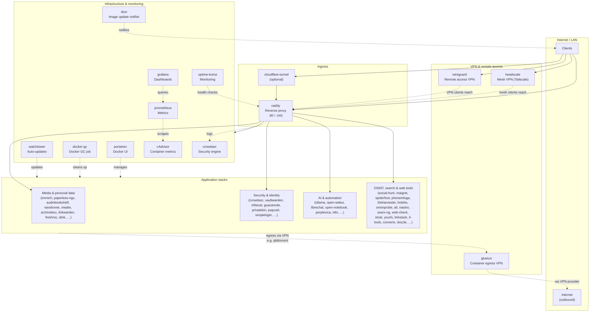

# 🐳 Docker homelab

A collection of **Docker Compose stacks** for self-hosting at home: reverse proxy, monitoring, auto-updates, document management, search, and optional Cloudflare Tunnels. Each stack lives in its own folder with a dedicated README—pick what you need and run it.

---

## 🗺️ Topology


```mermaid
flowchart TB
    subgraph internet["Internet / LAN"]
        users["Clients"]
        outbound["Internet<br>(outbound)"]
    end

    subgraph ingress["Ingress"]
        tunnel["cloudflare-tunnel<br>(optional)"]
        caddy["caddy<br>Reverse proxy<br>:80 / :443"]
    end

    subgraph vpn["VPN & remote access"]
        direction TB
        headscale["headscale<br>Mesh VPN (Tailscale)"]
        wireguard["wireguard<br>Remote access VPN"]
        gluetun["gluetun<br>Container egress VPN"]
    end

    subgraph apps["Application stacks"]
        apps_media["Media & personal data<br>(immich, paperless-ngx, audiobookshelf, navidrome, mealie, archivebox, linkwarden, freshrss, slink, …)"]
        apps_security["Security & identity<br>(crowdsec, vaultwarden, infisical, guacamole, privatebin, pwpush, simplelogin, …)"]
        apps_ai["AI & automation<br>(ollama, open-webui, librechat, open-notebook, perplexica, n8n, …)"]
        apps_osint["OSINT, search & web tools<br>(social-hunt, maigret, spiderfoot, phoneinfoga, theharvester, holehe, onionprobe, ail, naisho, searx-ng, web-check, stoat, yourls, linkstack, it-tools, convertx, dozzle, …)"]
    end

    subgraph infra["Infrastructure & monitoring"]
        direction TB
        portainer["portainer<br>Docker UI"]
        watchtower["watchtower<br>Auto-updates"]
        diun["diun<br>Image update notifier"]
        dockergc["docker-gc<br>Docker GC job"]
        kuma["uptime-kuma<br>Monitoring"]
        grafana["grafana<br>Dashboards"]
        prometheus["prometheus<br>Metrics"]
        cadvisor["cAdvisor<br>Container metrics"]
        crowdsec["crowdsec<br>Security engine"]
    end

    users --> tunnel
    users --> caddy
    tunnel --> caddy

    users --> wireguard
    users --> headscale
    wireguard -.->|VPN clients reach| caddy
    headscale -.->|mesh clients reach| caddy

    apps -.->|egress via VPN<br>e.g. qbittorrent| gluetun
    gluetun -.->|via VPN provider| outbound

    caddy --> apps_media
    caddy --> apps_security
    caddy --> apps_ai
    caddy --> apps_osint
    caddy --> infra

    caddy -.->|logs| crowdsec

    kuma -.->|health checks| caddy
    prometheus -.->|scrapes| cadvisor
    grafana -.->|queries| prometheus
    watchtower -.->|updates| apps
    dockergc -.->|cleans up| apps
    diun -.->|notifies| users
    portainer -.->|manages| apps
```

- **Traffic:** All HTTP(S) to apps and to web UIs (e.g. Uptime Kuma, Grafana) goes through Caddy. Clients reach Caddy directly (local DNS) or via Cloudflare Tunnel; Caddy routes by hostname.
- **VPN & remote access:** **Headscale** – mesh VPN (Tailscale); mesh clients reach Caddy and apps. **WireGuard** – remote-access VPN (UDP 51820); VPN clients connect from outside. **Gluetun** – outbound VPN for containers; selected stacks (e.g. qbittorrent) send traffic through Gluetun to a VPN provider.
- **Infrastructure:** Portainer manages stacks; Watchtower updates images; Docker GC cleans up; Diun notifies on image changes; Uptime Kuma monitors Caddy and app health; Grafana/Prometheus/cAdvisor provide metrics; CrowdSec consumes Caddy logs. Dozzle (behind Caddy) is a log viewer.

---

## 📦 What’s inside

| Stack | What it does |
|-------|----------------|
| [**stacks/ail**](stacks/ail/README.md) | AIL framework – analyse information leaks (pastes, trackers, MISP/TheHive, credentials/cards/keys detection) |
| [**stacks/archivebox**](stacks/archivebox/README.md) | Self-hosted web archive (ArchiveBox) – saves full snapshots (HTML, screenshots, PDFs, WARCs) from URLs and feeds |
| [**stacks/audiobookshelf**](stacks/audiobookshelf/README.md) | Audiobook and podcast server |
| [**stacks/bazarr**](stacks/bazarr/README.md) | Subtitle manager and downloader for Sonarr/Radarr libraries |
| [**stacks/blackbird**](stacks/blackbird/README.md) | OSINT: username/email search across many sites with optional PDF/CSV reports |
| [**stacks/caddy**](stacks/caddy/README.md) | Reverse proxy with automatic HTTPS (Let’s Encrypt, optional Cloudflare DNS-01) |
| [**stacks/cadvisor**](stacks/cadvisor/README.md) | Container resource metrics (CPU, memory, etc.) |
| [**stacks/cloudflare-tunnel**](stacks/cloudflare-tunnel/README.md) | Expose services via Cloudflare without port forwarding (cloudflared) |
| [**stacks/convertx**](stacks/convertx/README.md) | Self-hosted online file converter (1000+ formats: documents, images, video, e-books) |
| [**stacks/crowdsec**](stacks/crowdsec/README.md) | CrowdSec Security Engine – collaborative intrusion prevention and curated blocklists for malicious IPs |
| [**stacks/dependency-track**](stacks/dependency-track/README.md) | OWASP Dependency-Track – SBOM/dependency vulnerability tracking (upload CycloneDX/SPDX, CVE alerts) |
| [**stacks/diun**](stacks/diun/README.md) | Docker image update notifier (Telegram, Discord, etc.) |
| [**stacks/docker-gc**](stacks/docker-gc/README.md) | Garbage collector for Docker containers and images (removes old stopped containers and unused images) |
| [**stacks/dozzle**](stacks/dozzle/README.md) | Real-time container log viewer |
| [**stacks/emby**](stacks/emby/README.md) | Media server for movies, TV, and music (Emby) |
| [**stacks/freshrss**](stacks/freshrss/README.md) | RSS feed aggregator (Feedly-like) |
| [**stacks/ghunt**](stacks/ghunt/README.md) | OSINT: investigate Google accounts (email, Gaia, Drive, BSSID) via CLI with JSON export |
| [**stacks/gluetun**](stacks/gluetun/README.md) | Outbound VPN client for other containers (use via `network_mode: service:gluetun`) |
| [**stacks/grafana**](stacks/grafana/README.md) | Metrics dashboards (use with Prometheus + cAdvisor) |
| [**stacks/guacamole**](stacks/guacamole/README.md) | Clientless remote desktop gateway (RDP, VNC, SSH) with HTML5 web UI (Apache Guacamole) |
| [**stacks/headscale**](stacks/headscale/README.md) | Self-hosted Tailscale control server (mesh VPN) |
| [**stacks/holehe**](stacks/holehe/README.md) | OSINT: check where an email address has accounts via a FastAPI web UI (holehe-web) |
| [**stacks/immich**](stacks/immich/README.md) | Photo and video backup (OAuth-ready) |
| [**stacks/infisical**](stacks/infisical/README.md) | Self-hosted secrets manager (API keys, env vars, config) |
| [**stacks/it-tools**](stacks/it-tools/README.md) | Developer and IT utilities (converters, hashes, QR, etc.) |
| [**stacks/jellyfin**](stacks/jellyfin/README.md) | Open-source media server for movies, TV, and music |
| [**stacks/librechat**](stacks/librechat/README.md) | ChatGPT-style UI with agents, MCP, code interpreter (MongoDB + Redis) |
| [**stacks/lidarr**](stacks/lidarr/README.md) | Music collection manager for Usenet and torrents (Lidarr) |
| [**stacks/linkstack**](stacks/linkstack/README.md) | Self-hosted link-in-bio page (Linktree-style: one URL with your links) |
| [**stacks/linkwarden**](stacks/linkwarden/README.md) | Bookmark manager and link aggregator |
| [**stacks/maigret**](stacks/maigret/README.md) | OSINT: collect a dossier by username from thousands of sites (web UI, HTML/PDF/XMind reports) |
| [**stacks/mealie**](stacks/mealie/README.md) | Recipe manager and meal planner |
| [**stacks/metagoofil**](stacks/metagoofil/README.md) | OSINT: download documents and extract metadata (users, paths, versions) via search engines |
| [**stacks/metube**](stacks/metube/README.md) | Self-hosted yt-dlp web GUI with playlist support and download queue (MeTube) |
| [**stacks/n8n**](stacks/n8n/README.md) | Workflow automation (Zapier/Make-style, self-hosted) |
| [**stacks/naisho**](stacks/naisho/README.md) | Send data deletion request emails to data brokers at once (Rails app; SMTP in UI) |
| [**stacks/navidrome**](stacks/navidrome/README.md) | Personal music streaming server (Navidrome) – web UI and Subsonic-compatible apps |
| [**stacks/nodered**](stacks/nodered/README.md) | Low-code flow editor for automations (Node-RED) |
| [**stacks/nzbget**](stacks/nzbget/README.md) | High-performance Usenet downloader (NZBGet) |
| [**stacks/nzbhydra2**](stacks/nzbhydra2/README.md) | Meta search for Usenet indexers (Newznab-compatible API) |
| [**stacks/ollama**](stacks/ollama/README.md) | Local LLM runtime (Ollama) with GPU support and configurable model storage |
| [**stacks/onionprobe**](stacks/onionprobe/README.md) | Tor Onion Services monitoring (probe endpoints, Prometheus + Grafana + Alertmanager) |
| [**stacks/onionscan**](stacks/onionscan/README.md) | CLI to investigate Tor hidden services (OnionScan; scans for opsec/misconfig, runs over Tor in container) |
| [**stacks/open-notebook**](stacks/open-notebook/README.md) | Open-source Notebook LM alternative (SurrealDB + multi-provider AI) |
| [**stacks/open-webui**](stacks/open-webui/README.md) | Self-hosted AI chat UI; Ollama model management and multi-provider support |
| [**stacks/paperless-ngx**](stacks/paperless-ngx/README.md) | Document management with OCR and search |
| [**stacks/password-pusher**](stacks/password-pusher/README.md) | Password/secret sharing with view limits and expiration (Password Pusher) |
| [**stacks/perplexica**](stacks/perplexica/README.md) | Privacy-focused AI answering engine (bundled SearxNG, optional Ollama) |
| [**stacks/phoneinfoga**](stacks/phoneinfoga/README.md) | OSINT: phone number reconnaissance (country, carrier, line type, web footprints) with web UI/API |
| [**stacks/plex**](stacks/plex/README.md) | Media server for movies, TV, and music (Plex) |
| [**portainer**](portainer/README.md) | Docker management UI (Portainer CE) |
| [**stacks/postfix**](stacks/postfix/README.md) | SMTP relay for outbound mail from apps (Postfix) |
| [**stacks/privatebin**](stacks/privatebin/README.md) | Encrypted pastebin (share text with expiration, no account) |
| [**stacks/prometheus**](stacks/prometheus/README.md) | Metrics collection and storage |
| [**stacks/privotron**](stacks/privotron/README.md) | CLI to automate data broker opt-outs (Playwright; profiles, skip list, parallel runs) |
| [**stacks/prowlarr**](stacks/prowlarr/README.md) | Indexer manager/proxy for *arr apps (Usenet and torrent indexers) |
| [**stacks/qbittorrent**](stacks/qbittorrent/README.md) | Torrent client behind VPN (Gluetun) for *arr automation; shared `torrents` network and `torrents_downloads` |
| [**stacks/radarr**](stacks/radarr/README.md) | Movie collection manager for Usenet and torrents (Radarr) |
| [**stacks/readarr**](stacks/readarr/README.md) | Book and audiobook collection manager for Usenet and torrents (Readarr) |
| [**stacks/reconftw**](stacks/reconftw/README.md) | Automated recon framework orchestrating many tools (subdomains, ports, screenshots, Nuclei, etc.) |
| [**stacks/rtorrent-flood**](stacks/rtorrent-flood/README.md) | Manual torrent client (rTorrent) with Flood web UI |
| [**stacks/searx-ng**](stacks/searx-ng/README.md) | Privacy-respecting metasearch engine |
| [**stacks/simplelogin**](stacks/simplelogin/README.md) | Email alias service (unlimited aliases, forward & reply anonymously, Bitwarden/1Password) |
| [**stacks/slink**](stacks/slink/README.md) | Self-hosted image sharing (upload, collections, ShareX, S3/SMB) |
| [**stacks/social-hunt**](stacks/social-hunt/README.md) | OSINT framework: username search, breach lookups (HIBP/Snusbase), face match, reverse image |
| [**stacks/sonarr**](stacks/sonarr/README.md) | TV series management for Usenet and torrents |
| [**stacks/spiderfoot**](stacks/spiderfoot/README.md) | Automated multi-source OSINT scanner with 180+ modules and a web UI |
| [**stacks/stoat**](stacks/stoat/README.md) | Self-hosted Stoat chat platform (API, web, media, notifications, optional voice) |
| [**stacks/sublist3r**](stacks/sublist3r/README.md) | Subdomain enumeration tool using multiple search engines and output to files |
| [**stacks/theharvester**](stacks/theharvester/README.md) | OSINT: emails, hosts, and subdomains via multi-source recon (REST API variant) |
| [**stacks/threat-dragon**](stacks/threat-dragon/README.md) | OWASP Threat Dragon – threat modeling (diagrams, STRIDE; save to GitHub/Bitbucket/GitLab) |
| [**stacks/torbot**](stacks/torbot/README.md) | OWASP TorBot – Dark Web OSINT crawler (.onion crawl, email extraction, link tree, JSON export; Tor in separate container) |
| [**stacks/uptime-kuma**](stacks/uptime-kuma/README.md) | Status page and monitoring |
| [**stacks/vaultwarden**](stacks/vaultwarden/README.md) | Lightweight Bitwarden-compatible password manager |
| [**stacks/wireguard**](stacks/wireguard/README.md) | Remote access VPN server (LinuxServer WireGuard; UDP 51820) |
| [**stacks/watchtower**](stacks/watchtower/README.md) | Automatic container image updates (nickfedor fork, Docker 29+) |
| [**stacks/web-check**](stacks/web-check/README.md) | OSINT and website analysis tool |
| [**stacks/yourls**](stacks/yourls/README.md) | Self-hosted URL shortener (YOURLS): short links, web UI, optional API |
| [**stacks/zap**](stacks/zap/README.md) | OWASP ZAP – web/API security scanner (daemon + web UI; baseline/active scans; access via Caddy) |

Each stack has its own **README** with setup and usage; see also `portainer/README.md`.

### Optional: services that make maintenance easier

Beyond Portainer, Uptime Kuma, and Watchtower, these can reduce friction when running and debugging the stacks:

| Idea | What it does | Why it helps |
|------|----------------|--------------|
| **Dozzle** | Real-time container log viewer (single container, Docker socket) | When something breaks, see which container and what it logged without `docker logs` or Portainer log tabs. |
| **Backup** (e.g. **Restic** or **Duplicati**) | Backs up volumes and/or configs to local/NAS/S3/B2 | Configs are in git; app data (DBs, uploads) is not. A scheduled backup avoids losing data on bad updates or disk failure. |
| **Diun** | Notifies when new Docker image tags are available | Complements Watchtower: you see what images changed (e.g. Telegram/Discord/email) before or after Watchtower pulls. |
| **Grafana + Prometheus + cAdvisor** | Host and container metrics (CPU, memory, disk) | Uptime Kuma answers “is it up?”; these stacks answer “why is the host slow?” and help plan capacity. Deploy all three on the `monitor` network; see each stack’s README. |
| **Cloudflare Access (SSO)** | Login in front of tunnel subdomains | Use Zero Trust Access to protect e.g. `portainer.yourdomain.com` with Google/GitHub SSO or one-time PIN instead of basic auth. See [documents/ACCESS-SSO.md](documents/ACCESS-SSO.md). |
| **Scrutiny** | SMART disk health dashboard | Optional; useful if the host has physical disks—warn before failure. |

**Dozzle**, **Diun**, **Grafana**, **Prometheus**, and **cAdvisor** are included as stacks. Dozzle and the metrics stack are behind Caddy (see Caddyfile.example); Diun has no web UI.

---

## 🚀 Getting started

### 1. 🔐 Secrets and config

Sensitive files (`stack.env`, `config.yml`, `Caddyfile`, etc.) are gitignored. Copy from the `.example` templates in each stack and fill in your values:

- **stacks/ail** — optional `stack.env` with `TZ`; uses community image cciucd/ail-framework; >6GB RAM recommended; reset password after first login: `docker exec ail bin/LAUNCH.sh -rp`
- **stacks/archivebox** — `stack.env.example` → `stack.env`; set `ADMIN_USERNAME`, `ADMIN_PASSWORD`, `SEARCH_BACKEND_PASSWORD` (and adjust `ALLOWED_HOSTS` / `CSRF_TRUSTED_ORIGINS` for your Caddy hostnames)
- **stacks/caddy** — `stack.env.example` → `stack.env` (for Cloudflare DNS), `Caddyfile.example` → `Caddyfile`
- **stacks/cadvisor** — no config files
- **stacks/cloudflare-tunnel** — `stack.env.example` → `stack.env`, optionally `config.yml.example` → `config.yml`. To put tunnel subdomains behind SSO (e.g. Google/GitHub) instead of basic auth, see [documents/ACCESS-SSO.md](documents/ACCESS-SSO.md).
- **stacks/convertx** — `stack.env.example` → `stack.env`; set `JWT_SECRET` (recommended; `openssl rand -base64 32`); set `ACCOUNT_REGISTRATION=false` after first account
- **stacks/crowdsec** — `stack.env.example` → `stack.env` (optional); use it to set `TZ`, `GID`, and default hub `COLLECTIONS`. See the stack README and CrowdSec Docker docs for configuring acquisitions and bouncers; for Cloudflare edge blocking with the Workers bouncer, see [documents/CROWDSEC-CLOUDFLARE-WORKER.md](documents/CROWDSEC-CLOUDFLARE-WORKER.md).
- **stacks/dependency-track** — `stack.env.example` → `stack.env`; set `POSTGRES_PASSWORD` and `API_BASE_URL` (URL the browser uses for the API, e.g. https://dtrack.home/api). See stack README for Caddy path/subdomain setup.
- **stacks/diun** — `stack.env.example` → `stack.env`; set `DIUN_NOTIF_TELEGRAM_TOKEN` and `DIUN_NOTIF_TELEGRAM_CHATIDS` (or another notifier)
- **stacks/docker-gc** — `stack.env.example` → `stack.env`; by default runs in DRY RUN mode (`DRY_RUN=true`) so you can see which stopped containers and unused images would be removed. Adjust `DRY_RUN`, `DRY_RUN_CONTAINERS`, `DRY_RUN_IMAGES`, and `EXCLUDE_*` as needed before scheduling it.
- **stacks/dozzle** — no secrets; optional `DOZZLE_AUTH_*` for simple auth (see stack README)
- **stacks/freshrss** — `stack.env.example` → `stack.env`; optional `PUID`, `PGID`, `TZ`
- **stacks/gluetun** — `stack.env.example` → `stack.env`; set `TZ`, `VPN_SERVICE_PROVIDER`, `VPN_TYPE`, and provider-specific vars (e.g. WireGuard keys or OpenVPN user/pass). No HTTP; other containers use it via `network_mode: service:gluetun`. See [Gluetun docs](https://gluetun.com/configuration/).
- **stacks/grafana** — optional `stack.env` for `GF_SERVER_ROOT_URL` (e.g. https://grafana.yourdomain.com)
- **stacks/guacamole** — `stack.env.example` → `stack.env`; set `POSTGRES_PASSWORD` (strong random; shared by Postgres and the Guacamole web app); optional `POSTGRES_DB`, `POSTGRES_USER`, and `TZ`. Access via Caddy only.
- **stacks/headscale** — `stack.env.example` → `stack.env`; create `config.yaml` from `config.example.yaml`, then set `HEADSCALE_CONFIG_B64` to its base64 (e.g. `base64 -w 0 config.yaml`) in `stack.env` or in Portainer stack env
- **stacks/immich** — `stack.env.example` → `stack.env`; set `DB_PASSWORD` (and optionally `TZ`, OAuth via Admin UI)
- **stacks/infisical** — `stack.env.example` → `stack.env`; set `ENCRYPTION_KEY`, `AUTH_SECRET`, `POSTGRES_PASSWORD`, `SITE_URL` (e.g. `https://infisical.home` or `https://secrets.yourdomain.com`)
- **stacks/librechat** — `stack.env.example` → `stack.env`; set `JWT_SECRET`, `JWT_REFRESH_SECRET` (e.g. `openssl rand -base64 32`); set `MONGO_INITDB_ROOT_PASSWORD`, `REDIS_PASSWORD`; set `OLLAMA_BASE_URL` if using Ollama
- **stacks/linkstack** — `stack.env.example` → `stack.env` (all vars optional); optional `HTTP_SERVER_NAME` / `HTTPS_SERVER_NAME` when behind Caddy
- **stacks/linkwarden** — `stack.env.example` → `stack.env`; set `NEXTAUTH_SECRET`, `POSTGRES_PASSWORD`, `MEILI_MASTER_KEY` (and `NEXTAUTH_URL` if behind Caddy)
- **stacks/maigret** — no required env; optional TZ. Deploy and access via Caddy (e.g. https://maigret.home)
- **stacks/mealie** — `stack.env.example` → `stack.env`; set `BASE_URL` if behind Caddy, `ALLOW_SIGNUP` (false after first account)
- **stacks/n8n** — `stack.env.example` → `stack.env`; set `N8N_HOST` and `WEBHOOK_URL` to your Caddy URL (e.g. https://n8n.home or https://n8n.yourdomain.com); optional `N8N_ENCRYPTION_KEY`
- **stacks/naisho** — `stack.env.example` → `stack.env`; set `SECRET_KEY_BASE` (`openssl rand -hex 64`); stack builds from GitHub on first deploy; configure SMTP in the app when sending deletion emails
- **stacks/navidrome** — `stack.env.example` → `stack.env`; optional `TZ`; optional `ND_BASEURL` (when behind Caddy, set to your full Navidrome URL, e.g. https://music.yourdomain.com); optional `ND_LOGLEVEL`, `ND_SCANSCHEDULE`, and other `ND_` options (see Navidrome docs)
- **stacks/nzbget** — `stack.env.example` → `stack.env`; set `TZ`, `PUID`, `PGID`, optional `UMASK`, and optionally `NZBGET_USER`/`NZBGET_PASS` for the web UI. Configure Usenet servers in the NZBGet UI.
- **stacks/nzbhydra2** — `stack.env.example` → `stack.env`; set `TZ`, `PUID`, `PGID`, optional `UMASK`. Configure upstream indexers and API key in the NZBHydra 2 UI.
- **stacks/ollama** — `stack.env.example` → `stack.env`; optional `OLLAMA_MODELS_PATH` (absolute path recommended for models); other data uses Docker volume; GPU requires NVIDIA Container Toolkit
- **stacks/onionprobe** — run `./clone-repo.sh` once to clone the upstream repo into `./repo`; optional `stack.env` for `GRAFANA_DATABASE_PASSWORD`, `GF_SERVER_ROOT_URL`; access via Caddy (onionprobe.home → Grafana)
- **stacks/onionscan** — CLI only; no web UI or ports. Optional: `stack.env` with TZ. Start with `docker compose up -d`, wait for Tor (logs), then `docker compose exec onionscan onionscan [options] <onion-address>`. See stack README.
- **stacks/open-notebook** — `stack.env.example` → `stack.env`; set `OPEN_NOTEBOOK_ENCRYPTION_KEY` (e.g. `openssl rand -base64 32`); optional `OLLAMA_BASE_URL`
- **stacks/open-webui** — `stack.env.example` → `stack.env`; set `OLLAMA_BASE_URL` to reach Ollama (e.g. `http://ollama:11434` or `http://host.docker.internal:11434`)
- **stacks/paperless-ngx** — `stack.env.example` → `stack.env`; set `PAPERLESS_URL`, `PAPERLESS_SECRET_KEY`
- **stacks/password-pusher** — `stack.env.example` → `stack.env`; set `PWPUSH_MASTER_KEY` (generate at https://us.pwpush.com/generate_key); optional `PWP__HOST_DOMAIN` if behind Caddy
- **stacks/perplexica** — `stack.env.example` → `stack.env`; optional `PERPLEXICA_DATA_PATH`, `SEARXNG_API_URL`, `OLLAMA_BASE_URL`
- **stacks/plex** — `stack.env.example` → `stack.env`; set `TZ`, `PUID`, `PGID`, `VERSION=docker`, and optionally `PLEX_CLAIM` (from Plex) on first run to link the server to your account.
- **stacks/privotron** — no `stack.env` required; `docker compose build` then `docker compose run --rm privotron --profile NAME` (create profile with `--save-profile`). Optional: `PRIVOTRON_VERSION` when building; mount `./brokers` for `.skipbrokers`. See stack README.
- **stacks/prometheus** — no secrets; `prometheus.yml` is in the repo
- **stacks/qbittorrent** — `stack.env.example` → `stack.env`; set `TZ`, `PUID`, `PGID`; configure Gluetun VPN (`VPN_SERVICE_PROVIDER`, `VPN_TYPE`, and provider-specific vars, e.g. WireGuard keys). Create `torrents` network and `torrents_downloads` volume if not present. See stack README and [Gluetun docs](https://gluetun.com/configuration/).
- **stacks/searx-ng** — `stack.env.example` → `stack.env`; set `SEARXNG_SECRET` (and optionally `SEARXNG_BASE_URL`)
- **stacks/simplelogin** — `stack.env.example` → `stack.env`; create `data/dkim.key` (see README); set `URL`, `EMAIL_DOMAIN`, `EMAIL_SERVERS_WITH_PRIORITY`, `SUPPORT_EMAIL`, `FLASK_SECRET` (`openssl rand -hex 32`), `POSTGRES_PASSWORD`; run migration and init once (see stack README)
- **stacks/slink** — `stack.env.example` → `stack.env`; set `ORIGIN` to your Caddy URL (e.g. https://slink.home or https://slink.yourdomain.com)
- **stacks/sonarr** — `stack.env.example` → `stack.env`; set `TZ`, `PUID`, `PGID`. Configure NZBGet/qBittorrent and Prowlarr/NZBHydra 2 in the Sonarr UI.
- **stacks/stoat** — no `stack.env.example`; from the stack directory, download and run `generate_config.sh` from `stoatchat/self-hosted` to create `.env.web`, `Revolt.toml`, and `livekit.yml`; then optionally change `HOSTNAME=:80` in `.env.web` when running behind this repo’s main Caddy; see stack README and upstream docs for advanced config
- **stacks/threat-dragon** — `stack.env.example` → `stack.env`; set `SESSION_SIGNING_KEY` (e.g. `openssl rand -hex 16`); for repo storage set GitHub/Bitbucket/GitLab OAuth vars. See stack README.
- **stacks/torbot** — CLI only (OWASP TorBot). No ports. Optional: `stack.env` with TZ. Start with `docker compose up -d`, wait for Tor (`docker compose logs -f tor`), then `docker compose exec torbot torbot -u <url> --host tor --port 9050 [options]`. See stack README.
- **stacks/vaultwarden** — `stack.env.example` → `stack.env`; set `DOMAIN` if behind Caddy, `SIGNUPS_ALLOWED` (false after first account)
- **stacks/wireguard** — `stack.env.example` → `stack.env`; set `TZ`, `PUID`, `PGID`, `SERVERURL` (public IP or DNS, or `auto`), `SERVERPORT` (51820), `PEERS`. Forward UDP 51820 on your router. No Caddy hostname. See stack README.
- **stacks/web-check** — optional: `stack.env.example` → `stack.env` for API keys
- **stacks/watchtower** — TZ, LANG, LC_ALL, LC_CTYPE in `stack.env` if you choose to override defaults
- **stacks/yourls** — `stack.env.example` → `stack.env`; set `YOURLS_SITE` (e.g. https://short.home or https://short.yourdomain.com) to match Caddy hostname; set `YOURLS_USER`, `YOURLS_PASS`, `YOURLS_COOKIEKEY`, `YOURLS_DB_PASSWORD`, `YOURLS_DB_ROOT_PASSWORD`
- **stacks/zap** — Optional: `stack.env` with TZ. No host ports; access via Caddy (e.g. https://zap.home). See stack README.
- **stacks/bazarr** — `stack.env.example` → `stack.env`; set `TZ`, `PUID`, `PGID`. Wire to Sonarr and Radarr in the Bazarr UI and configure subtitle providers.
- **stacks/jellyfin** — `stack.env.example` → `stack.env`; set `TZ`, `PUID`, `PGID`. Configure libraries for `/data/tv`, `/data/movies`, `/data/music` in the Jellyfin UI.
- **stacks/lidarr** — `stack.env.example` → `stack.env`; set `TZ`, `PUID`, `PGID`. Wire to NZBGet/qBittorrent and Prowlarr/NZBHydra 2 in the Lidarr UI.
- **stacks/prowlarr** — `stack.env.example` → `stack.env`; set `TZ`, `PUID`, `PGID`. Configure indexers and app sync for Sonarr/Radarr/Lidarr/Readarr in the Prowlarr UI.
- **stacks/radarr** — `stack.env.example` → `stack.env`; set `TZ`, `PUID`, `PGID`. Wire to NZBGet/qBittorrent and Prowlarr/NZBHydra 2 in the Radarr UI.
- **stacks/readarr** — `stack.env.example` → `stack.env`; set `TZ`, `PUID`, `PGID`. Wire to NZBGet/qBittorrent and Prowlarr/NZBHydra 2 in the Readarr UI.
- **stacks/rtorrent-flood** — `stack.env.example` → `stack.env`; set `TZ`, `PUID`, `PGID`, optional `UMASK`. Configure Flood and rTorrent settings via the web UI; downloads land in the `torrents_manual` volume.

### 2. ⚙️ Shared settings

For timezone, locale, and optional per-app settings, see **[documents/ENV-VARS.md](documents/ENV-VARS.md)**.

### 3. ▶️ Deploy

From a stack directory: `docker compose up -d` (each stack’s compose loads `stack.env` via `env_file` where applicable). If a stack has no `env_file`, use `docker compose --env-file stack.env up -d` or set variables in Portainer. You can also add the stack in Portainer (Git deploy so bind-mounted config files are present).

---

## 💚 Health endpoints (Uptime Kuma)

These stacks expose a dedicated health/status URL so you can monitor them without hitting the main page:

| Stack | Endpoint |
|-------|----------|
| **headscale** | `/health` |
| **vaultwarden** | `/alive` |
| **immich** | `/api/server/ping` |
| **audiobookshelf** | `/healthcheck` |
| **mealie** | `/api/app/about` |
| **password-pusher** | `/up` |
| **yourls** | (no dedicated health endpoint; use HTTP check to app URL) |
| **navidrome** | (no dedicated health endpoint; use HTTP check to app URL, e.g. `https://music.yourdomain.com/`) |
| **ollama** | (API only; use HTTP check to `http://ollama:11434` or `/api/tags`) |
| **open-notebook** | (use HTTP check to app URL) |
| **perplexica** | (use HTTP check to app URL) |
| **open-webui** | (use HTTP check to app URL) |
| **librechat** | (use HTTP check to app URL) |
| **convertx** | (use HTTP check to app URL) |
| **slink** | (use HTTP check to app URL) |
| **n8n** | `/healthz` |

Other stacks (paperless-ngx, linkwarden, searx-ng, linkstack, caddy, infisical, etc.) have no dedicated health endpoint; use an HTTP check to the app URL if needed.

---

## 📁 Layout

The repo has a fixed top-level structure; the full list of stacks comes from the filesystem:

- **portainer/** — Portainer CE stack (Docker management UI).
- **stacks/** — One directory per stack (e.g. `stacks/caddy/`, `stacks/immich/`). Each contains `docker-compose.yml`, a README, and optionally `stack.env.example`, `clone-repo.sh`, etc. See the [**What’s inside**](#-whats-inside) table for the full list.
- **documents/** — ENV-VARS.md, ACCESS-SSO.md, and other guides.
- **.gitignore** — Excludes `.env`, `stack.env`, `config.yml`, `Caddyfile`, and other sensitive or generated files.

To print an up-to-date tree of all stack directories, run from the `docker/` repo root:

```bash
./scripts/list-layout.sh
```
