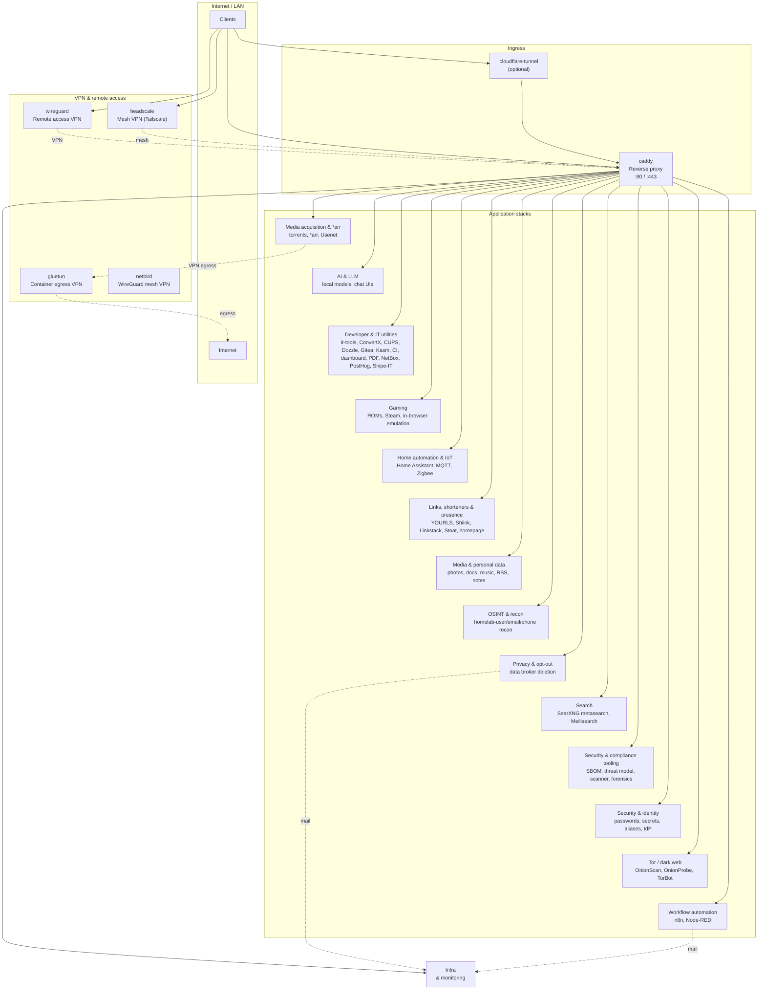
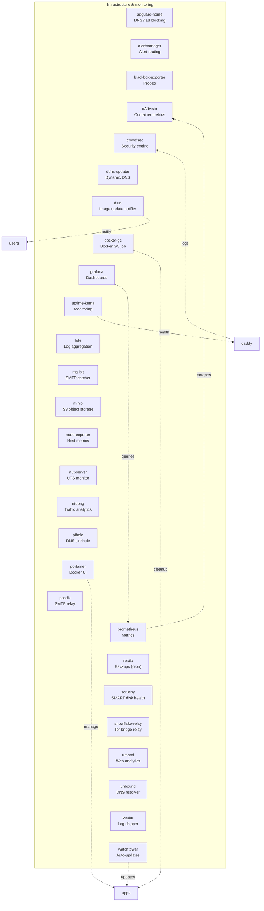

# 🐳 Docker homelab

A collection of **Docker Compose stacks** for self-hosting at home: reverse proxy, monitoring, auto-updates, document management, search, and optional Cloudflare Tunnels. Each stack lives in its own folder with a dedicated README—pick what you need and run it.

---

## 🗺️ Topology

The diagram and prose below are generated from **documents/topology.yaml**. To regenerate after editing that file, from the docker repo root run:

```bash
python3 scripts/build-topology.py --in-place
```

(Requires PyYAML: `pip install pyyaml`)

<!-- TOPOLOGY_GENERATED_START -->

```mermaid
%%{init: {'flowchart': {'curveStyle': 'linear'}}}%%
flowchart TB

    subgraph internet["Internet / LAN"]
        users["Clients"]
        outbound["Internet"]
    end

    subgraph ingress["Ingress"]
        tunnel["`cloudflare-tunnel
(optional)`"]
        caddy["`caddy
Reverse proxy
:80 / :443`"]
    end

    subgraph vpn["VPN & remote access"]
        direction TB
        headscale["`headscale
Mesh VPN (Tailscale)`"]
        wireguard["`wireguard
Remote access VPN`"]
        gluetun["`gluetun
Container egress VPN`"]
        netbird["`netbird
WireGuard mesh VPN`"]
    end

    internet ~~~ ingress ~~~ vpn

    subgraph apps["Application stacks"]
        direction TB
        apps_acquisition["`Media acquisition & *arr
torrents, *arr, Usenet`"]
        apps_ai["`AI & LLM
local models, chat UIs`"]
        apps_dev["`Developer & IT utilities
it-tools, ConvertX, CUPS, Dozzle, Gitea, Kasm, CI, dashboard, PDF, NetBox, PostHog, Snipe-IT`"]
        apps_gaming["`Gaming
ROMs, Steam, in-browser emulation`"]
        apps_home["`Home automation & IoT
Home Assistant, MQTT, Zigbee`"]
        apps_links["`Links, shorteners & presence
YOURLS, Shlink, Linkstack, Stoat, homepage`"]
        apps_media["`Media & personal data
photos, docs, music, RSS, notes`"]
        apps_osint["`OSINT & recon
homelab-user/email/phone recon`"]
        apps_privacy["`Privacy & opt-out
data broker deletion`"]
        apps_search["`Search
SearXNG metasearch, Meilisearch`"]
        apps_sec_tooling["`Security & compliance tooling
SBOM, threat model, scanner, forensics`"]
        apps_security["`Security & identity
passwords, secrets, aliases, IdP`"]
        apps_tor["`Tor / dark web
OnionScan, OnionProbe, TorBot`"]
        apps_workflow["`Workflow automation
n8n, Node-RED`"]
    end
    apps_acquisition ~~~ apps_ai ~~~ apps_dev ~~~ apps_gaming ~~~ apps_home ~~~ apps_links ~~~ apps_media ~~~ apps_osint ~~~ apps_privacy ~~~ apps_search ~~~ apps_sec_tooling ~~~ apps_security ~~~ apps_tor ~~~ apps_workflow

    infra["`Infra
& monitoring`"]

    users --> tunnel
    users --> caddy
    tunnel --> caddy
    users --> wireguard
    users --> headscale
    caddy --> apps_acquisition
    caddy --> apps_ai
    caddy --> apps_dev
    caddy --> apps_gaming
    caddy --> apps_home
    caddy --> apps_links
    caddy --> apps_media
    caddy --> apps_osint
    caddy --> apps_privacy
    caddy --> apps_search
    caddy --> apps_sec_tooling
    caddy --> apps_security
    caddy --> apps_tor
    caddy --> apps_workflow
    caddy --> infra

    wireguard -.->|VPN| caddy
    headscale -.->|mesh| caddy
    apps_acquisition -.->|VPN egress| gluetun
    gluetun -.->|egress| outbound
    apps_privacy -.->|mail| infra
    apps_workflow -.->|mail| infra
```

#### Infrastructure & monitoring


```mermaid
%%{init: {'flowchart': {'curveStyle': 'linear'}}}%%
flowchart TB

    subgraph infra["Infrastructure & monitoring"]
        direction TB
        adguard_home["`adguard-home
DNS / ad blocking`"]
        alertmanager["`alertmanager
Alert routing`"]
        blackbox_exporter["`blackbox-exporter
Probes`"]
        cadvisor["`cAdvisor
Container metrics`"]
        crowdsec["`crowdsec
Security engine`"]
        ddns_updater["`ddns-updater
Dynamic DNS`"]
        diun["`diun
Image update notifier`"]
        dockergc["`docker-gc
Docker GC job`"]
        grafana["`grafana
Dashboards`"]
        kuma["`uptime-kuma
Monitoring`"]
        loki["`loki
Log aggregation`"]
        mailpit["`mailpit
SMTP catcher`"]
        minio["`minio
S3 object storage`"]
        node_exporter["`node-exporter
Host metrics`"]
        nut_server["`nut-server
UPS monitor`"]
        ntopng["`ntopng
Traffic analytics`"]
        pihole["`pihole
DNS sinkhole`"]
        portainer["`portainer
Docker UI`"]
        postfix["`postfix
SMTP relay`"]
        prometheus["`prometheus
Metrics`"]
        restic["`restic
Backups (cron)`"]
        scrutiny["`scrutiny
SMART disk health`"]
        snowflake_relay["`snowflake-relay
Tor bridge relay`"]
        umami["`umami
Web analytics`"]
        unbound["`unbound
DNS resolver`"]
        vector["`vector
Log shipper`"]
        watchtower["`watchtower
Auto-updates`"]
    end
    adguard_home ~~~ alertmanager ~~~ blackbox_exporter ~~~ cadvisor ~~~ crowdsec ~~~ ddns_updater ~~~ diun ~~~ dockergc ~~~ grafana ~~~ kuma ~~~ loki ~~~ mailpit ~~~ minio ~~~ node_exporter ~~~ nut_server ~~~ ntopng ~~~ pihole ~~~ portainer ~~~ postfix ~~~ prometheus ~~~ restic ~~~ scrutiny ~~~ snowflake_relay ~~~ umami ~~~ unbound ~~~ vector ~~~ watchtower

    caddy["caddy"]
    apps["apps"]
    users["users"]

    caddy -.->|logs| crowdsec
    kuma -.->|health| caddy
    prometheus -.->|scrapes| cadvisor
    grafana -.->|queries| prometheus
    watchtower -.->|updates| apps
    dockergc -.->|cleanup| apps
    diun -.->|notify| users
    portainer -.->|manage| apps
```

- **Traffic:** All HTTP(S) to apps and to web UIs (e.g. Uptime Kuma, Grafana) goes through Caddy. Clients reach Caddy directly (local DNS) or via Cloudflare Tunnel; Caddy routes by hostname.
- **VPN & remote access:** **Headscale** – mesh VPN (Tailscale); mesh clients reach Caddy and apps. **WireGuard** – remote-access VPN (UDP 51820); VPN clients connect from outside. **Gluetun** – outbound VPN for containers; media acquisition stacks (e.g. qbittorrent) send traffic through Gluetun to a VPN provider.
- **Application categories:** **Media acquisition & *arr** – download clients and *arr automation (torrents, Usenet, Sonarr/Radarr/Lidarr/Readarr, Bazarr, Explo, MeTube, Mylar3, Soulseek). **AI & LLM** – local models and chat UIs (Ollama, Open WebUI, LibreChat, Open Notebook, Perplexica, Anything LLM, LiteLLM, Kokoro TTS, Whisper ASR). **Developer & IT utilities** – it-tools, ConvertX, CUPS print server, Dozzle, Gitea, Harbor, Woodpecker CI, Homarr dashboard, Baserow, Stirling-PDF, ntfy, NetBox, PostHog, Snipe-IT, code-server, Beszel, Mattermost, Terminus, NodePad, Asking-NG. **Gaming** – Steam automation (ArchiSteamFarm), ROM manager and in-browser emulation (RomM), Twitch drops mining. **Home automation & IoT** – Home Assistant, Mosquitto (MQTT), Zigbee2MQTT. **Links, shorteners & presence** – YOURLS, Shlink, Linkstack, Stoat, Glance, static homepage/landing. **Media & personal data** – consumption and personal content (photos, docs, music, tagging/organization, recipes, bookmarks, RSS, comics, eBooks, tasks, wiki, notes, budgeting, Affine, Appflowy, CryptPad, Trilium, Oasis, Paperless AI). **OSINT & recon** – homelab-user/email/phone recon, breach lookups, subdomain enumeration, AIL. **Privacy & opt-out** – data broker deletion (Naisho, Privotron). **Search** – SearXNG, Meilisearch. **Security & compliance tooling** – SBOM/vuln tracking (Dependency-Track), threat modeling (Threat Dragon), web scanner (ZAP/ZAP GUI), digital forensics (Acquire, Plaso, Docker Forensics Toolkit). **Security & identity** – passwords, secrets, aliases, remote desktop, secure sharing, IdP (Keycloak, authentik, Enclosed, RustDesk). **Tor / dark web** – OnionScan, OnionProbe, TorBot. **Workflow automation** – n8n, Node-RED, Cal.com
- **Application stacks (detail):** Each category and what it does:
- **Media acquisition & *arr:** download clients and *arr automation (torrents, Usenet, Sonarr/Radarr/Lidarr/Readarr, Bazarr, Explo, MeTube, Mylar3, Soulseek) Stacks: bazarr, explo, flaresolverr, lidarr, metube, mylar3, nzbget, nzbhydra2, qbittorrent, prowlarr, radarr, readarr, rtorrent-flood, seerr, sonarr, soulseek, whisparr.
- **AI & LLM:** local models and chat UIs (Ollama, Open WebUI, LibreChat, Open Notebook, Perplexica, Anything LLM, LiteLLM, Kokoro TTS, Whisper ASR) Stacks: anything-llm, kokoro-tts, litellm, ollama, open-webui, librechat, open-notebook, perplexica, whisper-asr.
- **Developer & IT utilities:** it-tools, ConvertX, CUPS print server, Dozzle, Gitea, Harbor, Woodpecker CI, Homarr dashboard, Baserow, Stirling-PDF, ntfy, NetBox, PostHog, Snipe-IT, code-server, Beszel, Mattermost, Terminus, NodePad, Asking-NG Stacks: asking-ng, baserow, beszel, code-server, convertx, cups, dozzle, gitea, harbor, homarr, it-tools, kasm, mattermost, netbox, nodepad, ntfy, posthog, snipe-it, stirling-pdf, terminus, woodpecker-ci.
- **Gaming:** Steam automation (ArchiSteamFarm), ROM manager and in-browser emulation (RomM), Twitch drops mining Stacks: archisteamfarm, romm, twitch-drops-miner.
- **Home automation & IoT:** Home Assistant, Mosquitto (MQTT), Zigbee2MQTT Stacks: home-assistant, mosquitto, zigbee2mqtt.
- **Links, shorteners & presence:** YOURLS, Shlink, Linkstack, Stoat, Glance, static homepage/landing Stacks: glance, homepage, linkstack, shlink, stoat, yourls.
- **Media & personal data:** consumption and personal content (photos, docs, music, tagging/organization, recipes, bookmarks, RSS, comics, eBooks, tasks, wiki, notes, budgeting, Affine, Appflowy, CryptPad, Trilium, Oasis, Paperless AI) Stacks: affine, appflowy, actual-budget, archivebox, audiobookshelf, bookstack, calibre-web, cryptpad, docuseal, emby, firefly-iii, freshrss, hedgedoc, immich, jellyfin, jellystat, joplin-server, logseq-sync, kavita, komga, lanraragi, linkding, linkwarden, mealie, navidrome, nextcloud, oasis, outline, paperless-ai-next, paperless-gpt, paperless-ngx, picard, plex, seafile, slink, super-productivity, syncthing, trilium, vikunja.
- **OSINT & recon:** homelab-user/email/phone recon, breach lookups, subdomain enumeration, AIL Stacks: social-hunt, maigret, spiderfoot, phoneinfoga, theharvester, holehe, blackbird, ghunt, metagoofil, reconftw, sublist3r, ail, web-check.
- **Privacy & opt-out:** data broker deletion (Naisho, Privotron) Stacks: naisho, privotron.
- **Search:** SearXNG, Meilisearch Stacks: meilisearch, searx-ng.
- **Security & compliance tooling:** SBOM/vuln tracking (Dependency-Track), threat modeling (Threat Dragon), web scanner (ZAP/ZAP GUI), digital forensics (Acquire, Plaso, Docker Forensics Toolkit) Stacks: acquire, dependency-track, docker-forensics-toolkit, plaso, threat-dragon, zap, zed-attack-proxy.
- **Security & identity:** passwords, secrets, aliases, remote desktop, secure sharing, IdP (Keycloak, authentik, Enclosed, RustDesk) Stacks: authentik, enclosed, guacamole, infisical, keycloak, password-pusher, privatebin, rustdesk, simplelogin, vaultwarden.
- **Tor / dark web:** OnionScan, OnionProbe, TorBot Stacks: onionprobe, onionscan, torbot.
- **Workflow automation:** n8n, Node-RED, Cal.com Stacks: calcom, n8n, node-red.
- **Infrastructure:** Portainer manages stacks; Watchtower updates images; Docker GC cleans up; Diun notifies on image changes; Uptime Kuma monitors Caddy and app health; Grafana/Prometheus/cAdvisor provide metrics; CrowdSec consumes Caddy logs. **MinIO** provides S3-compatible object storage, often used as a backend for apps and backups; **Restic** handles scheduled backups to object storage; **Scrutiny** monitors disk SMART health. **Postfix** – SMTP relay for outbound mail from apps (e.g. Naisho, n8n). Dozzle (behind Caddy) is a log viewer.
- **Relations:**
  - **users → tunnel**: Clients use optional Cloudflare Tunnel to reach Caddy.
  - **users → caddy**: Clients reach Caddy directly (local DNS or tunnel).
  - **tunnel → caddy**: Tunnel forwards to Caddy by hostname.
  - **users → wireguard**: Clients connect via WireGuard for remote access.
  - **users → headscale**: Clients join mesh via Headscale (Tailscale).
  - **caddy → apps**: Caddy routes HTTP(S) to all application stacks by hostname.
  - **caddy → infra**: Caddy is managed and monitored by infra services.
  - **wireguard → caddy** (VPN): VPN clients reach Caddy and apps.
  - **headscale → caddy** (mesh): Mesh clients reach Caddy and apps.
  - **apps_acquisition → gluetun** (VPN egress): Media acquisition stacks send traffic through Gluetun (VPN).
  - **gluetun → outbound** (egress): Gluetun egresses via VPN provider to internet.
  - **apps_privacy → postfix** (mail): Privacy/opt-out apps send mail via Postfix.
  - **apps_workflow → postfix** (mail): Workflow apps (e.g. n8n) send mail via Postfix.
  - **postfix → mailpit** (relay (internal-only)): When RELAYHOST=mailpit:1025, Postfix relays to Mailpit; no external delivery.
  - **caddy → crowdsec** (logs): Caddy logs feed CrowdSec security engine.
  - **kuma → caddy** (health): Uptime Kuma monitors Caddy and app health.
  - **prometheus → cadvisor** (scrapes): Prometheus scrapes cAdvisor for container metrics.
  - **grafana → prometheus** (queries): Grafana queries Prometheus for dashboards.
  - **watchtower → apps** (updates): Watchtower updates container images for app stacks.
  - **dockergc → apps** (cleanup): Docker GC cleans stopped containers and unused images.
  - **diun → users** (notify): Diun notifies users of new image tags.
  - **portainer → apps** (manage): Portainer manages Docker stacks and containers.
<!-- TOPOLOGY_GENERATED_END -->


---

## 📦 What’s inside

The catalog below is generated from every `stacks/<name>/README.md`. Regenerate
it after adding or renaming a stack:

```bash
python3 scripts/build-stack-catalog.py
```

<!-- STACK_CATALOG_GENERATED_START -->
| Stack | What it does |
|---|---|
| [**acquire**](stacks/acquire/README.md) | Gather forensic artifacts from disk images or a live system into a single archive. [Acquire](https://docs.dissect.tools/en/stable/projects/acquire/index.html) uses the [Dissect](https://dissect.tools/) framework: it collects modules (paths/globs) by profile (`full`, `default`, `minimal`, `none`) and outputs a lightweight container for triage. Supports VMDK, E01, and other formats via Dissect; optional volatile (memory) collection. |
| [**actual-budget**](stacks/actual-budget/README.md) | [Actual Budget](https://actualbudget.org/) is a local-first, open-source budgeting app with envelope-style budgeting and optional sync. This stack runs the **Actual sync server** so you can use the desktop/mobile app with cloud sync. No host ports; put it behind Caddy. |
| [**adguard-home**](stacks/adguard-home/README.md) | Network-wide DNS-level ad and tracker blocking. Run AdGuard Home on your Docker host as the primary DNS server for your LAN and expose the web UI via Caddy. |
| [**affine**](stacks/affine/README.md) | AFFiNE is a self-hosted collaborative knowledge workspace combining docs, whiteboards, and a knowledge graph in one app. |
| [**afl-libfuzzer**](stacks/afl-libfuzzer/README.md) | Coverage-guided fuzzing toolbox (AFL++ and libFuzzer) for discovering crashes and vulnerabilities in binaries and libraries. |
| [**ail**](stacks/ail/README.md) | `docker exec ail bin/LAUNCH.sh -rp` (If the image uses a different path, use the path to `LAUNCH.sh` inside the container.) |
| [**ail-framework**](stacks/ail-framework/README.md) | `docker exec ail-framework bin/LAUNCH.sh -rp` (If the container name or path differs, adjust accordingly.) Then read the new password: `docker exec ail-framework cat /opt/AIL/DEFAULT_PASSWORD` This resets **`admin@admin.test`** (creates it if missing, or sets a new password if it already exists). It also writes a **new API key** for that user. If you had renamed the admin email, log in as **`admin@admin.test`** with the new password, then clean up duplicate users in the UI if needed. |
| [**alertmanager**](stacks/alertmanager/README.md) | Prometheus Alertmanager for routing alerts (email, webhooks, chat, etc.) based on labels. Use it together with the Prometheus stack in this repo to turn metrics into actionable notifications. |
| [**anything-llm**](stacks/anything-llm/README.md) | All-in-one **RAG workspace**: upload documents, build vector workspaces, and chat with **Ollama** (or other providers) using built-in **LanceDB**. |
| [**appflowy**](stacks/appflowy/README.md) | AppFlowy self-hosting stack scaffold for Caddy/Portainer deployment. |
| [**archisteamfarm**](stacks/archisteamfarm/README.md) | Steam card idling and automation. ASF runs in the background, optionally exposing a web IPC (API + ASF-ui) for management. Access via Caddy at **https://asf.yourdomain.com** (or your configured hostname). |
| [**archivebox**](stacks/archivebox/README.md) | Self-hosted web archive: save full copies of web pages (HTML, screenshots, PDFs, and WARCs) from URLs, bookmarks, and feeds. |
| [**asking**](stacks/asking/README.md) | Lightweight self-hosted strawpoll-style polling app with a Next.js frontend and Node.js API backed by PostgreSQL. |
| [**asking-ng**](stacks/asking-ng/README.md) | Lightweight poll application (frontend + API + PostgreSQL) for homelab deployment. |
| [**atomic-red-team**](stacks/atomic-red-team/README.md) | Atomic Red Team is a library of small, portable adversary-simulation tests mapped to MITRE ATT&CK techniques. |
| [**audiobookshelf**](stacks/audiobookshelf/README.md) | Self-hosted podcast (and audiobook) server: subscribe to podcasts, stream or download episodes, sync progress across web and mobile apps. |
| [**auth-fuzz**](stacks/auth-fuzz/README.md) | HTTP authentication fuzzer for testing login endpoints against wordlists and brute-force attack patterns. |
| [**authentik**](stacks/authentik/README.md) | [authentik](https://goauthentik.io/) is an open-source identity provider and access management platform. It can act as an OIDC/OAuth2/SAML IdP for your other stacks (e.g. Outline, Grafana, Immich, Linkwarden) and integrates well with reverse proxies and Kubernetes/containers. |
| [**auto-identity-remove**](stacks/auto-identity-remove/README.md) | Local LLM-powered PII redaction service. Accepts document uploads and returns redacted PDFs with personal information blacked out. Runs entirely on-prem — no data leaves the host. |
| [**baserow**](stacks/baserow/README.md) | [Baserow](https://baserow.io/) is an open-source no-code database and spreadsheet (tables, views, API). This stack runs Baserow with embedded SQLite; for production or heavy use you can switch to Postgres (see [Baserow Docker docs](https://baserow.io/docs/installation/install-with-docker-compose)). No host ports; put it behind Caddy. |
| [**bazarr**](stacks/bazarr/README.md) | Bazarr is a subtitle manager and downloader for Sonarr and Radarr. It automatically searches for subtitles in your preferred languages and keeps them up to date for your TV and movie library. |
| [**beszel**](stacks/beszel/README.md) | Lightweight server monitoring with Docker/Podman stats, historical metrics, and alerts. The **hub** is the web UI and API; **agents** run on each host you want to monitor ([Beszel](https://beszel.dev/), [GitHub](https://github.com/henrygd/beszel)). |
| [**blackbird**](stacks/blackbird/README.md) | OSINT tool to search for accounts by homelab-user or email across many sites (Sherlock-like, with extended coverage and report export). Supports PDF/CSV reports and optional AI-based profiling. |
| [**blackbox-exporter**](stacks/blackbox-exporter/README.md) | Prometheus Blackbox Exporter for probing endpoints over HTTP, TCP, and other protocols. Use it with Prometheus and Alertmanager to create synthetic checks (e.g. “can I reach my tunnel hostname from inside the homelab?”). |
| [**bookstack**](stacks/bookstack/README.md) | [BookStack](https://www.bookstackapp.com/) is a simple, self-hosted wiki for storing documentation in books, chapters, and pages. This stack runs BookStack with MariaDB behind Caddy. No host ports; access via Caddy. |
| [**caddy**](stacks/caddy/README.md) | Reverse proxy with automatic HTTPS. Proxies to services on the host via `host.docker.internal`. Supports local DNS (e.g. AdGuard Home) and public access (Cloudflare Tunnel or port forwarding). |
| [**cadvisor**](stacks/cadvisor/README.md) | Container resource metrics (CPU, memory, network, filesystem) for all containers on the host. Prometheus scrapes cAdvisor; Grafana displays the data (e.g. dashboard 893). |
| [**calcom**](stacks/calcom/README.md) | Self-hosted open-source scheduling platform. Lets users share booking links, configure availability, and manage appointments without relying on Calendly or similar SaaS tools. Backed by PostgreSQL and Redis. |
| [**calibre-web**](stacks/calibre-web/README.md) | Web UI for an existing Calibre library: browse, read, and download eBooks. Uses your Calibre database (`metadata.db`) and book files. Supports OPDS, optional ebook conversion (Docker mod), and Google OAuth. |
| [**camofox-browser**](stacks/camofox-browser/README.md) | Anti-detection browser server for AI agents. Wraps Camoufox (a Firefox fork with C++-level fingerprint spoofing) in a REST API. Accessibility snapshots, stable element refs, session isolation, proxy support. |
| [**clark-browser**](stacks/clark-browser/README.md) | Stealth Chromium for browser automation. Anti-fingerprinting patches compiled directly into Chromium source — not fragile JS shims. Exposes a CDP endpoint that Playwright connects to via connect_over_cdp(). |
| [**cloudflare-tunnel**](stacks/cloudflare-tunnel/README.md) | Exposes services on your Docker host via Cloudflare—no port forwarding or dynamic IP. Traffic goes outbound from host → Cloudflare → your services. |
| [**code-server**](stacks/code-server/README.md) | LinuxServer image **`lscr.io/linuxserver/code-server`**. No host config directory is required: settings and extensions persist in the Docker volume **`code_server_config`** mounted at **`/config`**. |
| [**convertx**](stacks/convertx/README.md) | Self-hosted online file converter supporting **1000+ formats**: documents (LibreOffice, Pandoc), images (ImageMagick, Vips, HEIF, JPEG XL), video (FFmpeg), e-books (Calibre), 3D (Assimp), and more. Written with TypeScript, Bun and Elysia. |
| [**cowrie**](stacks/cowrie/README.md) | Cowrie is a medium-to-high interaction SSH and Telnet honeypot that logs brute-force attacks and shell interaction. |
| [**crowdsec**](stacks/crowdsec/README.md) | CrowdSec is a collaborative, open-source intrusion prevention system. It analyzes logs from your services, detects aggressive IPs and known attack patterns, and uses curated blocklists and community telemetry to help you block malicious traffic before it reaches your apps. |
| [**cryptpad**](stacks/cryptpad/README.md) | End-to-end encrypted collaborative office tools (docs, sheets, kanban, forms, drive) behind Caddy. |
| [**cups**](stacks/cups/README.md) | Self-hosted **CUPS** print server with a web admin UI, **IPP** sharing, and common Debian printer drivers. Suitable as a homelab “cloud print” hub: add printers in the UI, then point clients at `ipp://…` or install the queue via your OS print settings. |
| [**databasus**](stacks/databasus/README.md) | Databasus is a lightweight self-hosted database management UI for browsing and querying SQL databases via a web interface. |
| [**dbgate**](stacks/dbgate/README.md) | DbGate is an open-source database manager supporting MySQL, PostgreSQL, SQLite, MongoDB, and more via a web or desktop UI. |
| [**ddns-updater**](stacks/ddns-updater/README.md) | Lightweight DDNS client that keeps **A** and **AAAA** records updated across [many DNS providers](https://github.com/qdm12/ddns-updater/blob/master/README.md). Includes a small **web UI** on port 8000, optional [Shoutrrr](https://github.com/nicholas-fedor/shoutrrr) notifications, and a built-in Docker healthcheck (DNS verification of your records). |
| [**dependency-track**](stacks/dependency-track/README.md) | Software Composition Analysis (SCA) platform: upload SBOMs (CycloneDX, SPDX), track components, and get vulnerability alerts from NVD, OSS Index, GitHub Advisories, and more. [Dependency-Track](https://dependencytrack.org/) provides a web UI and REST API—no host ports; access via Caddy. |
| [**dionaea-conpot**](stacks/dionaea-conpot/README.md) | Dionaea and ConPot are multi-protocol malware and industrial-control honeypots that capture exploits, payloads, and ICS/SCADA probe traffic. |
| [**dispatcharr**](stacks/dispatcharr/README.md) | Dispatcharr is a self-hosted stream routing and EPG management tool for organizing IPTV channels and playlist sources. |
| [**diun**](stacks/diun/README.md) | Docker image update notifier. Watches your running containers’ images and sends a notification when new tags are available (e.g. Telegram, Discord, webhook). Complements Watchtower: you see what changed before or after Watchtower pulls. No web UI; no Caddy reverse proxy needed. |
| [**docker-forensics-toolkit**](stacks/docker-forensics-toolkit/README.md) | Post-mortem analysis of Docker runtime environments from forensic copies of a Docker host’s disk. [Docker Forensics Toolkit](https://github.com/docker-forensics-toolkit/toolkit) can mount host disk images, list containers/images, show configs and logs, mount container filesystems, and extract metadata for timeline analysis (e.g. with Sleuth Kit’s `mactime`). |
| [**docker-gc**](stacks/docker-gc/README.md) | Garbage collector for Docker containers and images. Runs a one-shot cleanup against the Docker daemon on the host using the Docker socket. |
| [**docuseal**](stacks/docuseal/README.md) | [DocuSeal](https://www.docuseal.co/) is an open-source platform for building PDF forms, collecting signatures, and sending signing links. This stack runs the official **DocuSeal** image with **PostgreSQL** behind Caddy (no published ports on the host). |
| [**dozzle**](stacks/dozzle/README.md) | Real-time Docker container log viewer. One container, no database; uses the Docker socket to list containers and stream logs. Handy when debugging which service is failing without jumping between Portainer log tabs or `docker logs`. |
| [**emby**](stacks/emby/README.md) | Media server for movies, TV shows, and music. Emby serves your library to web, mobile, and TV apps and supports hardware-accelerated transcoding. |
| [**enclosed**](stacks/enclosed/README.md) | Minimal web app for sharing **end-to-end encrypted** notes and files: the server only stores ciphertext (similar idea to PrivateBin / Bitwarden Send). |
| [**ersatztv**](stacks/ersatztv/README.md) | ErsatzTV is a self-hosted virtual cable TV server that creates linear TV channels from your media library. |
| [**explo**](stacks/explo/README.md) | [Explo](https://github.com/LumePart/Explo) is a scheduled discovery worker for self-hosted music systems. It fetches personalized recommendations (ListenBrainz) and requests tracks from YouTube and/or Soulseek into your library. |
| [**firecrawl**](stacks/firecrawl/README.md) | Web scraping and crawling API that converts any website into LLM-ready markdown or structured data. |
| [**firefly-iii**](stacks/firefly-iii/README.md) | [Firefly III](https://www.firefly-iii.org/) is a self-hosted personal finance manager for tracking accounts, transactions, budgets, and reports. |
| [**flaresolverr**](stacks/flaresolverr/README.md) | Proxy server that solves Cloudflare and DDoS-GUARD browser challenges and returns HTML, cookies, and user-agent for use with other HTTP clients (for example *arr indexers or Jackett). |
| [**flood**](stacks/flood/README.md) | Flood provides a web interface for the bundled rTorrent service. Both services share the `torrents_manual` download volume and rTorrent socket volume. |
| [**freshrss**](stacks/freshrss/README.md) | Self-hosted RSS feed aggregator: subscribe to feeds, categories, star articles, and use extensions. Feedly-like experience with no account limits. |
| [**ghunt**](stacks/ghunt/README.md) | OSINT framework for investigating Google accounts and assets: emails, Gaia IDs, Drive files, BSSIDs, and Digital Asset Links. Provides CLI modules with JSON export and requires a one-time login using the GHunt Companion browser extension. |
| [**gitea**](stacks/gitea/README.md) | [Gitea](https://about.gitea.com/) is a lightweight, self-hosted Git service with a web UI, issue tracking, and basic CI integrations. |
| [**gitlab**](stacks/gitlab/README.md) | GitLab is a self-hosted DevSecOps platform providing Git repositories, CI/CD pipelines, issue tracking, and a container registry. |
| [**gitlab-runners**](stacks/gitlab-runners/README.md) | GitLab Runners are CI/CD job execution agents that connect to a GitLab instance and run pipeline jobs in isolated containers. |
| [**glance**](stacks/glance/README.md) | [Glance](https://github.com/glanceapp/glance) is a lightweight dashboard for RSS, weather, markets, Docker status, custom widgets, and more. Configuration is YAML (`config/glance.yml`). This stack runs Glance behind Caddy on the shared `monitor` network; there are no host port bindings. |
| [**gluetun**](stacks/gluetun/README.md) | Outbound VPN client so **specific containers** can use a commercial VPN without putting the whole host behind it. Other stacks attach with `network_mode: service:gluetun` (e.g. the qbittorrent stack uses its own Gluetun instance; this stack is for a shared or alternate VPN client). |
| [**gotenberg**](stacks/gotenberg/README.md) | Gotenberg is a stateless API microservice for converting HTML, Markdown, Office documents, and URLs to PDF using headless Chrome and LibreOffice. |
| [**grafana**](stacks/grafana/README.md) | Dashboard and visualization for Prometheus (and other datasources). Use with the Prometheus and cAdvisor stacks for host and container metrics. |
| [**grafana-alloy**](stacks/grafana-alloy/README.md) | Grafana Alloy collects Docker container logs and ships them to Loki, and exposes self-observability metrics for Prometheus to scrape. |
| [**guacamole**](stacks/guacamole/README.md) | Clientless remote desktop gateway for **RDP**, **VNC**, and **SSH** accessible entirely through a modern HTML5 web browser—no client software required. Once deployed, you reach all your configured desktops and servers via a single Guacamole web UI. |
| [**handbrake**](stacks/handbrake/README.md) | HandBrake is an open-source video transcoder that converts video files between formats and compresses media. |
| [**harbor**](stacks/harbor/README.md) | [Harbor](https://goharbor.io/) is a cloud-native container registry providing policies, RBAC, replication, scanning, and a web UI. Harbor is normally installed using its own installer, which generates a dedicated `docker-compose.yml` and `harbor.yml` config. |
| [**hashcat**](stacks/hashcat/README.md) | Hashcat is the world's fastest and most advanced password recovery utility supporting hundreds of hash types. |
| [**headscale**](stacks/headscale/README.md) | Self-hosted implementation of the Tailscale control server. Lets you run your own Tailscale-style mesh VPN and use Tailscale clients (or headscale-specific options) to connect. |
| [**hedgedoc**](stacks/hedgedoc/README.md) | [HedgeDoc](https://hedgedoc.org/) is a collaborative markdown editor for real-time note taking and documentation, similar to HackMD. This stack runs HedgeDoc with Postgres behind Caddy. |
| [**holehe**](stacks/holehe/README.md) | Holehe checks if an email address is registered on many websites using their “forgot password” flows, without sending emails to the target. This stack wraps the **holehe-web** FastAPI app to provide a simple web UI and CSV export. |
| [**homarr**](stacks/homarr/README.md) | [Homarr](https://homarr.dev/) is a dashboard for your homelab: add links to your services, widgets (Docker, Uptime Kuma, etc.), and optional integrations. This stack runs Homarr behind Caddy. No host ports; access via Caddy. |
| [**home-assistant**](stacks/home-assistant/README.md) | Home automation hub for integrating lights, sensors, switches, and other devices. This stack runs Home Assistant in Docker with persistent config and exposes the web UI via Caddy. |
| [**homepage**](stacks/homepage/README.md) | Static **landing page** (e.g. “under construction”) for your root domain or a dedicated hostname. One nginx container serves files from `./www`; no database or app logic. Replace the default `www/index.html` with your own content when you are ready. |
| [**immich**](stacks/immich/README.md) | Self-hosted photo and video backup: upload from phones and the web, face detection, search, and albums. |
| [**infisical**](stacks/infisical/README.md) | Self-hosted secrets manager for API keys, environment variables, and config. Sync secrets to apps, CI/CD, and CLI. Open-source alternative to Doppler, Vault (simpler), and env vaults. |
| [**influxdb**](stacks/influxdb/README.md) | InfluxDB is an open-source time-series database optimized for storing metrics, events, and analytics data. |
| [**it-tools**](stacks/it-tools/README.md) | Collection of handy online tools for developers, with great UX. A comprehensive set of utilities for developers and IT professionals. |
| [**jellyfin**](stacks/jellyfin/README.md) | Open-source media server for movies, TV shows, and music. Jellyfin serves your media library to web, mobile, and TV apps with no proprietary cloud dependency. |
| [**jellystat**](stacks/jellystat/README.md) | [Jellystat](https://github.com/CyferShepard/Jellystat) is a free, open-source statistics app for [Jellyfin](https://jellyfin.org/) (session monitoring, libraries, watch history, and related metrics). This stack runs the official [Docker image](https://hub.docker.com/r/cyfershepard/jellystat) with a dedicated PostgreSQL instance. |
| [**joplin-server**](stacks/joplin-server/README.md) | [Joplin Server](https://joplinapp.org/help/server/) is the official synchronization backend for Joplin note-taking clients. This stack runs Joplin Server with Postgres behind Caddy. |
| [**kali**](stacks/kali/README.md) | Kali Linux is a Debian-based distribution packed with offensive security and penetration testing tools. |
| [**kasm**](stacks/kasm/README.md) | Container streaming platform for **browser-based access to desktops and applications**. Delivers on-demand, disposable Docker containers (Remote Browser Isolation, DaaS, secure remote access) streamed to the web—no client software or VPN required. Powered by KasmVNC. |
| [**kavita**](stacks/kavita/README.md) | Comics, manga, and eBook server with a built-in web reader, OPDS support, and reading progress. Single app for mixed libraries (CBZ, CBR, EPUB, etc.). Can run alongside Komga and Calibre-Web or replace one of them depending on preference. |
| [**keycloak**](stacks/keycloak/README.md) | [Keycloak](https://www.keycloak.org/) is an open-source identity and access management solution. It provides SSO, identity brokering, and user management, and can act as an OpenID Connect / OAuth 2.0 / SAML IdP for your other stacks (e.g. Outline, Grafana, Immich, Linkwarden). |
| [**kokoro-tts**](stacks/kokoro-tts/README.md) | Open **https://kokoro-tts.home/web** (or your internal hostname) to try voices. API base on Docker: **`http://kokoro-tts:8880/v1`** with a dummy API key (e.g. `not-needed`). Add your own public `site` in Caddy only if you intentionally expose TTS on the Internet. |
| [**kometa**](stacks/kometa/README.md) | Kometa (formerly Plex Meta Manager) is a tool that automatically manages Plex library metadata, overlays, and collections. |
| [**komga**](stacks/komga/README.md) | Self-hosted comics and manga server: organize, browse, and read CBZ, CBR, PDF, and EPUB in the browser. OPDS support for apps like Tachiyomi; multi-user with reading progress and library-level permissions. |
| [**lanraragi**](stacks/lanraragi/README.md) | Tag-based comic and manga archive manager. Upload or drop CBR, CBZ, PDF, and other archives; organize with namespaced tags and plugins for metadata. Good for large, tag-heavy libraries (e.g. doujinshi, manga). Reads from archives without extracting. |
| [**librechat**](stacks/librechat/README.md) | Enhanced ChatGPT Clone with support for multiple AI providers, agents, MCP, code interpreter, and more. |
| [**lidarr**](stacks/lidarr/README.md) | Music collection manager for Usenet and torrents. Lidarr tracks artists and albums, grabs them from NZB/torrent indexers, and keeps your library organized. |
| [**linkding**](stacks/linkding/README.md) | [Linkding](https://linkding.link/) is a simple, self-hosted bookmark manager with tags, full-text search, and import (Netscape bookmarks, etc.). This stack runs Linkding behind Caddy. No host ports; access via Caddy. |
| [**linkstack**](stacks/linkstack/README.md) | Self-hosted **link-in-bio** page (Linktree-style): one URL that shows your profile and a list of links (social, projects, etc.). Customizable themes, optional multi-user, no database required—data lives in the container volume. |
| [**linkwarden**](stacks/linkwarden/README.md) | Self-hosted bookmark manager and link aggregator: save links, archive pages, organize with collections, full-text search. |
| [**litellm**](stacks/litellm/README.md) | OpenAI-compatible **LLM proxy** for Ollama, OpenAI, Anthropic, Azure, and [many other providers](https://docs.litellm.ai/docs/providers). |
| [**logseq-sync**](stacks/logseq-sync/README.md) | This stack is a thin wrapper around the community [logseq-sync](https://github.com/bcspragu/logseq-sync) backend implementation. It is **experimental** and not an official Logseq product. Integration with the Logseq clients may require code modifications or custom builds; see the upstream repository for current status and instructions. |
| [**loki**](stacks/loki/README.md) | [Loki](https://grafana.com/oss/loki/) is a log aggregation system from Grafana, optimized for storing and querying logs with Prometheus-style labels. This stack runs a single-node Loki instance. Deploy **Promtail** (`stacks/promtail`) separately to ship host and container logs to Loki. |
| [**maigret**](stacks/maigret/README.md) | OSINT tool: collect a dossier on a person **by homelab-user only**, checking thousands of sites and gathering available info from profile pages. No API keys. Fork of Sherlock with profile parsing, recursive search, and report export (HTML, PDF, XMind). |
| [**mailpit**](stacks/mailpit/README.md) | Local **SMTP catcher** for development and testing. Receives all mail on port 1025 and displays it in a web UI (port 8025). No external delivery—ideal for internal-only mailing when combined with the Postfix relay. |
| [**maloja**](stacks/maloja/README.md) | Maloja is a self-hosted music scrobble server that tracks your listening history and provides statistics. |
| [**matomo**](stacks/matomo/README.md) | Matomo is a self-hosted, privacy-respecting web analytics platform that gives you full ownership of your data. |
| [**mattermost**](stacks/mattermost/README.md) | Self-hosted team chat and collaboration with PostgreSQL backend, proxied by Caddy. |
| [**mealie**](stacks/mealie/README.md) | Self-hosted recipe manager and meal planner: import recipes from URLs, plan meals, generate shopping lists, and organize cookbooks. |
| [**meilisearch**](stacks/meilisearch/README.md) | [Meilisearch](https://www.meilisearch.com/) is a fast, typo-tolerant search engine with an HTTP API. Use it as a search backend for your apps or custom UIs. This stack runs Meilisearch behind Caddy. No host ports; access via Caddy. |
| [**metagoofil**](stacks/metagoofil/README.md) | OSINT tool for extracting metadata from publicly available documents (PDF, DOC, XLS, PPT, etc.) discovered via Google. Downloads files for a given domain and can reveal homelab-users, software versions, paths, and other metadata. No upstream Docker image; built from source. |
| [**metube**](stacks/metube/README.md) | Self-hosted web GUI for `yt-dlp`/`youtube-dl` with playlist support and a download queue. Lets you send video URLs from your browser and download them as video or audio to your homelab storage. |
| [**minio**](stacks/minio/README.md) | [MinIO](https://min.io/) is a high-performance, S3-compatible object store. Use it as a backend for backups (e.g. the `restic` stack), application uploads, logs, and other large objects. |
| [**mosquitto**](stacks/mosquitto/README.md) | Lightweight MQTT broker for Home Assistant, Zigbee2MQTT, Node-RED, and other IoT/automation clients. |
| [**mylar3**](stacks/mylar3/README.md) | Automated comic book downloader (CBR/CBZ) for Usenet and torrents. Tracks series, fetches new issues via NZBGet or qBittorrent, and organizes them into a comics folder. Pair with **Komga** by pointing Komga’s library at the same path as Mylar3’s completed comics (e.g. `/comics` or a bind-mounted host path). |
| [**n8n**](stacks/n8n/README.md) | Workflow automation: connect apps, APIs, and services with a visual editor. Self-hosted alternative to Zapier/Make. Uses SQLite by default (data in Docker volume); optional Postgres for scaling. |
| [**naisho**](stacks/naisho/README.md) | Send personal data deletion request emails to hundreds of data brokers at once. Free, open-source Rails app: you compose your request, pick which companies to contact, and Naisho sends the emails via SMTP. |
| [**navidrome**](stacks/navidrome/README.md) | Self-hosted music streaming server: index your music library and stream it from anywhere with a modern web UI and Subsonic-compatible mobile apps (Android/iOS, desktop players, etc.). Navidrome is lightweight, fast, and handles very large libraries. |
| [**netbird**](stacks/netbird/README.md) | Self-hosted [NetBird](https://netbird.io/) control plane: WireGuard-based mesh VPN with a web dashboard, embedded identity (Dex), and combined management/signal/relay in one server image ([NetBird Docs](https://docs.netbird.io/selfhosted/selfhosted-quickstart)). |
| [**netboot.xyz**](stacks/netboot.xyz/README.md) | netboot.xyz is a network boot utility that lets you PXE-boot into dozens of OS installers and live environments from a single menu. |
| [**netbox**](stacks/netbox/README.md) | NetBox is an IPAM (IP address management) and DCIM (data center infrastructure management) tool for documenting networks, devices, racks, and circuits. The recommended Docker deployment is maintained in the **netbox-docker** project. |
| [**netexec**](stacks/netexec/README.md) | NetExec (formerly CrackMapExec) is a network pentesting framework for enumerating and attacking Active Directory and network services. |
| [**nextcloud**](stacks/nextcloud/README.md) | [Nextcloud](https://nextcloud.com/) is a self-hosted file sync and sharing platform with support for calendar, contacts, tasks, and many apps. This stack runs Nextcloud behind Caddy with Postgres and Redis. |
| [**node-exporter**](stacks/node-exporter/README.md) | Prometheus Node Exporter for host-level metrics (CPU, memory, disk, network). Use with Prometheus and Grafana (e.g. dashboard **1860** – Node Exporter Full). |
| [**node-red**](stacks/node-red/README.md) | Node-RED is a **flow-based, low-code programming tool** for wiring together hardware devices, APIs, and online services. It lets you build automations as drag‑and‑drop flows that react to events, timers, webhooks, MQTT messages, and more. |
| [**nodepad**](stacks/nodepad/README.md) | Spatial, AI-augmented thinking canvas ([nodepad](https://github.com/mskayyali/nodepad)) — notes on a canvas with automatic classification and connections. **API keys are stored only in the browser** (per upstream); the container just serves the Next.js UI. |
| [**ntfy**](stacks/ntfy/README.md) | [ntfy](https://ntfy.sh/) is a simple HTTP-based pub-sub notification service. Send push notifications via PUT/POST; use the Android/iOS app or curl to subscribe. This stack runs ntfy behind Caddy. No host ports; access via Caddy. |
| [**ntopng**](stacks/ntopng/README.md) | Network traffic analytics and flow monitoring. This stack runs ntopng with host networking so it can observe traffic on the Docker host’s interfaces. |
| [**nut-server**](stacks/nut-server/README.md) | Self-hosted NUT server (`upsd`) for exposing UPS status to LAN clients and monitoring tools. |
| [**nzbget**](stacks/nzbget/README.md) | High-performance Usenet downloader. NZBGet handles NZB downloads from Usenet providers and integrates with automation tools like Sonarr, Radarr, Lidarr, and Prowlarr. |
| [**nzbhydra2**](stacks/nzbhydra2/README.md) | Meta search for Usenet indexers. NZBHydra 2 aggregates results from multiple NZB indexers, normalizes them, and exposes a Newznab-compatible API for apps like Sonarr, Radarr, Lidarr, and Prowlarr. |
| [**oasis**](stacks/oasis/README.md) | Self-hosted **file server** with user authentication, upload/download, search, previews (text, images, audio, video, PDF), media playlists, and shareable external links. Stack: Svelte frontend, Rust (Rocket) backend. |
| [**ollama**](stacks/ollama/README.md) | Self-hosted Ollama instance with GPU support for running local LLMs. |
| [**ombi**](stacks/ombi/README.md) | Ombi is a self-hosted media request and user management tool for Plex, Jellyfin, and Emby. |
| [**onionprobe**](stacks/onionprobe/README.md) | Tor Onion Services monitoring: continuously probes a set of onion endpoints, exports metrics to Prometheus, and provides Grafana dashboards and Alertmanager alerts. Uses the [official Tor Project Onionprobe](https://onionservices.torproject.org/apps/web/onionprobe/) stack with service names prefixed so it does not clash with your existing Prometheus/Grafana. |
| [**onionscan**](stacks/onionscan/README.md) | CLI tool for investigating Tor hidden services (onion sites). Scans for operational security issues and misconfigurations (e.g. mod_status, directory listings, EXIF, server fingerprinting). Useful for hidden-service operators and researchers. |
| [**open-notebook**](stacks/open-notebook/README.md) | An open source, privacy-focused alternative to Google's Notebook LM with support for multiple AI providers. |
| [**open-webui**](stacks/open-webui/README.md) | Extensible, feature-rich, and user-friendly self-hosted AI platform designed to operate entirely offline. Supports Ollama and OpenAI-compatible APIs. |
| [**opengist**](stacks/opengist/README.md) | OpenGist is a self-hosted Gist service backed by Git, providing paste/snippet sharing with syntax highlighting. |
| [**openspeedtest**](stacks/openspeedtest/README.md) | OpenSpeedTest is a self-hosted HTML5 network speed test tool that runs entirely in the browser. |
| [**outline**](stacks/outline/README.md) | [Outline](https://www.getoutline.com/) is a modern, collaborative knowledge base and wiki. This stack runs Outline with Postgres, Redis, and S3-compatible storage (e.g. the `minio` stack) behind Caddy, and is designed to integrate with an external IdP such as Keycloak or authentik. |
| [**paperless-ai-next**](stacks/paperless-ai-next/README.md) | AI-assisted classification and OCR rescue workflows for `paperless-ngx`. |
| [**paperless-gpt**](stacks/paperless-gpt/README.md) | LLM and OCR augmentation service for `paperless-ngx`. |
| [**paperless-ngx**](stacks/paperless-ngx/README.md) | Document management: scan, OCR, and search your paperwork. |
| [**password-pusher**](stacks/password-pusher/README.md) | Secure password and secret sharing: create shareable links with **view limits** and **expiration**. Recipients see the secret once (or a set number of times), then the link expires. Optional passphrase for extra protection. |
| [**peanut**](stacks/peanut/README.md) | PeaNUT is a self-hosted web dashboard for monitoring UPS devices via Network UPS Tools (NUT). |
| [**perplexica**](stacks/perplexica/README.md) | Privacy-focused AI-powered answering engine that combines web search with AI models for cited answers. This stack runs Perplexica behind Caddy on the shared `monitor` network with no published host ports. |
| [**pgadmin**](stacks/pgadmin/README.md) | pgAdmin 4 is the leading open-source web-based administration and development platform for PostgreSQL. |
| [**phoneinfoga**](stacks/phoneinfoga/README.md) | Phone number OSINT tool: looks up basic information about a phone number (country, carrier, line type, VOIP or mobile) and searches for web footprints using multiple search engines and sources. Exposes a web UI and REST API. |
| [**picard**](stacks/picard/README.md) | MusicBrainz Picard is an advanced music tagger and organizer. This stack provides a browser-accessible Picard UI and mounts both your main library and a staging import directory so you can review, tag, and move files into your canonical music tree. |
| [**pihole**](stacks/pihole/README.md) | This stack runs Pi-hole for network-wide ad blocking and DNS filtering in Docker. |
| [**plaso**](stacks/plaso/README.md) | Digital forensics timeline tool. [Plaso](https://plaso.readthedocs.io/) (log2timeline) extracts timestamps from disk images, directories, and evidence files into a single timeline; `psort` writes that to CSV, JSON, or other formats. Use for incident response, artifact analysis, and timeline reconstruction. |
| [**plex**](stacks/plex/README.md) | Self-hosted media server for movies, TV shows, and music. Plex serves your media library to web, mobile, TV apps, and other clients. |
| [**pocketbase**](stacks/pocketbase/README.md) | PocketBase is an open-source backend-as-a-service with a built-in SQLite database, auth, and admin UI. |
| [**postfix**](stacks/postfix/README.md) | Central **SMTP relay ("null client")** for your Docker stacks, based on [`boky/postfix`](https://github.com/bokysan/docker-postfix). Apps send mail to this container; it then relays via your real mail provider (SES, Mailgun, SMTP relay from your ISP, etc.). |
| [**posthog**](stacks/posthog/README.md) | [PostHog](https://posthog.com/) is product analytics, session replay, feature flags, and experimentation. The **hobby** deployment is PostHog’s supported Docker Compose layout (Postgres, ClickHouse, Kafka, Temporal, MinIO, SeaweedFS, workers, and an **internal Caddy** `proxy` service that routes traffic to `web`, capture, livestream, etc.). |
| [**postiz**](stacks/postiz/README.md) | Postiz is an open-source social media scheduling and management platform supporting multiple networks. |
| [**presidio**](stacks/presidio/README.md) | Microsoft Presidio is a data protection and PII detection/anonymization API for text and images. |
| [**privatebin**](stacks/privatebin/README.md) | Encrypted pastebin: share text snippets with optional expiration and password. No account required; pastes are encrypted in the browser before upload. |
| [**privotron**](stacks/privotron/README.md) | CLI tool to automate opting out of data brokers. Uses Playwright to fill opt-out forms so you don't have to do it by hand. Tracks which brokers you've already opted out from via profiles. No upstream Docker image; built from source. |
| [**prometheus**](stacks/prometheus/README.md) | Metrics collection and storage. Scrapes cAdvisor (container metrics), optional Watchtower `/v1/metrics`, and itself. Grafana uses Prometheus as a datasource for dashboards. |
| [**promtail**](stacks/promtail/README.md) | [Promtail](https://grafana.com/docs/loki/latest/clients/promtail/) is the log-shipping agent for Loki. It tails log files on the host and pushes them to a Loki instance. Deploy this stack **after** the Loki stack so logs are available in Grafana (Explore → Loki). |
| [**prowlarr**](stacks/prowlarr/README.md) | Indexer manager and proxy for Usenet and torrents. Prowlarr manages indexers centrally and syncs them to Sonarr, Radarr, Lidarr, Readarr, and other *arr apps. |
| [**pwntools-gdb**](stacks/pwntools-gdb/README.md) | pwntools + GDB/pwndbg is a containerized CTF and exploit-development environment with Python pwntools and a patched GDB. |
| [**qbittorrent**](stacks/qbittorrent/README.md) | Torrent client with **all traffic routed through a VPN** (Gluetun). Intended for **automated torrents** from Sonarr/Radarr/Lidarr/Readarr. The stack uses the shared `torrents` network and `torrents_downloads` volume so *arr apps can send torrents to qBittorrent and read completed files. |
| [**rackula**](stacks/rackula/README.md) | Rackula is a static site generator that turns a Rack-compatible Ruby app into a static website. |
| [**radarr**](stacks/radarr/README.md) | Movie collection manager for Usenet and torrents. Radarr monitors your wanted movies, grabs releases from NZB/torrent indexers, sends them to download clients, and organizes the resulting files. |
| [**readarr**](stacks/readarr/README.md) | Book and audiobook collection manager for Usenet and torrents. Readarr monitors authors and series, grabs releases from indexers, and organizes your book library. |
| [**reconftw**](stacks/reconftw/README.md) | Automated recon framework that orchestrates many tools (subdomain enumeration, port scanning, screenshots, Nuclei, directory fuzzing, OSINT, etc.) into a single workflow. Designed for offensive recon and bug bounty style asset discovery. |
| [**resilio**](stacks/resilio/README.md) | Resilio Sync (formerly BitTorrent Sync) is a peer-to-peer file synchronization tool for homelab and private file sharing. |
| [**responder-mitm6**](stacks/responder-mitm6/README.md) | Responder and mitm6 are network penetration testing tools for LLMNR/NBT-NS/WPAD poisoning and IPv6 MitM attacks. |
| [**restic**](stacks/restic/README.md) | Automated backups using [restic](https://restic.readthedocs.io/) running on a schedule, typically targeting an S3-compatible object store such as the `minio` stack in this repo. |
| [**romm**](stacks/romm/README.md) | Self-hosted ROM manager: scan, enrich with metadata, browse, and play games in the browser via EmulatorJS. Supports 400+ platforms, multi-disk games, mods, and optional metadata from IGDB, Screenscraper, MobyGames, SteamGridDB, and RetroAchievements. |
| [**rtorrent**](stacks/rtorrent/README.md) | Standalone rTorrent service for manual torrent downloads. It stores session state in `rtorrent_data` and downloads in the shared external `torrents_manual` volume. |
| [**rtorrent-flood**](stacks/rtorrent-flood/README.md) | Manual torrent stack for **hand‑curated torrents from private trackers**. Uses the LinuxServer.io `rtorrent-flood` image, which bundles the rTorrent daemon with the Flood web UI. |
| [**rustdesk**](stacks/rustdesk/README.md) | Self-hosted **ID / rendezvous** (`hbbs`) and **relay** (`hbbr`) for [RustDesk](https://rustdesk.com) remote desktop. Traffic stays on infrastructure you control; clients use your public hostname or IP with the ports below. |
| [**rustfs**](stacks/rustfs/README.md) | RustFS is a high-performance, S3-compatible object storage server written in Rust. |
| [**rutorrent**](stacks/rutorrent/README.md) | LinuxServer.io ruTorrent deployment with persistent configuration and the shared `torrents_manual` download volume. |
| [**scrutiny**](stacks/scrutiny/README.md) | [Scrutiny](https://github.com/AnalogJ/scrutiny) provides a web UI and alerting for disk SMART metrics. It helps you monitor drive health and catch failing disks early. |
| [**scrypted**](stacks/scrypted/README.md) | Scrypted is a home automation and camera management platform with AI-powered plugins for smart home integration. |
| [**seafile**](stacks/seafile/README.md) | [Seafile](https://www.seafile.com/) is a self-hosted file sync and sharing platform with desktop and mobile clients. This stack runs Seafile with MariaDB and Memcached behind Caddy. |
| [**searx-ng**](stacks/searx-ng/README.md) | Privacy-respecting metasearch engine. Aggregates results from multiple search engines. |
| [**seerr**](stacks/seerr/README.md) | [Seerr](https://seerr.dev/) is an open-source media discovery and request manager. It works with **Jellyfin**, **Plex**, or **Emby**, and forwards approved requests to **Radarr** and **Sonarr**. |
| [**shlink**](stacks/shlink/README.md) | Self-hosted **URL shortener**: short links, redirects, REST API, visit analytics, and optional geolocation. Use the web UI at [app.shlink.io](https://app.shlink.io) (add your server URL and API key) or self-host the web client. Separate from YOURLS (which lives at `urls.yourdomain.com` in this repo); Shlink is at `short.yourdomain.com`. |
| [**simplelogin**](stacks/simplelogin/README.md) | Email alias service: create unlimited aliases (e.g. `shop@yourdomain.com`) that forward to your real inbox. Reply anonymously, block spam per alias, integrate with Bitwarden/1Password. Self-hosted fork of the Proton-owned SimpleLogin app. |
| [**slink**](stacks/slink/README.md) | Self-hosted **image sharing** platform: upload images (PNG, JPG, WEBP, SVG, AVIF, HEIC, etc.), create collections, share links, ShareX integration, optional guest uploads. Built with Symfony and SvelteKit. |
| [**snipe-it**](stacks/snipe-it/README.md) | IT asset management (hardware, software licenses, accessories, consumables). This stack runs Snipe-IT with a MariaDB backend and exposes the web UI via Caddy. |
| [**snowflake-relay**](stacks/snowflake-relay/README.md) | Snowflake is a Tor pluggable transport proxy that helps censored users reach the Tor network via WebRTC. |
| [**social-hunt**](stacks/social-hunt/README.md) | OSINT framework for homelab-user discovery across 500+ platforms, breach lookups (Have I Been Pwned, BreachVIP, Snusbase, LeakCheck), face matching, reverse image search, and optional AI demasking. Includes a web dashboard and CLI. |
| [**sonarr**](stacks/sonarr/README.md) | TV series management for Usenet and torrents. Sonarr monitors your library, grabs new episodes from NZB/torrent indexers, sends them to your download clients, and organizes the resulting files. |
| [**soulseek**](stacks/soulseek/README.md) | Self-hosted Soulseek client stack using [slskd](https://github.com/slskd/slskd): web UI, API, and background Soulseek connectivity in one container. |
| [**spiderfoot**](stacks/spiderfoot/README.md) | Automated OSINT tool with 180+ modules for domains, IPs, emails, BTC addresses, homelab-users and more. Aggregates data from many sources (DNS, breaches, Shodan, GreyNoise, cloud buckets, social media, etc.) into a single web UI. |
| [**stirling-pdf**](stacks/stirling-pdf/README.md) | [Stirling-PDF](https://www.stirlingpdf.com/) is a web-based PDF toolkit: merge, split, rotate, watermark, OCR, convert to/from images, and more. This stack runs Stirling-PDF behind Caddy. No host ports; access via Caddy. |
| [**stoat**](stacks/stoat/README.md) | Self-hosted, user-first chat platform (channels, DMs, threads, media, voice) compatible with the official Stoat clients. This stack embeds the upstream `stoatchat/self-hosted` services but **does not expose any host ports** – all access goes through the main `caddy` reverse proxy in this homelab. |
| [**sublist3r**](stacks/sublist3r/README.md) | Subdomain enumeration tool that discovers subdomains for a given domain using multiple search engines and techniques. Often used as a first step in recon workflows. |
| [**super-productivity**](stacks/super-productivity/README.md) | Self-hosted productivity app (tasks, timeboxing, focus, and planning UI) served as a web app behind Caddy. |
| [**syncthing**](stacks/syncthing/README.md) | [Syncthing](https://syncthing.net/) is a continuous file synchronization tool that keeps folders in sync across devices without a central server. |
| [**tailscale-exporter**](stacks/tailscale-exporter/README.md) | tailscale-exporter is a Prometheus exporter that exposes Headscale node and network metrics. |
| [**tautulli**](stacks/tautulli/README.md) | Tautulli is a monitoring and statistics tracker for Plex Media Server. |
| [**terminus**](stacks/terminus/README.md) | [Terminus](https://github.com/usetrmnl/terminus) is the self-hosted API and web backend for [TRMNL](https://usetrmnl.com/) e-paper devices. This stack runs the official image with PostgreSQL, Valkey (Redis-compatible), and a Sidekiq worker, matching the upstream [compose.yml](https://github.com/usetrmnl/terminus/blob/main/compose.yml) layout adapted for Caddy (no published host ports on the app or data stores). |
| [**theharvester**](stacks/theharvester/README.md) | Classic OSINT tool to collect emails, subdomains, hosts, open ports, and banners from multiple public sources (search engines, PGP servers, Shodan, etc.). This stack runs the **REST API** variant (`restfulharvest`) so you can query theHarvester over HTTP from other tools and scripts. |
| [**thelounge**](stacks/thelounge/README.md) | The Lounge is a self-hosted, always-on IRC web client with persistent connection and multi-user support. |
| [**threat-dragon**](stacks/threat-dragon/README.md) | Threat modeling tool: create diagrams, document threats (STRIDE, etc.), and optionally save models to GitHub, Bitbucket, or GitLab. [OWASP Threat Dragon](https://owasp.org/www-project-threat-dragon/) runs as a web app—no host ports; access via Caddy. |
| [**tika**](stacks/tika/README.md) | Apache Tika is a content detection and extraction toolkit that parses text and metadata from hundreds of file types. |
| [**torbot**](stacks/torbot/README.md) | Dark Web OSINT tool: crawl .onion sites, extract links and emails, check if links are live, save results as JSON or tree. [OWASP TorBot](https://owasp.org/www-project-torbot/) project; upstream [DedSecInside/TorBot](https://github.com/DedSecInside/TorBot). **No official Docker image** — you must build from upstream once and set `TORBOT_IMAGE`, or use an image from your registry. |
| [**trilium**](stacks/trilium/README.md) | TriliumNext Notes is a self-hosted hierarchical note-taking application with rich text, code blocks, and relation maps. |
| [**twitch-drops-miner**](stacks/twitch-drops-miner/README.md) | This stack runs [TwitchDropsMiner](https://github.com/rangermix/TwitchDropsMiner) using Docker Compose. |
| [**umami**](stacks/umami/README.md) | [Umami](https://umami.is/) is a self-hosted, privacy-focused web analytics dashboard. You add websites in the UI, embed a small `script.js` on pages you want to measure, and view traffic in Umami. |
| [**unbound**](stacks/unbound/README.md) | Unbound is a validating, recursive, caching DNS resolver for private DNS resolution in your homelab. |
| [**uptime-kuma**](stacks/uptime-kuma/README.md) | Self-hosted uptime monitoring and status page. Monitors HTTP(s), TCP, ping, and more; supports many notification channels (Telegram, email, Discord, etc.). |
| [**vaultwarden**](stacks/vaultwarden/README.md) | Lightweight, self-hosted password manager compatible with Bitwarden clients (browser extensions, mobile apps, CLI). |
| [**vector**](stacks/vector/README.md) | Vector is a log collection and routing agent. This stack ships host and container logs to the existing Loki stack for centralized search and dashboards in Grafana. |
| [**vikunja**](stacks/vikunja/README.md) | [Vikunja](https://vikunja.io/) is a self-hosted task and project manager (lists, kanban, Gantt, CalDAV). This stack runs Vikunja with SQLite behind Caddy. No host ports; access via Caddy. |
| [**watchtower**](stacks/watchtower/README.md) | Automatically updates running containers when new images are available. Uses the Docker socket on the host. |
| [**web-check**](stacks/web-check/README.md) | 🕵️‍♂️ All-in-one OSINT tool for analysing any website. Comprehensive, on-demand open source intelligence for any website. |
| [**whisparr**](stacks/whisparr/README.md) | Adult movie collection manager for Usenet and torrents (Servarr family). Monitors indexers, sends grabs to download clients, and organizes files—same workflow as Radarr, separate library and metadata. |
| [**whisper-asr**](stacks/whisper-asr/README.md) | For faster inference, switch the image to **`onerahmet/openai-whisper-asr-webservice:latest-gpu`**, set **`ASR_DEVICE=cuda`**, install the **NVIDIA Container Toolkit**, and add the same **`deploy.resources.reservations.devices`** NVIDIA block used in `stacks/ollama/docker-compose.yml`. |
| [**wireguard**](stacks/wireguard/README.md) | Remote access VPN server so you can connect laptops and phones into your homelab over WireGuard. This stack runs the LinuxServer.io WireGuard image and exposes **UDP 51820** on the host. No HTTP UI; peer configs and QR codes are generated under the `wireguard_config` volume. |
| [**woodpecker-ci**](stacks/woodpecker-ci/README.md) | [Woodpecker CI](https://woodpecker-ci.org/) is a lightweight, Docker-native CI/CD system. This stack runs a Woodpecker server and agent with Postgres, designed to integrate with your `gitea` stack as the Git provider. |
| [**yourls**](stacks/yourls/README.md) | Self-hosted URL shortener: one app with web UI, API, and redirects. No path routing—Caddy just reverse-proxies the host to the container. |
| [**zed-attack-proxy**](stacks/zed-attack-proxy/README.md) | Web application and API security scanner. This stack runs ZAP with the **Webswing UI and proxy**; access it through your browser or via ZAP desktop/scripts pointing at the proxy port via Caddy. |
| [**zigbee2mqtt**](stacks/zigbee2mqtt/README.md) | Bridge Zigbee devices to MQTT so they can be used by Home Assistant, Node-RED, and other automation tools. |
<!-- STACK_CATALOG_GENERATED_END -->

Each stack has its own **README** with setup and usage; see also `portainer/README.md`.

### Maintenance-related stacks and services

Beyond core infra like Portainer, Uptime Kuma, Watchtower, Prometheus, and Grafana, these stacks and services can further reduce friction when running and debugging the others:

| Idea | What it does | Why it helps |
|------|----------------|--------------|
| **Backups (Restic stack)** | Backs up volumes and/or configs to local/NAS/S3/B2 using restic | Configs are in git; app data (DBs, uploads) is not. The `stacks/restic` stack gives you a scheduled backup job so you avoid losing data on bad updates or disk failure. |
| **Cloudflare Access (SSO)** | Login in front of tunnel subdomains | Use Zero Trust Access to protect e.g. `portainer.yourdomain.com` with Google/GitHub SSO or one-time PIN instead of basic auth. See [documents/ACCESS-SSO.md](documents/ACCESS-SSO.md). |
| **Diun** | Notifies when new Docker image tags are available | Complements Watchtower: you see what images changed (e.g. Telegram/Discord/email) before or after Watchtower pulls. |
| **Dozzle** | Real-time container log viewer (single container, Docker socket) | When something breaks, see which container and what it logged without `docker logs` or Portainer log tabs. |
| **Grafana + Prometheus + cAdvisor** | Host and container metrics (CPU, memory, disk) | Uptime Kuma answers “is it up?”; these stacks answer “why is the host slow?” and help plan capacity. Deploy all three on the `monitor` network; see each stack’s README. |
| **Loki + Promtail** | Log aggregation and shipping | Query logs in Grafana (**Explore** → **Loki**). Deploy `stacks/loki` then `stacks/promtail` on `monitor`; Grafana datasources include Loki when using the example. |
| **Alertmanager + ntfy** | Alert routing and push notifications | Prometheus example config points at Alertmanager; Alertmanager example sends to ntfy. Deploy `stacks/alertmanager` and `stacks/ntfy` on `monitor`; subscribe to your topic in the ntfy app. |
| **Scrutiny** | SMART disk health dashboard | Optional; useful if the host has physical disks—warn before failure. |

All of these (except Cloudflare Access, which is configured via your Cloudflare account) are available as dedicated stacks in this repo; see the [**What’s inside**](#-whats-inside) table for links.

---

## 🚀 Getting started

For a new host or first deployment, follow the concise
**[Getting started guide](documents/GETTING-STARTED.md)** first. It covers
prerequisites, read-only checks, mounts, secrets, networks, deployment, and
verification. The catalog below is the per-stack reference.

### 1. 🔐 Secrets and config

Sensitive files (`stack.env`, `config.yml`, `Caddyfile`, etc.) are gitignored. Copy from the `.example` templates in each stack and fill in your values.

**Optional – shared TZ/locale:** From the `docker/` repo root, copy `shared.env.example` → `shared.env` and set your timezone and locale once; supported Compose files load it automatically. Add the same values in Portainer when deploying through its editor. See [documents/SHARED-RESOURCES.md](documents/SHARED-RESOURCES.md#1-shared-env-file-tz--locale).

- **stacks/ail** — optional `stack.env` with `TZ`; uses community image cciucd/ail-framework; >6GB RAM recommended; reset password after first login: `docker exec ail bin/LAUNCH.sh -rp`
- **stacks/anything-llm** — `./prepare-stack.sh`; set `JWT_SECRET` in `stack.env`; pull Ollama chat + embedding models per `stack.env.example`; `docker compose --env-file stack.env up -d`
- **stacks/archivebox** — `stack.env.example` → `stack.env`; set `ADMIN_USERNAME`, `ADMIN_PASSWORD`, `SEARCH_BACKEND_PASSWORD` (and adjust `ALLOWED_HOSTS` / `CSRF_TRUSTED_ORIGINS` for your Caddy hostnames)
- **stacks/acquire** — optional `stack.env.example` → `stack.env` (e.g. `TZ`). CLI only; mount evidence under `./data`, run `docker compose run --rm acquire /data/evidence.vmdk -o /data/output.tar`. See stack README.
- **stacks/adguard-home** — optional `stack.env.example` → `stack.env`. DNS on host 53/853; web UI via Caddy to adguard-home:3000. Run setup wizard on first visit.
- **stacks/actual-budget** — optional `stack.env.example` → `stack.env` (e.g. `TZ`). No host ports; access via Caddy to actual-budget:5006. Set server URL in Actual desktop/mobile app to your Caddy hostname.
- **stacks/alertmanager** — optional `stack.env.example` → `stack.env`. Copy `alertmanager.yml.example` to `~/.config/alertmanager/alertmanager.yml` and edit for receivers (email, webhooks). No host ports; access via Caddy to alertmanager:9093. Wire Prometheus to `alertmanager:9093`. From Portainer set `ALERTMANAGER_CONFIG_PATH` to the absolute path of that file.
- **stacks/authentik** — `stack.env.example` → `stack.env`; set `AUTHENTIK_SECRET_KEY` (e.g. `openssl rand -base64 50`), `PG_PASS`, `AUTHENTIK_HOST` (e.g. https://authentik.yourdomain.com). Access via Caddy to authentik-server:9000.
- **stacks/archisteamfarm** — create `config/`, copy `ASF.json.example` → `config/ASF.json` and set `IPCPassword` (e.g. `openssl rand -base64 32`); optional `stack.env.example` → `stack.env` for `TZ`, `ASF_UID`. No host ports; access via Caddy (e.g. https://asf.yourdomain.com).
- **stacks/blackbox-exporter** — optional `stack.env.example` → `stack.env`. Copy `blackbox.yml.example` to `~/.config/blackbox-exporter/blackbox.yml` and edit for probe modules. From Portainer set `BLACKBOX_CONFIG_PATH` to the absolute path of that file. No Caddy; Prometheus scrapes blackbox-exporter:9115 on `monitor` network. Add scrape job in Prometheus.
- **stacks/baserow** — `stack.env.example` → `stack.env`; set `BASEROW_PUBLIC_URL` (e.g. https://baserow.yourdomain.com). No host ports; access via Caddy to baserow:80.
- **stacks/bookstack** — `stack.env.example` → `stack.env`; set `APP_URL` (e.g. https://bookstack.yourdomain.com), `MYSQL_ROOT_PASSWORD`, `MYSQL_PASSWORD`. Default login admin@admin.com / password — change immediately. Access via Caddy to bookstack:80.
- **stacks/calibre-web** — `stack.env.example` → `stack.env` (optional TZ, PUID, PGID); on first run set Calibre DB path to `/books` in the UI and change default admin password.
- **stacks/caddy** — `stack.env.example` → `stack.env` (for Cloudflare DNS), `Caddyfile.example` → `Caddyfile`
- **stacks/cadvisor** — no config files
- **stacks/cloudflare-tunnel** — `stack.env.example` → `stack.env`, optionally `config.yml.example` → `config.yml`. To put tunnel subdomains behind SSO (e.g. Google/GitHub) instead of basic auth, see [documents/ACCESS-SSO.md](documents/ACCESS-SSO.md).
- **stacks/convertx** — `stack.env.example` → `stack.env`; set `JWT_SECRET` (recommended; `openssl rand -base64 32`); set `ACCOUNT_REGISTRATION=false` after first account
- **stacks/crowdsec** — `stack.env.example` → `stack.env` (optional); use it to set `TZ`, `GID`, and default hub `COLLECTIONS`. See the stack README and CrowdSec Docker docs for configuring acquisitions and bouncers; for Cloudflare edge blocking with the Workers bouncer, see [documents/CROWDSEC-CLOUDFLARE-WORKER.md](documents/CROWDSEC-CLOUDFLARE-WORKER.md).
- **stacks/dependency-track** — `stack.env.example` → `stack.env`; set `POSTGRES_PASSWORD` and `API_BASE_URL` (URL the browser uses for the API, e.g. https://dtrack.home/api). See stack README for Caddy path/subdomain setup.
- **stacks/diun** — `stack.env.example` → `stack.env`; set `DIUN_NOTIF_TELEGRAM_TOKEN` and `DIUN_NOTIF_TELEGRAM_CHATIDS` (or another notifier)
- **stacks/docker-gc** — `stack.env.example` → `stack.env`; by default runs in DRY RUN mode (`DRY_RUN=true`) so you can see which stopped containers and unused images would be removed. Adjust `DRY_RUN`, `DRY_RUN_CONTAINERS`, `DRY_RUN_IMAGES`, and `EXCLUDE_*` as needed before scheduling it.
- **stacks/docker-forensics-toolkit** — optional `stack.env.example` → `stack.env` (e.g. `TZ`). CLI only; build with `docker compose build`, mount forensic disk image under `./data`, run `docker compose run --rm [--privileged] docker-forensics-toolkit mount-image /data/host.raw` then other commands. See stack README.
- **stacks/dozzle** — optional simple auth via `users.yaml` in **`DOZZLE_CONFIG_DIR`** (default **`~/.config/dozzle`**); run **`./prepare-stack.sh`** (see stack README)
- **stacks/explo** — run `./prepare-stack.sh`; set ListenBrainz (`LISTENBRAINZ_USER`), target media system (`EXPLO_SYSTEM`, `SYSTEM_URL`, credentials), and downloader settings (`DOWNLOAD_SERVICES`, `YOUTUBE_API_KEY` for youtube). This is a scheduled worker (no Caddy/HTTP route) that writes downloads under `./data/explo` by default.
- **stacks/firefly-iii** — `stack.env.example` → `stack.env`; set `DB_PASSWORD`, `APP_URL` (e.g. https://firefly-iii.yourdomain.com), `APP_KEY` (generate with `docker run --rm fireflyiii/core php artisan key:generate --show`). Access via Caddy to firefly-iii:8080.
- **stacks/freshrss** — `stack.env.example` → `stack.env`; optional `PUID`, `PGID`, `TZ`
- **stacks/gluetun** — `stack.env.example` → `stack.env`; set `TZ`, `VPN_SERVICE_PROVIDER`, `VPN_TYPE`, and provider-specific vars (e.g. WireGuard keys or OpenVPN user/pass). No HTTP; other containers use it via `network_mode: service:gluetun`. See [Gluetun docs](https://gluetun.com/configuration/).
- **stacks/gitea** — `stack.env.example` → `stack.env`; set `GITEA_DB_PASSWORD`, `GITEA_ROOT_URL` (e.g. https://gitea.yourdomain.com). Access via Caddy to gitea:3000.
- **stacks/grafana** — copy `stack.env.example` → `stack.env`; create `~/.config/grafana/provisioning_dashboards` (copy `provisioning_dashboards.example/default.yaml` and add `json/` subdir; see stack README). Optional: `GF_SERVER_ROOT_URL`, `GRAFANA_DATASOURCES_PATH`, `GRAFANA_DASHBOARDS_PATH`; TZ/locale via shared.env
- **stacks/guacamole** — `stack.env.example` → `stack.env`; set `POSTGRES_PASSWORD` (strong random; shared by Postgres and the Guacamole web app); optional `POSTGRES_DB`, `POSTGRES_USER`, and `TZ`. Access via Caddy only.
- **stacks/harbor** — No stack.env in this repo; use the official Harbor installer and generated compose (see stacks/harbor/README.md).
- **stacks/headscale** — `stack.env.example` → `stack.env`; create `config.yaml` from `config.example.yaml`, then set `HEADSCALE_CONFIG_B64` to its base64 (e.g. `base64 -w 0 config.yaml`) in `stack.env` or in Portainer stack env
- **stacks/homepage** — optional `stack.env.example` → `stack.env`. Static files in `./www`; edit `www/index.html` for content. No host ports; access via Caddy at your root domain (e.g. yourdomain.com, www.yourdomain.com) or homepage.yourdomain.com.
- **stacks/homarr** — optional `stack.env.example` → `stack.env` (e.g. `TZ`). No host ports; access via Caddy to homarr:7575.
- **stacks/home-assistant** — optional `stack.env.example` → `stack.env`. No host ports; access via Caddy to home-assistant:8123.
- **stacks/hedgedoc** — `stack.env.example` → `stack.env`; set `POSTGRES_PASSWORD`, `CMD_DOMAIN` (e.g. hedgedoc.yourdomain.com). Access via Caddy to hedgedoc:3000.
- **stacks/immich** — `stack.env.example` → `stack.env`; set `DB_PASSWORD` (and optionally `TZ`, OAuth via Admin UI)
- **stacks/komga** — `stack.env.example` → `stack.env` (optional TZ, JAVA_TOOL_OPTIONS); create first user in the web UI, then add libraries (default `/data` or bind-mount).
- **stacks/kavita** — `stack.env.example` → `stack.env` (optional TZ, PUID, PGID); run setup wizard in the web UI and add libraries (e.g. `/data` or bind-mount).
- **stacks/infisical** — `stack.env.example` → `stack.env`; set `ENCRYPTION_KEY`, `AUTH_SECRET`, `POSTGRES_PASSWORD`, `SITE_URL` (e.g. `https://infisical.home` or `https://secrets.yourdomain.com`)
- **stacks/librechat** — `./prepare-stack.sh` or `stack.env.example` → `stack.env`; set `JWT_SECRET`, `JWT_REFRESH_SECRET` (e.g. `openssl rand -base64 32`); set `MONGO_INITDB_ROOT_PASSWORD`, `REDIS_PASSWORD`; set `DOMAIN_CLIENT` / `DOMAIN_SERVER` and `OLLAMA_BASE_URL` for Caddy + Ollama
- **stacks/litellm** — `./prepare-stack.sh`; set `LITELLM_MASTER_KEY`, `POSTGRES_PASSWORD`, `UI_*`; edit `litellm_config.yaml` for providers; `docker compose up -d` (bundled Postgres; see stack README)
- **stacks/linkstack** — `stack.env.example` → `stack.env` (all vars optional); optional `HTTP_SERVER_NAME` / `HTTPS_SERVER_NAME` when behind Caddy
- **stacks/lanraragi** — `stack.env.example` → `stack.env` (optional TZ, LRR_UID, LRR_GID); upload or drop archives in the web UI or content volume.
- **stacks/linkwarden** — `stack.env.example` → `stack.env`; set `NEXTAUTH_SECRET`, `POSTGRES_PASSWORD`, `MEILI_MASTER_KEY` (and `NEXTAUTH_URL` if behind Caddy)
- **stacks/linkding** — optional `stack.env.example` → `stack.env` (e.g. `TZ`). No host ports; access via Caddy to linkding:9090.
- **stacks/loki** — Copy `loki-config.yml.example` to `~/.config/loki/loki-config.yml` (create dir if needed). From Portainer set `LOKI_CONFIG_PATH` to that absolute path. Optional `stack.env` for `TZ`. No Caddy; add Loki as data source in Grafana (http://loki:3100).
- **stacks/logseq-sync** — Experimental; run `./clone-repo.sh`, then build and run. See stack README.
- **stacks/maigret** — no required env; optional TZ. Deploy and access via Caddy (e.g. https://maigret.home)
- **stacks/mailpit** — no config required. Deploy and add Caddy block for mailpit.yourdomain.com. For internal-only mail, set Postfix `RELAYHOST=mailpit:1025` in `stacks/postfix/stack.env`.
- **stacks/mealie** — `stack.env.example` → `stack.env`; set `BASE_URL` if behind Caddy, `ALLOW_SIGNUP` (false after first account)
- **stacks/meilisearch** — `stack.env.example` → `stack.env`; when exposing via Caddy set `MEILI_MASTER_KEY` (e.g. `openssl rand -hex 32`) and `MEILI_ENV=production`. No host ports; access via Caddy to meilisearch:7700.
- **stacks/minio** — `stack.env.example` → `stack.env`; set `MINIO_ROOT_USER`, `MINIO_ROOT_PASSWORD` (e.g. `openssl rand -hex 16`, `openssl rand -base64 32`); optional `MINIO_SERVER_URL`. Access via Caddy to minio:9001 (console).
- **stacks/mylar3** — `stack.env.example` → `stack.env` (optional TZ, PUID, PGID). Ensure `usenet` and `torrents` networks exist; configure NZBGet, qBittorrent, Prowlarr in the UI. Point `/comics` at a path Komga can use.
- **stacks/mosquitto** — optional `stack.env.example` → `stack.env`. MQTT on host 1883; create `mosquitto.conf` in config volume. Used by Zigbee2MQTT, Home Assistant, Node-RED.
- **stacks/n8n** — `stack.env.example` → `stack.env`; set `N8N_HOST` and `WEBHOOK_URL` to your Caddy URL (e.g. https://n8n.home or https://n8n.yourdomain.com); optional `N8N_ENCRYPTION_KEY`
- **stacks/ntfy** — `stack.env.example` → `stack.env`; set `NTFY_BASE_URL` (e.g. https://ntfy.yourdomain.com). No host ports; access via Caddy to ntfy:80.
- **stacks/ntopng** — optional `stack.env.example` → `stack.env`. Uses host networking; web UI on host :3000. Optional Caddy block to host.docker.internal:3000.
- **stacks/naisho** — `stack.env.example` → `stack.env`; set `SECRET_KEY_BASE` (`openssl rand -hex 64`); stack builds from GitHub on first deploy; configure SMTP in the app when sending deletion emails
- **stacks/navidrome** — `stack.env.example` → `stack.env`; optional `TZ`; optional `ND_BASEURL` (when behind Caddy, set to your full Navidrome URL, e.g. https://music.yourdomain.com); optional `ND_LOGLEVEL`, `ND_SCANSCHEDULE`, and other `ND_` options (see Navidrome docs)
- **stacks/nextcloud** — `stack.env.example` → `stack.env`; set `POSTGRES_PASSWORD`, `NEXTCLOUD_ADMIN_PASSWORD`, `NEXTCLOUD_TRUSTED_DOMAINS` (e.g. nextcloud.yourdomain.com). Access via Caddy to nextcloud:80.
- **stacks/netbox** — Pointer stack; use upstream netbox-docker. Attach to `monitor` network and add Caddy block for netbox.yourdomain.com. See stack README.
- **stacks/nzbget** — `stack.env.example` → `stack.env`; set `TZ`, `PUID`, `PGID`, optional `UMASK`, and optionally `NZBGET_USER`/`NZBGET_PASS` for the web UI. Configure Usenet servers in the NZBGet UI.
- **stacks/nzbhydra2** — `stack.env.example` → `stack.env`; set `TZ`, `PUID`, `PGID`, optional `UMASK`. Configure upstream indexers and API key in the NZBHydra 2 UI.
- **stacks/ollama** — `./prepare-stack.sh` or `stack.env.example` → `stack.env`; optional `OLLAMA_MODELS_PATH` (absolute path recommended for models); other data uses Docker volume; compose includes NVIDIA `deploy` (comment it out on CPU-only hosts without the toolkit); GPU needs NVIDIA Container Toolkit + Docker runtime config
- **stacks/onionprobe** — run `./clone-repo.sh` once to clone the upstream repo into `./repo`; optional `stack.env` for `GRAFANA_DATABASE_PASSWORD`, `GF_SERVER_ROOT_URL`; access via Caddy (onionprobe.home → Grafana)
- **stacks/onionscan** — CLI only; no web UI or ports. Optional: `stack.env` with TZ. Start with `docker compose up -d`, wait for Tor (logs), then `docker compose exec onionscan onionscan [options] <onion-address>`. See stack README.
- **stacks/outline** — `stack.env.example` → `stack.env`; set `POSTGRES_PASSWORD`, `URL` (e.g. https://outline.yourdomain.com), `SECRET_KEY`, `UTILS_SECRET`, and S3 vars if using MinIO. Create bucket in MinIO. Access via Caddy to outline:3000.
- **stacks/open-notebook** — run `./prepare-stack.sh`; set `OPEN_NOTEBOOK_ENCRYPTION_KEY` (e.g. `openssl rand -base64 32`), `SURREAL_PASSWORD`, and `API_URL` (must match your Caddy hostname, e.g. https://notebook.yourdomain.com); optional `OLLAMA_BASE_URL`
- **stacks/open-webui** — `stack.env.example` → `stack.env`; set `OLLAMA_BASE_URL` to reach Ollama (e.g. `http://ollama:11434` or `http://host.docker.internal:11434`); optional `OPENAI_API_BASE_URL` + `OPENAI_API_KEY` for **litellm** (see stack README / ENV-VARS)
- **stacks/paperless-ngx** — `stack.env.example` → `stack.env`; set `PAPERLESS_URL`, `PAPERLESS_SECRET_KEY`
- **stacks/paperless-ai-next** — `./prepare-stack.sh`; external volume `paperless-ai-next_paperless_ai_next_data` must exist; `stack.env` per `stack.env.example`; `docker compose --env-file stack.env up -d`
- **stacks/paperless-gpt** — `./prepare-stack.sh`; external volumes for prompts/hocr/pdf must exist; `stack.env` per `stack.env.example`; `docker compose --env-file stack.env up -d`
- **stacks/password-pusher** — `stack.env.example` → `stack.env`; set `PWPUSH_MASTER_KEY` (generate at https://us.pwpush.com/generate_key); optional `PWP__HOST_DOMAIN` if behind Caddy
- **stacks/perplexica** — `stack.env.example` → `stack.env`; optional `PERPLEXICA_DATA_PATH`, `SEARXNG_API_URL`, `OLLAMA_BASE_URL`
- **stacks/picard** — run `./prepare-stack.sh`; optionally set `PUID`/`PGID`, then confirm `PICARD_MUSIC_PATH` (default `/mnt/unraid/media/music`) and `PICARD_IMPORT_PATH` (default `/mnt/unraid/media/downloads/soulseek`) in `stack.env`. Access via Caddy to `picard:5800`.
- **stacks/plex** — `stack.env.example` → `stack.env`; set `TZ`, `PUID`, `PGID`, `VERSION=docker`, and optionally `PLEX_CLAIM` (from Plex) on first run to link the server to your account.
- **stacks/plaso** — optional `stack.env.example` → `stack.env` (e.g. `TZ`). CLI only; mount evidence under `./data` and run `docker compose run --rm plaso log2timeline ...` / `psort ...`. See stack README.
- **stacks/privotron** — `./prepare-stack.sh` or `cp stack.env.example stack.env`; `docker compose build` (no upstream image); then `docker compose run --rm privotron --profile NAME` (create profile with `--save-profile`). Optional: `PRIVOTRON_VERSION` in stack.env when building; mount `./brokers` for `.skipbrokers`. See stack README.
- **stacks/prometheus** — copy `prometheus.yml.example` to `~/.config/prometheus/prometheus.yml` and `alerts.yml.example` to `~/.config/prometheus/rules/alerts.yml` (create both dirs if needed); when deploying from Portainer set `PROMETHEUS_CONFIG_PATH` and `PROMETHEUS_RULES_PATH` to the absolute paths of that file and the rules directory; no secrets
- **stacks/promtail** — Copy `promtail-config.yml.example` to `~/.config/promtail/promtail-config.yml` (create dir if needed). Deploy after Loki; from Portainer set `PROMTAIL_CONFIG_PATH` to that absolute path. Optional `stack.env`. No Caddy; ships logs to http://loki:3100 on `monitor`.
- **stacks/qbittorrent** — `stack.env.example` → `stack.env`; set `TZ`, `PUID`, `PGID`; configure Gluetun VPN (`VPN_SERVICE_PROVIDER`, `VPN_TYPE`, and provider-specific vars, e.g. WireGuard keys). Create `torrents` network and `torrents_downloads` volume if not present. See stack README and [Gluetun docs](https://gluetun.com/configuration/).
- **stacks/searx-ng** — `./prepare-stack.sh` or `stack.env.example` → `stack.env`; set `SEARXNG_SECRET`, `SEARXNG_BASE_URL` (must match the public Caddy URL), and optionally `SEARXNG_SETTINGS_PATH` (default `~/.config/searx-ng/settings.yml`); deploy with `docker compose --env-file stack.env up -d` so volume paths interpolate correctly
- **stacks/scrutiny** — `stack.env.example` → `stack.env` (optional TZ). Runs privileged for SMART/device access; adjust `devices` in compose if needed. Access via Caddy to scrutiny:8080.
- **stacks/seafile** — `stack.env.example` → `stack.env`; set `MYSQL_ROOT_PASSWORD`, `SEAFILE_DB_PASSWORD`, `SEAFILE_SERVER_HOSTNAME` (e.g. seafile.yourdomain.com). Access via Caddy to seafile:80.
- **stacks/simplelogin** — `stack.env.example` → `stack.env`; create `data/dkim.key` (see README); set `URL`, `EMAIL_DOMAIN`, `EMAIL_SERVERS_WITH_PRIORITY`, `SUPPORT_EMAIL`, `FLASK_SECRET` (`openssl rand -hex 32`), `POSTGRES_PASSWORD`; run migration and init once (see stack README)
- **stacks/shlink** — `stack.env.example` → `stack.env`; set `DEFAULT_DOMAIN` (e.g. short.yourdomain.com) to match Caddy hostname, `GEOLITE_LICENSE_KEY` (free at MaxMind); optional `INITIAL_API_KEY` (e.g. `openssl rand -hex 32`). Access via Caddy to shlink:8080; manage short URLs at app.shlink.io with server URL and API key.
- **stacks/slink** — `stack.env.example` → `stack.env`; set `ORIGIN` to your Caddy URL (e.g. https://slink.home or https://slink.yourdomain.com)
- **stacks/snipe-it** — `stack.env.example` → `stack.env`; set `APP_KEY` (`openssl rand -base64 32`), `DB_PASSWORD`, `MYSQL_PASSWORD`, `MYSQL_ROOT_PASSWORD`, `APP_URL` (e.g. https://snipe-it.yourdomain.com). Optional MAIL_* for Postfix. Access via Caddy to snipeit:80.
- **stacks/syncthing** — `stack.env.example` → `stack.env` (optional TZ). Access via Caddy to syncthing:8384.
- **stacks/sonarr** — `stack.env.example` → `stack.env`; set `TZ`, `PUID`, `PGID`. Configure NZBGet/qBittorrent and Prowlarr/NZBHydra 2 in the Sonarr UI.
- **stacks/soulseek** — run `./prepare-stack.sh`; then set `SLSKD_SLSK_USERNAME` and `SLSKD_SLSK_PASSWORD` in `stack.env` (and optionally `SLSKD_SLSK_LISTEN_PORT`, default `50300`). Forward that TCP/UDP peer port from your router/firewall if you want inbound peers. Access web UI via Caddy to soulseek:5030.
- **stacks/stirling-pdf** — optional `stack.env.example` → `stack.env` (e.g. `TZ`). No host ports; access via Caddy to stirling-pdf:8080.
- **stacks/stoat** — no `stack.env.example`; from the stack directory, download and run `generate_config.sh` from `stoatchat/self-hosted` to create `.env.web`, `Revolt.toml`, and `livekit.yml`; then optionally change `HOSTNAME=:80` in `.env.web` when running behind this repo’s main Caddy; see stack README and upstream docs for advanced config
- **stacks/threat-dragon** — `stack.env.example` → `stack.env`; set `SESSION_SIGNING_KEY` (e.g. `openssl rand -hex 16`); for repo storage set GitHub/Bitbucket/GitLab OAuth vars. See stack README.
- **stacks/torbot** — CLI only (OWASP TorBot). No ports. Optional: `stack.env` with TZ. Start with `docker compose up -d`, wait for Tor (`docker compose logs -f tor`), then `docker compose exec torbot torbot -u <url> --host tor --port 9050 [options]`. See stack README.
- **stacks/umami** — `./prepare-stack.sh` or `stack.env.example` → `stack.env`; set `POSTGRES_PASSWORD` and `APP_SECRET` (`openssl rand -base64 32`); `./prepare-stack.sh` copies `stack.env` → `.env` so Compose substitutes `${VAR}` in `DATABASE_URL`. Edit `caddy_snippet.conf`, reload Caddy. Default login admin / umami — change immediately. Access via Caddy to umami:3000.
- **stacks/vaultwarden** — `stack.env.example` → `stack.env`; set `DOMAIN` if behind Caddy, `SIGNUPS_ALLOWED` (false after first account)
- **stacks/vector** — optional `stack.env.example` → `stack.env`. Log shipper to Loki (http://loki:3100); ensure Loki stack is on `monitor` network. No Caddy.
- **stacks/vikunja** — `stack.env.example` → `stack.env`; set `VIKUNJA_SERVICE_PUBLICURL` (e.g. https://vikunja.yourdomain.com/ with trailing slash). No host ports; access via Caddy to vikunja:3456.
- **stacks/woodpecker-ci** — `stack.env.example` → `stack.env`; set `POSTGRES_PASSWORD`, `WOODPECKER_DATABASE_DATASOURCE` (same password), `WOODPECKER_GITEA_URL`, `WOODPECKER_GITEA_CLIENT`, `WOODPECKER_GITEA_SECRET`, `WOODPECKER_AGENT_SECRET`. Create OAuth app in Gitea. Access via Caddy to woodpecker-server:8000.
- **stacks/wireguard** — `stack.env.example` → `stack.env`; set `TZ`, `PUID`, `PGID`, `SERVERURL` (public IP or DNS, or `auto`), `SERVERPORT` (51820), `PEERS`. Forward UDP 51820 on your router. No Caddy hostname. See stack README.
- **stacks/web-check** — optional: `stack.env.example` → `stack.env` for API keys
- **stacks/whisper-asr** — `./prepare-stack.sh`; tune `ASR_MODEL` / `ASR_ENGINE` in `stack.env`; `docker compose --env-file stack.env up -d` (GPU: see stack README)
- **stacks/watchtower** — TZ, LANG, LC_ALL, LC_CTYPE in `stack.env` if you choose to override defaults
- **stacks/yourls** — `stack.env.example` → `stack.env`; set `YOURLS_SITE` (e.g. https://short.home or https://short.yourdomain.com) to match Caddy hostname; set `YOURLS_USER`, `YOURLS_PASS`, `YOURLS_COOKIEKEY`, `YOURLS_DB_PASSWORD`, `YOURLS_DB_ROOT_PASSWORD`
- **stacks/zed-attack-proxy** — Optional: `stack.env` with TZ. No host ports; access via Caddy (e.g. https://zap.home). See stack README.
- **stacks/zigbee2mqtt** — `stack.env.example` → `stack.env`; set `ZIGBEE2MQTT_CONFIG_MQTT_SERVER` (e.g. mqtt://mosquitto:1883). Adjust device path in compose if needed. Access via Caddy to zigbee2mqtt:8080.
- **stacks/bazarr** — `stack.env.example` → `stack.env`; set `TZ`, `PUID`, `PGID`. Wire to Sonarr and Radarr in the Bazarr UI and configure subtitle providers.
- **stacks/jellyfin** — `stack.env.example` → `stack.env`; set `TZ`, `PUID`, `PGID`. Configure libraries for `/data/tv`, `/data/movies`, `/data/music` in the Jellyfin UI.
- **stacks/kasm** — optional `stack.env.example` → `stack.env` (DOCKER_HUB_*, DOCKER_MTU). No host ports; access via Caddy to kasm:443 (main UI) and kasm:3000 (setup wizard). Complete setup wizard at kasm-setup.yourdomain.com first; then set Proxy Port to 0 in Admin → Zones. Requires privileged mode (DinD).
- **stacks/joplin-server** — `stack.env.example` → `stack.env`; set `POSTGRES_PASSWORD`, `APP_BASE_URL` (e.g. https://joplin.yourdomain.com). Access via Caddy to joplin-server:22300.
- **stacks/keycloak** — `stack.env.example` → `stack.env`; set `POSTGRES_PASSWORD`, `KEYCLOAK_ADMIN_PASSWORD`, `KC_HOSTNAME` (e.g. https://keycloak.yourdomain.com). Access via Caddy to keycloak:8080.
- **stacks/kokoro-tts** — `./prepare-stack.sh`; optional `KOKORO_IMAGE_TAG` / `API_LOG_LEVEL` in `stack.env`; `docker compose --env-file stack.env up -d` (GPU: see stack README)
- **stacks/lidarr** — `stack.env.example` → `stack.env`; set `TZ`, `PUID`, `PGID`. Wire to NZBGet/qBittorrent and Prowlarr/NZBHydra 2 in the Lidarr UI.
- **stacks/prowlarr** — `stack.env.example` → `stack.env`; set `TZ`, `PUID`, `PGID`. Configure indexers and app sync for Sonarr/Radarr/Lidarr/Readarr in the Prowlarr UI.
- **stacks/radarr** — `stack.env.example` → `stack.env`; set `TZ`, `PUID`, `PGID`. Wire to NZBGet/qBittorrent and Prowlarr/NZBHydra 2 in the Radarr UI.
- **stacks/readarr** — `stack.env.example` → `stack.env`; set `TZ`, `PUID`, `PGID`. Wire to NZBGet/qBittorrent and Prowlarr/NZBHydra 2 in the Readarr UI.
- **stacks/whisparr** — `stack.env.example` → `stack.env`; set `WHISPARR_*_PATH` bind paths and `PUID`/`PGID`/`TZ`. Deploy with **`docker compose --env-file stack.env up -d`** so compose can substitute volume paths. Image `ghcr.io/thespad/whisparr` (port 6969); `usenet`/`torrents` networks match other acquisition stacks.
- **stacks/restic** — `./prepare-stack.sh` or `cp stack.env.example stack.env`; set `RESTIC_REPOSITORY` (e.g. s3:http://minio:9000/restic), `RESTIC_PASSWORD`, `AWS_ACCESS_KEY_ID`, `AWS_SECRET_ACCESS_KEY`; set `RESTIC_PATH_DOCKER` and `RESTIC_PATH_MEDIA` for backup paths (or edit compose). CLI/cron only; no Caddy.
- **stacks/romm** — `stack.env.example` → `stack.env`; set `ROMM_AUTH_SECRET_KEY` (`openssl rand -hex 32`), `MARIADB_ROOT_PASSWORD`, `MARIADB_PASSWORD`, `ROMM_BASE_URL` (e.g. https://romm.yourdomain.com); add `config.yml` to config volume or bind-mount (see [RomM config](https://docs.romm.app/latest/Getting-Started/Configuration-File/)).
- **stacks/rtorrent-flood** — `stack.env.example` → `stack.env`; set `TZ`, `PUID`, `PGID`, optional `UMASK`. Configure Flood and rTorrent settings via the web UI; downloads land in the `torrents_manual` volume.

### 2. 🔗 Shared resources and one-time setup

Networks (`monitor`, `torrents`, `usenet`), **MinIO**, **Postfix**, and **Ollama** are shared across stacks where applicable. For a one-time setup checklist and optional optimizations (e.g. **shared env file** for TZ/locale, shared Redis), see **[documents/SHARED-RESOURCES.md](documents/SHARED-RESOURCES.md)**.

### 3. 📊 Step-by-step: Grafana & Prometheus integration

To bring up metrics collection and dashboards, bring these stacks online in order. All use the shared **`monitor`** network so Caddy can reverse-proxy to them and Prometheus can scrape targets.

| Step | Stack | Purpose | Notes |
|------|--------|---------|--------|
| **0** | **Create network** | One-time | From the `docker/` repo root: `docker network create monitor` (if not already present). |
| **1** | **Caddy** | HTTP(S) entrypoint | Must be running so you can reach Grafana and Prometheus UIs by hostname. If Caddy is already up, skip. |
| **2** | **Prometheus** | Metrics storage | Copy `prometheus.yml.example` to `~/.config/prometheus/prometheus.yml`, then `cd stacks/prometheus && docker compose up -d`. No secrets. |
| **3** | **cAdvisor** | Container metrics | `cd stacks/cadvisor && docker compose up -d`. Prometheus scrapes `cadvisor:8080` (already in the example config). |
| **4** | **Grafana** | Dashboards | `cd stacks/grafana && cp stack.env.example stack.env && docker compose up -d`. Open via Caddy (e.g. https://grafana.yourdomain.com). Default login `admin` / `admin`; change on first use. Prometheus (and Loki, if deployed) are provisioned via `datasources.yml.example`. |
| **Optional** | **Alertmanager** | Alert routing | Deploy `stacks/alertmanager`; `prometheus.yml.example` already includes an `alerting` block to `alertmanager:9093`. Configure receivers in `~/.config/alertmanager/alertmanager.yml` (example enables ntfy webhook). |
| **Optional** | **ntfy** | Push notifications | Deploy `stacks/ntfy` on `monitor`; set `NTFY_BASE_URL` to your Caddy URL. Subscribe to the topic used in Alertmanager (e.g. `alerts`) in the ntfy app to receive alerts. |
| **Optional** | **Blackbox exporter** | Synthetic probes | For HTTP/TCP/ICMP probes: deploy `stacks/blackbox-exporter`, then add a scrape job in `prometheus.yml` for `blackbox-exporter:9115`. |
| **Optional** | **Loki** | Log aggregation | Deploy `stacks/loki` (copy `loki-config.yml.example` to `~/.config/loki/loki-config.yml`). Grafana’s provisioned datasources include Loki; use **Explore** → **Loki** to query. |
| **Optional** | **Alloy** | Docker log shipper | Deploy `stacks/alloy` after Loki. Alloy owns Docker container discovery and shipping in the current baseline. |
| **Optional** | **Promtail** | Host log shipper | Deploy `stacks/promtail` after Loki; copy config to `~/.config/promtail/promtail-config.yml`. It handles host files and journald, avoiding duplicate Docker ingestion with Alloy. |
| **Alternative** | **Vector** | Log shipper | Deploy Vector only when intentionally using it instead of the baseline shippers; avoid collecting the same source twice. |

Grafana provisions the repository's datasources and dashboards when its example
configuration is installed. External dashboards such as IDs **893** (cAdvisor)
and **3662** (Prometheus overview) remain optional. See
[stacks/grafana/README.md](stacks/grafana/README.md).

### 4. ⚙️ Shared settings

For timezone, locale, and optional per-app settings, see **[documents/ENV-VARS.md](documents/ENV-VARS.md)**.

### 5. ▶️ Deploy

From a stack directory: `docker compose up -d` (each stack’s compose loads `stack.env` via `env_file` where applicable). If a stack has no `env_file`, use `docker compose --env-file stack.env up -d` or set variables in Portainer. You can also add the stack in Portainer (Git deploy so bind-mounted config files are present).

---

## 💚 Health endpoints (Uptime Kuma)

These stacks expose a dedicated health/status URL so you can monitor them without hitting the main page:

| Stack | Endpoint |
|-------|----------|
| **alertmanager** | `/-/healthy` |
| **anything-llm** | (use HTTP check to app URL) |
| **audiobookshelf** | `/healthcheck` |
| **cadvisor** | `/healthz` |
| **convertx** | (use HTTP check to app URL) |
| **grafana** | `/api/health` |
| **headscale** | `/health` |
| **immich** | `/api/server/ping` |
| **kokoro-tts** | `/docs` (FastAPI OpenAPI; UI at `/web`) |
| **librechat** | (use HTTP check to app URL) |
| **litellm** | `/health/liveliness` (upstream spelling) |
| **loki** | `http://loki:3100/ready` (internal; no Caddy) |
| **mealie** | `/api/app/about` |
| **mattermost** | `/api/v4/system/ping` |
| **n8n** | `/healthz` |
| **naisho** | `/up` |
| **navidrome** | (no dedicated health endpoint; use HTTP check to app URL, e.g. `https://music.yourdomain.com/`) |
| **ntfy** | (use HTTP check to app URL, e.g. `https://ntfy.yourdomain.com`) |
| **ollama** | (API only; use HTTP check to `http://ollama:11434` or `/api/tags`) |
| **open-notebook** | (use HTTP check to app URL) |
| **open-webui** | (use HTTP check to app URL) |
| **password-pusher** | `/up` |
| **perplexica** | (use HTTP check to app URL) |
| **prometheus** | `/-/healthy` |
| **promtail** | `http://promtail:9080/ready` (internal; no Caddy) |
| **shlink** | `/rest/v3/health` (or use HTTP check to app URL) |
| **slink** | (use HTTP check to app URL) |
| **umami** | `/api/heartbeat` |
| **vaultwarden** | `/alive` |
| **whisper-asr** | (use HTTP check to app URL, e.g. `/` on port 9000) |
| **yourls** | (no dedicated health endpoint; use HTTP check to app URL) |

Other stacks (paperless-ngx, linkwarden, searx-ng, linkstack, caddy, infisical, romm, komga, calibre-web, mylar3, kavita, lanraragi, etc.) have no dedicated health endpoint; use an HTTP check to the app URL if needed. Keep this table alphabetized by stack name when adding new entries.

---

## 📁 Layout

The repo has a fixed top-level structure; the full list of stacks comes from the filesystem:

- **portainer/** — Portainer CE stack (Docker management UI).
- **stacks/** — One directory per stack (e.g. `stacks/caddy/`, `stacks/immich/`). Each contains `docker-compose.yml`, a README, and optionally `stack.env.example`, `clone-repo.sh`, etc. See the [**What’s inside**](#-whats-inside) table for the full list.
- **documents/** — ENV-VARS.md, ACCESS-SSO.md, and other guides.
- **.gitignore** — Excludes `.env`, `stack.env`, `config.yml`, `Caddyfile`, and other sensitive or generated files.

To print an up-to-date tree of all stack directories, run from the `docker/` repo root:

```bash
./scripts/list-layout.sh
```

---

## 🧱 Adding or updating a stack

When you add a new stack or update an existing one, follow these conventions so docs and infra stay in sync:

- **Name & directory**: Use the primary service name in kebab-case (e.g. `immich`, `grafana`), and create `stacks/<stack-name>/` with at least `docker-compose.yml`, `README.md`, and optionally `stack.env.example`.
- **Environment files**: Load per-stack config from `stack.env` via `env_file` in compose. For `TZ`, `LANG`, `LC_ALL`, and `LC_CTYPE` prefer the shared `shared.env` file (see `documents/SHARED-RESOURCES.md`) instead of duplicating them in each `stack.env.example`—add a short comment in new `stack.env.example` files pointing to that doc.
- **Hostnames & Caddy**: In committed files (READMEs, examples, Caddy snippets) use only placeholder hostnames like `<stack-name>.yourdomain.com`; set your real domain in local, gitignored files (`stack.env`, `Caddyfile`, etc.). Wire HTTP(S) through Caddy on the `monitor` network rather than binding app ports directly.
- **Docs to update**: When you add a stack, update:
  - The **“What’s inside”** table in this README (keep it alphabetized).
  - The **“Secrets and config”** list in this README.
  - `documents/ENV-VARS.md` (add an entry under “Already set in these stacks”, keep the list alphabetized).
  - `documents/ACCESS-SSO.md` if the stack is exposed via tunnel and you care about SSO.
  - The **Health endpoints** table above if the app has a dedicated health path.
  - `documents/topology.yaml` (then re-run `python3 scripts/build-topology.py --in-place`) if the new stack meaningfully changes the high-level topology.
