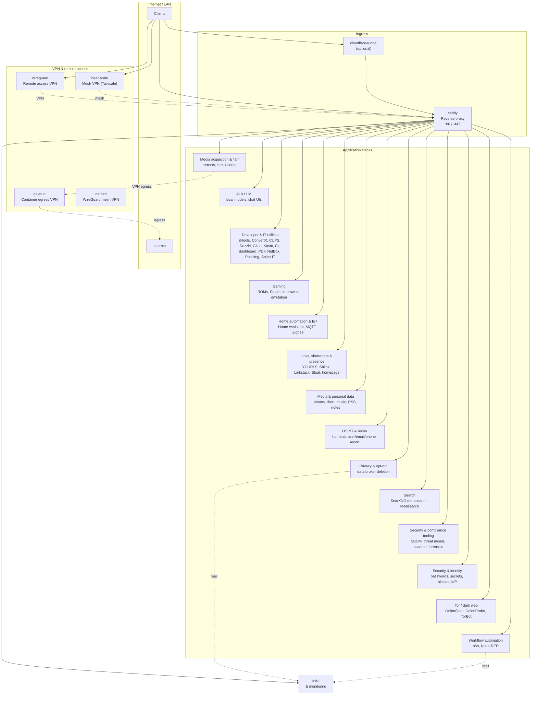
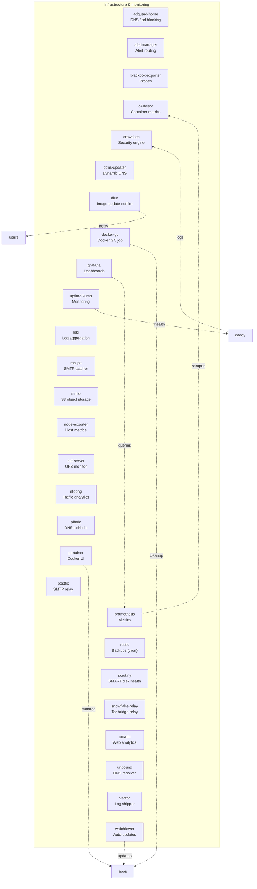

# Homelab topology

Generated from `documents/topology.yaml`. Do not edit the generated section directly.

<!-- TOPOLOGY_GENERATED_START -->

#### Infrastructure & monitoring

- **Traffic:** All HTTP(S) to apps and to web UIs (e.g. Uptime Kuma, Grafana) goes through Caddy. Clients reach Caddy directly (local DNS) or via Cloudflare Tunnel; Caddy routes by hostname.
- **VPN & remote access:** **Headscale** – mesh VPN (Tailscale); mesh clients reach Caddy and apps. **WireGuard** – remote-access VPN (UDP 51820); VPN clients connect from outside. **Gluetun** – outbound VPN for containers; media acquisition stacks (e.g. qbittorrent) send traffic through Gluetun to a VPN provider.
- **Application categories:** **Media acquisition & *arr** – download clients and *arr automation (torrents, Usenet, Sonarr/Radarr/Lidarr/Readarr, Bazarr, Explo, MeTube, Mylar3, Soulseek). **AI & LLM** – local models and chat UIs (Ollama, Open WebUI, LibreChat, Open Notebook, Perplexica, Anything LLM, LiteLLM, Kokoro TTS, Whisper ASR). **Developer & IT utilities** – it-tools, ConvertX, CUPS print server, Dozzle, Gitea, Harbor, Woodpecker CI, Homarr dashboard, Baserow, Stirling-PDF, ntfy, NetBox, PostHog, Snipe-IT, code-server, Beszel, Mattermost, Terminus, NodePad, Asking-NG. **Gaming** – Steam automation (ArchiSteamFarm), ROM manager and in-browser emulation (RomM), Twitch drops mining. **Home automation & IoT** – Home Assistant, Mosquitto (MQTT), Zigbee2MQTT. **Links, shorteners & presence** – YOURLS, Shlink, Linkstack, Stoat, Glance, static homepage/landing. **Media & personal data** – consumption and personal content (photos, docs, music, tagging/organization, recipes, bookmarks, RSS, comics, eBooks, tasks, wiki, notes, budgeting, Affine, Appflowy, CryptPad, Trilium, Oasis, Paperless AI). **OSINT & recon** – homelab-user/email/phone recon, breach lookups, subdomain enumeration, AIL. **Privacy & opt-out** – data broker deletion (Naisho, Privotron). **Search** – SearXNG, Meilisearch. **Security & compliance tooling** – SBOM/vuln tracking (Dependency-Track), threat modeling (Threat Dragon), web scanner (ZAP/ZAP GUI), digital forensics (Acquire, Plaso, Docker Forensics Toolkit). **Security & identity** – passwords, secrets, aliases, remote desktop, secure sharing, IdP (Keycloak, authentik, Enclosed, RustDesk). **Tor / dark web** – OnionScan, OnionProbe, TorBot. **Workflow automation** – n8n, Node-RED, Cal.com
- **Application stacks (detail):** Each category and what it does:
- **Media acquisition & *arr:** download clients and *arr automation (torrents, Usenet, Sonarr/Radarr/Lidarr/Readarr, Bazarr, Explo, MeTube, Mylar3, Soulseek) Stacks: bazarr, explo, flaresolverr, lidarr, metube, mylar3, nzbget, nzbhydra2, qbittorrent, prowlarr, radarr, readarr, rtorrent-flood, seerr, sonarr, soulseek, whisparr.
- **AI & LLM:** local models and chat UIs (Ollama, Open WebUI, LibreChat, Open Notebook, Perplexica, Anything LLM, LiteLLM, Kokoro TTS, Whisper ASR) Stacks: anything-llm, kokoro-tts, litellm, ollama, open-webui, librechat, open-notebook, perplexica, whisper-asr.
- **Developer & IT utilities:** it-tools, ConvertX, CUPS print server, Dozzle, Gitea, Harbor, Woodpecker CI, Homarr dashboard, Baserow, Stirling-PDF, ntfy, NetBox, PostHog, Snipe-IT, code-server, Beszel, Mattermost, Terminus, NodePad, Asking-NG Stacks: baserow, beszel, code-server, convertx, cups, dozzle, gitea, harbor, homarr, it-tools, kasm, mattermost, netbox, nodepad, ntfy, posthog, snipe-it, stirling-pdf, terminus, woodpecker-ci.
- **Gaming:** Steam automation (ArchiSteamFarm), ROM manager and in-browser emulation (RomM), Twitch drops mining Stacks: archisteamfarm, romm, twitch-drops-miner.
- **Home automation & IoT:** Home Assistant, Mosquitto (MQTT), Zigbee2MQTT Stacks: home-assistant, mosquitto, zigbee2mqtt.
- **Links, shorteners & presence:** YOURLS, Shlink, Linkstack, Stoat, Glance, static homepage/landing Stacks: glance, homepage, linkstack, shlink, stoat, yourls.
- **Media & personal data:** consumption and personal content (photos, docs, music, tagging/organization, recipes, bookmarks, RSS, comics, eBooks, tasks, wiki, notes, budgeting, Affine, Appflowy, CryptPad, Trilium, Oasis, Paperless AI) Stacks: affine, appflowy, actual-budget, archivebox, audiobookshelf, bookstack, calibre-web, cryptpad, docuseal, emby, firefly-iii, freshrss, hedgedoc, immich, jellyfin, jellystat, joplin-server, logseq-sync, kavita, komga, lanraragi, linkding, linkwarden, mealie, navidrome, nextcloud, oasis, outline, paperless-ai-next, paperless-gpt, paperless-ngx, picard, plex, seafile, slink, super-productivity, syncthing, trilium, vikunja.
- **OSINT & recon:** homelab-user/email/phone recon, breach lookups, subdomain enumeration, AIL Stacks: social-hunt, maigret, spiderfoot, phoneinfoga, theharvester, holehe, blackbird, ghunt, metagoofil, reconftw, sublist3r, ail, web-check.
- **Privacy & opt-out:** data broker deletion (Naisho, Privotron) Stacks: naisho, privotron.
- **Search:** SearXNG, Meilisearch Stacks: meilisearch, searx-ng.
- **Security & compliance tooling:** SBOM/vuln tracking (Dependency-Track), threat modeling (Threat Dragon), web scanner (ZAP/ZAP GUI), digital forensics (Acquire, Plaso, Docker Forensics Toolkit) Stacks: acquire, dependency-track, docker-forensics-toolkit, plaso, threat-dragon, zap, zed-attack-proxy.
- **Security & identity:** passwords, secrets, aliases, remote desktop, secure sharing, IdP (Keycloak, authentik, Enclosed, RustDesk) Stacks: authentik, enclosed, guacamole, infisical, keycloak, password-pusher, privatebin, rustdesk, simplelogin, vaultwarden.
- **Tor / dark web:** OnionScan, OnionProbe, TorBot Stacks: onionprobe, onionscan, torbot.
- **Workflow automation:** n8n, Node-RED, Cal.com Stacks: calcom, n8n, node-red.
- **Infrastructure:** Portainer manages stacks; Watchtower updates images; Docker GC cleans up; Diun notifies on image changes; Uptime Kuma monitors Caddy and app health; Grafana/Prometheus/cAdvisor provide metrics; CrowdSec consumes Caddy logs. **MinIO** provides S3-compatible object storage, often used as a backend for apps and backups; **Restic** handles scheduled backups to object storage; **Scrutiny** monitors disk SMART health. **Postfix** – SMTP relay for outbound mail from apps (e.g. Naisho, n8n). Dozzle (behind Caddy) is a log viewer.
- **Relations:**
  - **users → tunnel**: Clients use optional Cloudflare Tunnel to reach Caddy.
  - **users → caddy**: Clients reach Caddy directly (local DNS or tunnel).
  - **tunnel → caddy**: Tunnel forwards to Caddy by hostname.
  - **users → wireguard**: Clients connect via WireGuard for remote access.
  - **users → headscale**: Clients join mesh via Headscale (Tailscale).
  - **caddy → apps**: Caddy routes HTTP(S) to all application stacks by hostname.
  - **caddy → infra**: Caddy is managed and monitored by infra services.
  - **wireguard → caddy** (VPN): VPN clients reach Caddy and apps.
  - **headscale → caddy** (mesh): Mesh clients reach Caddy and apps.
  - **apps_acquisition → gluetun** (VPN egress): Media acquisition stacks send traffic through Gluetun (VPN).
  - **gluetun → outbound** (egress): Gluetun egresses via VPN provider to internet.
  - **apps_privacy → postfix** (mail): Privacy/opt-out apps send mail via Postfix.
  - **apps_workflow → postfix** (mail): Workflow apps (e.g. n8n) send mail via Postfix.
  - **postfix → mailpit** (relay (internal-only)): When RELAYHOST=mailpit:1025, Postfix relays to Mailpit; no external delivery.
  - **caddy → crowdsec** (logs): Caddy logs feed CrowdSec security engine.
  - **kuma → caddy** (health): Uptime Kuma monitors Caddy and app health.
  - **prometheus → cadvisor** (scrapes): Prometheus scrapes cAdvisor for container metrics.
  - **grafana → prometheus** (queries): Grafana queries Prometheus for dashboards.
  - **watchtower → apps** (updates): Watchtower updates container images for app stacks.
  - **dockergc → apps** (cleanup): Docker GC cleans stopped containers and unused images.
  - **diun → users** (notify): Diun notifies users of new image tags.
  - **portainer → apps** (manage): Portainer manages Docker stacks and containers.
<!-- TOPOLOGY_GENERATED_END -->
